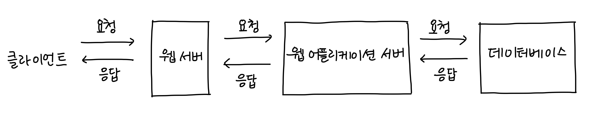

# [2주차 - Day4] 240307 정리

### 1️⃣ 웹 (백엔드)

- **웹 서버(Web Server)** : 정적 페이지에 대응하여 웹 애플리케이션 서버에게 전달

  - 정적 페이지: 화면의 내용/데이터 등의 변동이 없는 페이지
  - 동적 페이지: 데이터 처리/연산을 통해 화면의 내용, 데이터가 변하는 페이지

- **웹 애플리케이션 서버(Web Application Server)**: 동적 페이지를 처리, 필요한 데이터 연산을 위해 데이터베이스와 연결되어 있으며 데이터 조회/수정/삭제에 대한 처리를 요청

### 2️⃣ Node.js

자바스크립트를 브라우저 말고도 로컬 PC에서도 실행시켜줄 수 있는 실행창(런타임)
[Node.js공식페이지](https://nodejs.org/en/about)

### 3️⃣ URL(Uniform Resource Locator)

인터넷 상에서 웹 페이지가 어디있는지 위치를 알려주는 주소
