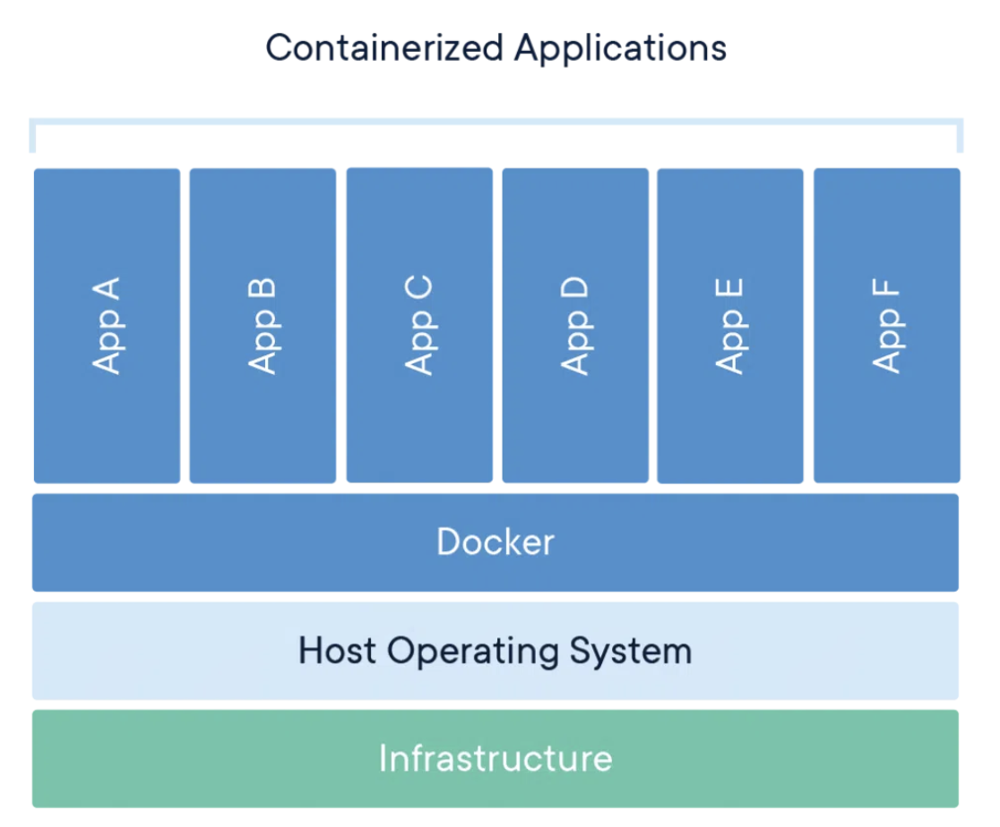
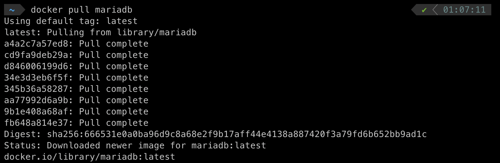
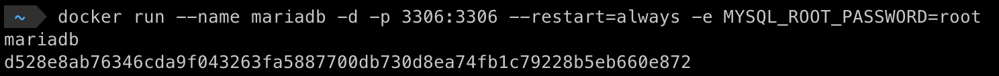

# [2주차 - Day5] 240308 정리

### 1️⃣ 웹 (데이터베이스)

-  **데이터베이스(DataBase, DB)**  : 여러 사람이 공유하여 사용할 목적으로 체계화해 통합, 관리하는 데이터의 집합

### 2️⃣ DBMS(DataBase Management System)

다수의 사용자들이 데이터베이스 내의 데이터를 접근할 수 있도록 해주는 소프트웨어 도구의 집합

### 3️⃣ SQL(Structured Query Language)

관계형 데이터베이스 관리 시스템의 데이터를 관리하기 위해 설계한 특수 목적의 프로그래밍 언어

### 4️⃣ 도커(docker)

컨테이너 이미지는 코드, 런타임, 시스템 도구, 시스템 라이브러리 및 설정 등 애플리케이션을 실행하는 데 필요한 모든 것을 포함하는 경량의 독립형 실행 가능 소프트웨어 패키지

- 도커로 mariadb 실행 
  
  ✨ mariadb실행 ✨ mariadb -u root -p

### 5️⃣ 데이터베이스 조회, 생성, 들어가기

- **조회**: SHOW DATABASES;
- **생성**: CREATE DATABASE [이름];
- **들어가기**: USE [이름];

### 6️⃣ 테이블 생성, 조회, 삽입, 수정, 삭제

- 생성: CREATE TABLE ~;
- 조회: SELECT ... FROM ~;
- 삽입: INSERT ... INTO ~;
- 수정: UPDATE ... SET ~ WHERE ...;
- 삭제: DELETE FROM ~ WHERE ...;
