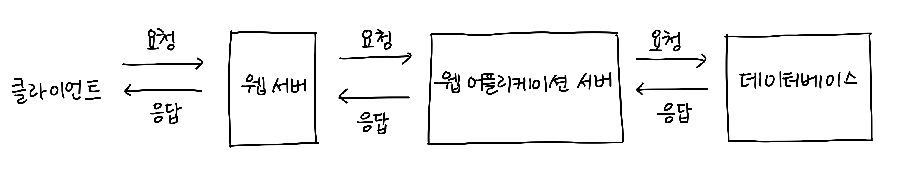
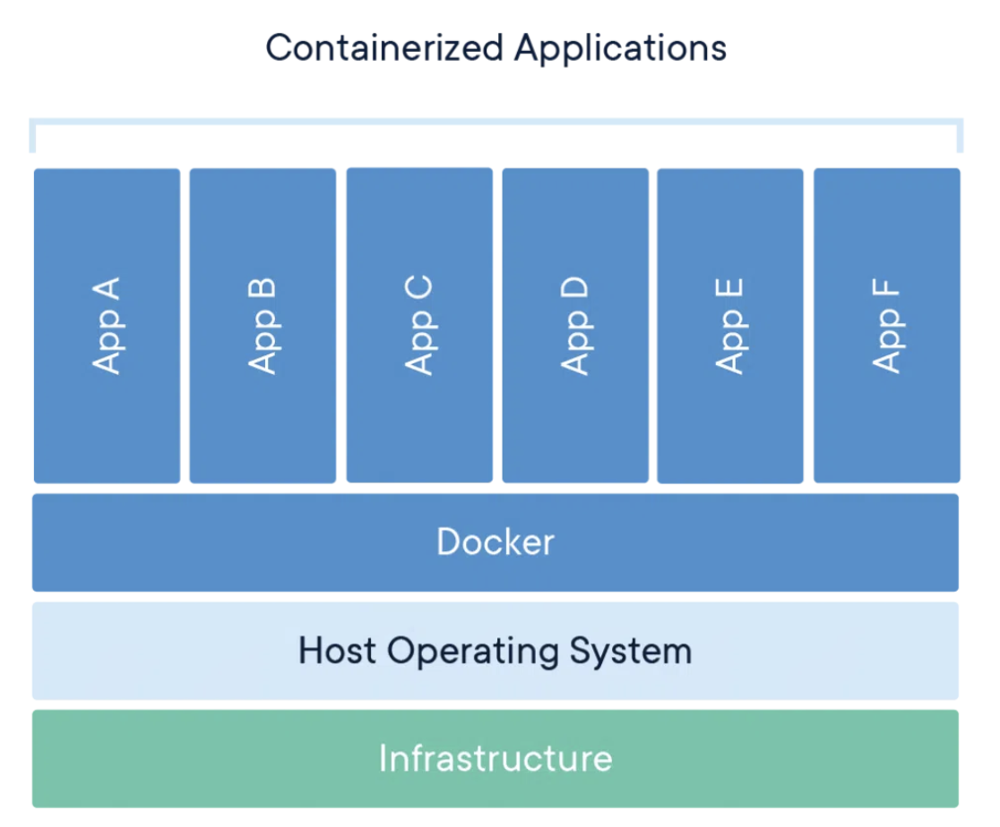
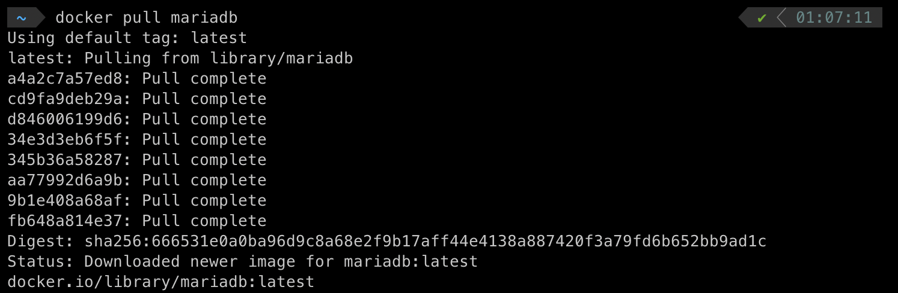
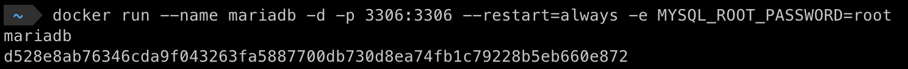

# [2주차] 정리
### Git 브랜치
*  **브랜치 생성**  : git branch
*  **브랜치 전환**  : git checkout [브랜치명]
*  **브랜치 삭제** : git branch -d [삭제할 브랜치명]
*  **브랜치 생성 후 복사**  : git push [원격저장소별칭] [브랜치명]

### 깃 브랜치 전략
*  **fast-forward 전략** : 현재 브랜치의 HEAD를 대상 브랜치의 HEAD까지로 옮기는 것
  * 중간에 변경이 없을 때만 동작
*  **3-way 전략**  : 공통 조상 커밋과 두 브랜치의 마지막 커밋, 총 3개의 커밋을 비교하여 병합을 수행하는 방식

---
### 웹(Web)
월드 와이드 웹(World Wide Web, WWW, W3)이란 인터넷에 연결된 사용자들이 서로의 정보를 공유할 수 있는 공간

* 웹의 특징
  * 정보를  하이퍼텍스트  형식으로 표현하여, 하이퍼텍스트를 따라 이동하며 다양한 정보/문서들을 연결, 제공
  * **하이퍼텍스트(hypertext)** : 참조(하이퍼링크)를 통해 독자가 한 문서에서 다른 문서로 즉시 접근할 수 있는 텍스트
* 웹의 구조
  * **클라이언트(Client)**: 서비스를 이용(요청)하는 컴퓨터
  * **서버(Server)**: 서비스를 제공하는 컴퓨터

*  **프로토콜** 
  * 컴퓨터 내부에서, 또는 컴퓨터 사이에서 데이터의 교환 방식을 정의하는 규칙 체계

* HTML: 웹 페이지구성 요소들의 구조
* CSS: 마크업 언어로 작성된 문서가 실제로 웹사이트에 표현되는 방법을 정해주는 스타일 시트 언어
* Javascript: 웹 페이지를 위한 스크립트 언어
  * **스크립트 언어** : 독립적인 프로그램을 개발할 수 있는 프로그래밍 언어가 아닌 프로그램을 제어하는 스크립트 역할을 하는 언어

### 웹 (프론트엔드)
* HTML에 CSS를 적용하는 방법
  * 인라인(inline): HTML 태그 안에 같이 작성
  * 내부 스타일 시트(internal style sheet): HTML 문서 안에 같이 작성
  * 외부 스타일 시트(external style sheet): HTML 문서 밖에 작성하고 연결

* 특정 태그 찾기
  *  id로 찾기 : document.getElementById('아이디')
  *  class로 찾기 : document.getElementsByClassName('클래스 이름')
  *  tag이름으로 찾기  : document.getElementsByTagName('태그 이름')

### 웹 (백엔드)

* **웹 서버(Web Server)** : 정적 페이지에 대응하여 웹 애플리케이션 서버에게 전달
  * 정적 페이지: 화면의 내용/데이터 등의 변동이 없는 페이지
  * 동적 페이지: 데이터 처리/연산을 통해 화면의 내용, 데이터가 변하는 페이지

* **웹 애플리케이션 서버(Web Application Server)**: 동적 페이지를 처리, 필요한 데이터 연산을 위해 데이터베이스와 연결되어 있으며 데이터 조회/수정/삭제에 대한 처리를 요청

*  **Node.js**  : 자바스크립트를 브라우저 말고도 로컬 PC에서도 실행시켜줄 수 있는 실행창(런타임)
  [Node.js공식페이지](https://nodejs.org/en/about)

* URL(Uniform Resource Locator): 인터넷 상에서 웹 페이지가 어디있는지 위치를 알려주는 주소

### 웹 (데이터베이스)
*  **데이터베이스(DataBase, DB)**  : 여러 사람이 공유하여 사용할 목적으로 체계화해 통합, 관리하는 데이터의 집합

*  **DBMS(DataBase Management System)**  : 다수의 사용자들이 데이터베이스 내의 데이터를 접근할 수 있도록 해주는 소프트웨어 도구의 집합

* **SQL(Structured Query Language)** : 관계형 데이터베이스 관리 시스템의 데이터를 관리하기 위해 설계한 특수 목적의 프로그래밍 언어

* 도커(docker) : 컨테이너 이미지는 코드, 런타임, 시스템 도구, 시스템 라이브러리 및 설정 등 애플리케이션을 실행하는 데 필요한 모든 것을 포함하는 경량의 독립형 실행 가능 소프트웨어 패키지
  

* 도커로 mariadb 실행 
  
  ✨ mariadb실행 ✨ mariadb -u root -p

* 데이터베이스 조회, 생성, 들어가기
  * **조회**: SHOW DATABASES;
  * **생성**: CREATE DATABASE [이름];
  * **들어가기**:* USE [이름];

* 테이블 생성, 조회, 삽입, 수정, 삭제
  * 생성: CREATE TABLE ~;
  * 조회: SELECT ... FROM ~;
  * 삽입: INSERT ... INTO ~;
  * 수정: UPDATE ... SET ~ WHERE ...;
  * 삭제: DELETE FROM ~ WHERE ...;