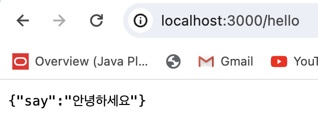

# [3주차 - Day5] 240315 정리

### 1️⃣ Express

웹 및 모바일 애플리케이션을 위한 일련의 강력한 기능을 제공하는 간결하고 유연한 Node.js 웹 애플리케이션 프레임 워크

### 2️⃣ Express로 서버 만들기

```javascript
const express = require("express");
const app = express();

app.get("/", function (req, res) {
  res.send("Hello World");
});

app.listen(3000);
```

- 모듈 가져와서 express변수에 담기
- app변수에 express를 호출하여 서버를 담음
- http://localhost:3000는 기본값
- http://localhost:3000/ 으로 요청이 날아 오면 콜백함수가 다음에 호출됨
- 포트번호는 3000

### 3️⃣ JSON (JavaScript Object Notation)

Javascript 객체 문법으로 구조화된 데이터를 표현하기 위한 문자 기반의 표준 포맷

- 형태
  ```javascript
  let person = {
    name: "김뫄뫄",
    age: 20,
  };
  ```

### 4️⃣ JSON 실습

```javascript
app.get("/hello", function (req, res) {
  res.json({
    say: "안녕하세요",
  });
});
```

- 실행결과
  
