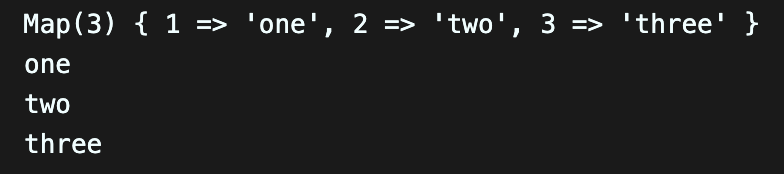

# [4주차 - Day1] 240318 정리

### 1️⃣ 자바스크립트 네이밍 컨벤션

1. <span style="background-color:#FFFFF0">파일이름</span>은 소문자 kebab-case 또는 snake_case
2. <span style="background-color:#FFFFF0">패키지이름</span>은 lowerCamelCase로 표기
3. <span style="background-color:#FFFFF0">변수이름</span>은 lowerCamelCase로 표기, 알파벳으로 시작
4. <span style="background-color:#FFFFF0">함수이름</span>은 lowerCaseCamel로 표기, 동사구문
5. <span style="background-color:#FFFFF0">객체이름</span>은 lowerCaseCamel로 표기
6. <span style="background-color:#FFFFF0">클래스이름</span>은 PascalCase로 표기
7. <span style="background-color:#FFFFF0">폴더이름</span>은 공백에 '-' 사용하여 표기

### REST API 디자인 및 구현

### 2️⃣ GET

- query 날려보기

  ```javascript
  app.get("/test", function (req, res) {
    const q = req.query;
    console.log(q);

    res.json({});
  });
  ```

### 3️⃣ 자바스크립트 Map

```javascript
let map = new Map();
map.set(1, "one");
map.set(2, "two");
map.set(3, "three");

console.log(map);
console.log(map.get(1));
console.log(map.get(2));
console.log(map.get(3));
```

실행결과

