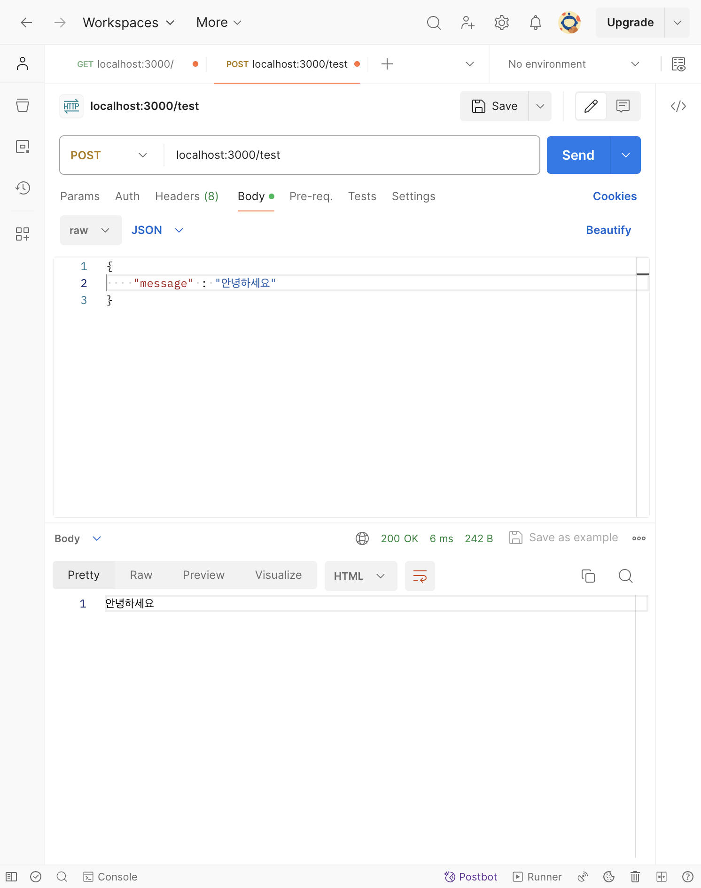
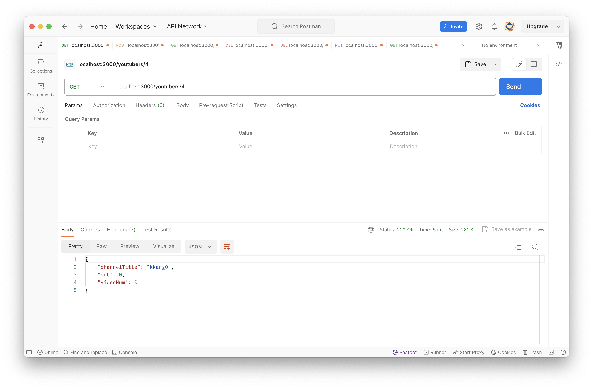

# [4주차 - Day3] 240320 정리

### 1️⃣ POST

웹 서버가 요청 메시지의 본문에 감싸있는 데이터를 받아들일 것을 요청하고 이를 저장

- postman 사용해보기

  - POST

    ```javascript
    app.use(express.json()); // json 미들웨어 -> req body를 json으로 읽어오기
    app.post("/test", (req, res) => {
      // body에 숨겨져서 들어온 데이터를 화면에 보여주기
      console.log(req.body.message);

      res.send(req.body.message);
    });
    ```

    

### 2️⃣ POST 기능을 추가한 API 설계

유튜버 "등록" : **POST** /youtubers

- req: body에 channelTitle, sub = 0, videoNum = 0 신규 유튜버 정보 전달 + db에 저장
- res: “channelTitle님, 유튜버 생활을 응원합니다!”

### 3️⃣ POST 적용 실습

```javascript
app.use(express.json()); // http 외 모듈인 '미들웨어 json' 설정
app.post("/youtuber", (req, res) => {
  console.log(req.body);
  // db에 Map 저장(set)
  db.set(id++, req.body);

  res.json({
    message: `${db.get(id - 1).channelTitle}님, 유튜버 생활을 응원합니다!`,
  });
});
```

POST 실행결과


- "kkang0"이라는 새로운 유튜버가 등록

GET 실행결과


- 4번 id에 "kkang0"이 새로 조회됨
