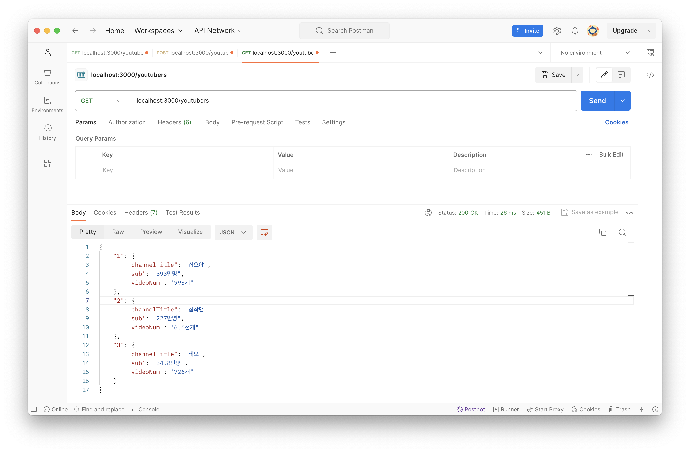
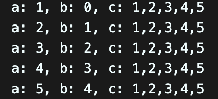
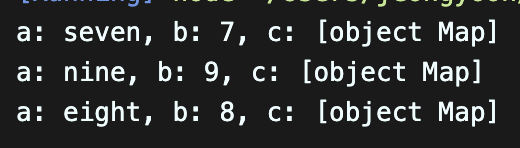
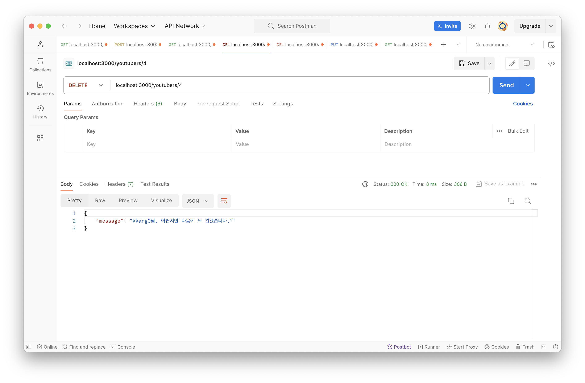

# [4주차 - Day3] 240321 정리

### 1️⃣ 자바스크립트 Map을 json으로 변환하기

youtubers객체를 만들어서 db의 key, value값을 json으로 출력하도록 함

```javascript
app.get("/youtubers", function (req, res) {
  let youtubers = {};
  db.forEach(function (value, key) {
    youtubers[key] = value;
  });

  res.json(youtubers);
});
```

실행결과


### 2️⃣ forEach() 메서드

forEach() 메서드는 순회 메서드 </br>
이 메서드는 배열의 각 요소에 대해 제공된 콜백 함수를 오름차순 인덱스 순서로 한 번씩 호출. </br>
map()과 달리 forEach()는 항상 undefined를 반환하므로 체이닝할 수 없음.

- forEach를 이용한 배열 순회 실습

  ```javascript
  const arr [1, 2, 3, 4, 5];

  arr.forEach(function (a, b, c) {
  console.log(`a: ${a}, b: ${b}, c: ${c}`); // 데이터, 인덱스, 객체 전체
  });
  ```

- 출력 결과

  

### 3️⃣ map() 메서드

콜백 함수를 이용해 각각의 요소에 호출해서 그 값을 변환하게 해줌

- map을 forEach()를 이용하여 순회

  ```javascript
  let map = new Map();
  map.set(7, "seven");
  map.set(9, "nine");
  map.set(8, "eight");

  map.forEach(function (a, b, c) {
    console.log(`a: ${a}, b: ${b}, c: ${c}`);
  });
  ```

- 출력 결과
  

### 4️⃣ DELETE 기능을 추가한 API 설계

유튜버 개별 "삭제" : **DELETE** /youtubers/:id </br>
(개별 조회와 url이 같아도 HTTP method로 구분이 됨)

- res: params.id ⬅️ map에 저장된 key값을 전달
- req: “channelTitle님, 아쉽지만 다음에 또 뵙겠습니다.”

### 5️⃣ 개별 DELETE 적용 실습

```javascript
app.delete("/youtubers/:id", function (req, res) {
  let id = req.params.id;
  id = parseInt(id);

  let youtuber = db.get(id);
  if (youtuber == undefined) {
    res.json({
      message: `요청하신 ${id}번은 없는 유튜버입니다.”`,
    });

    return;
  }
  const channelTitle = youtuber.channelTitle;
  db.delete(id);

  res.json({
    message: `${channelTitle}님, 아쉽지만 다음에 또 뵙겠습니다.”`,
  });
});
```

- 실행결과
  
  url에 4번 id를 주었더니, 4번 유튜버가 삭제됨

### 6️⃣ 리팩토링 (Refactoring)

이미 작성한 소스코드에서 구현된 일련의 행위들을 변경없이, 코드의 가독성과 유지보수성을 높이기 위해 내부구조를 변경하는 것

- 리팩토링을 하는 이유?

  1. 코드 중복 제거
  2. 수정 용이성 향상
  3. 가독성 향상
  4. 버그 찾기
  5. 개발 속도 향상 ...

- 리팩토링은 언제 할까?
  1. 코드 중복이 발생할 때
  2. 새로운 기능 추가할 때
  3. 코드리뷰를 할 때

❗️ 배포, 운영 직전에는 절대로 코드 수정이 일어나면 안됨 ❗️

### 7️⃣ 전체 DELETE 적용 실습

```javascript
app.delete("/youtubers", function (req, res) {
  if (db.size >= 1) {
    db.clear();

    res.json({
      message: "전체 유튜버가 삭제되었습니다.",
    });

    return;
  }
  res.json({
    message: "삭제할 유튜버가 없습니다.",
  });
});
```

### 8️⃣ PUT 기능을 추가한 API 설계

유튜버 "개별" 수정 : "PUT" /youtubers/:id

- req: params.id, channelTitle(body에서 받아오기)
- res: “{이전channelTitle}님, 채널명이 {새로운channelTitle}로 변경되었습니다.”

```javascript
app.put("/youtubers/:id", (req, res) => {
  let { id } = req.params;
  id = parseInt(id);

  let youtuber = db.get(id);
  let oldTitle = youtuber.channelTitle;
  if (youtuber == undefined) {
    res.json({
      message: `요청하신 ${id}번은 없는 유튜버입니다.`,
    });

    return;
  }
  let newTitle = req.body.channelTitle;
  youtuber.channelTitle = newTitle;
  db.set(id, youtuber); // 기존 id 덮어쓰고 객체 넣기

  res.json({
    message: `${oldTitle}님, 채널명이 ${newTitle}로 수정되었습니다.`,
  });
});
```

### 9️⃣ HTTP 상태 코드

특정 HTTP 요청이 성공적으로 완료되었는지 알려주는 코드

✅1XX: Informational(정보 제공) </br>
✅2XX: Success(성공) </br>
✅3XX: Redirection(리다이렉션) </br>
✅4XX: Client Error(클라이언트 에러) </br>
✅5XX: Server Error(서버 에러)
