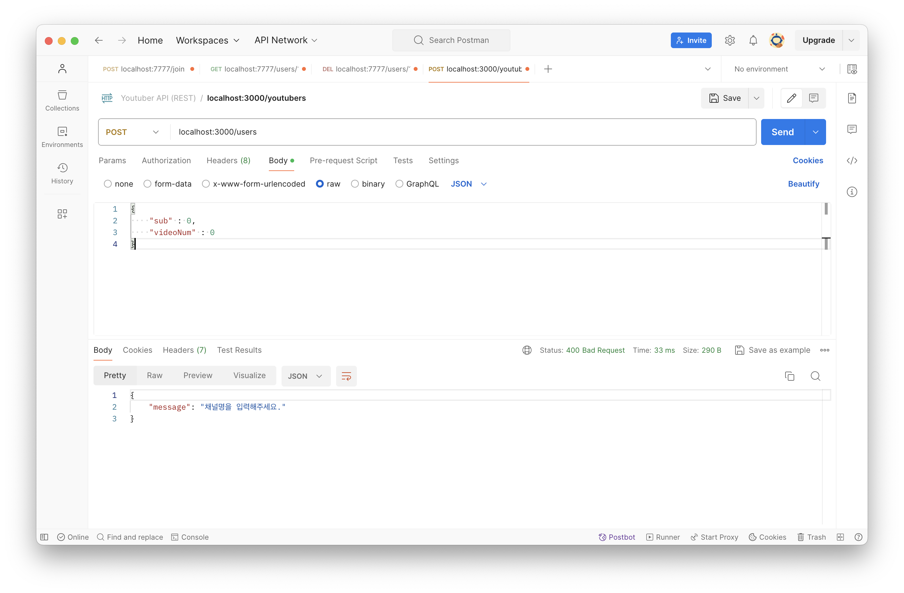
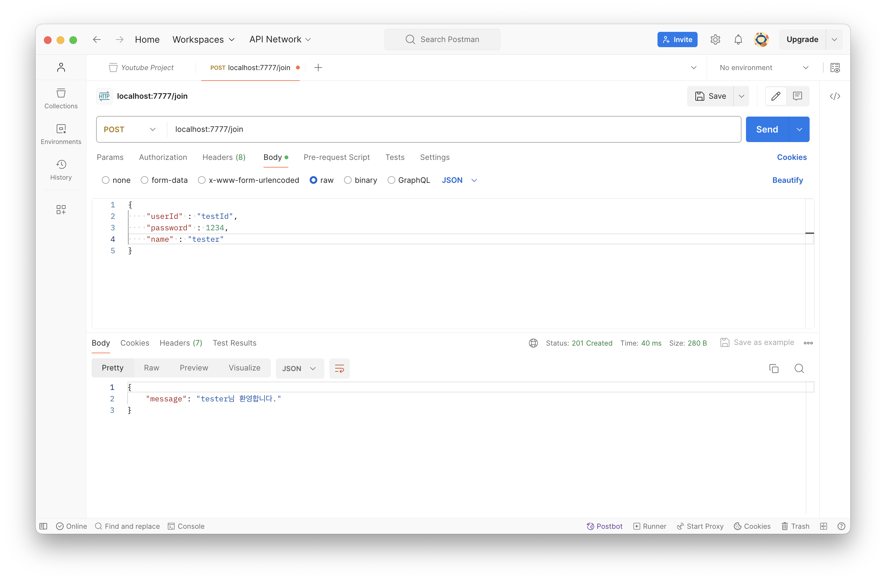
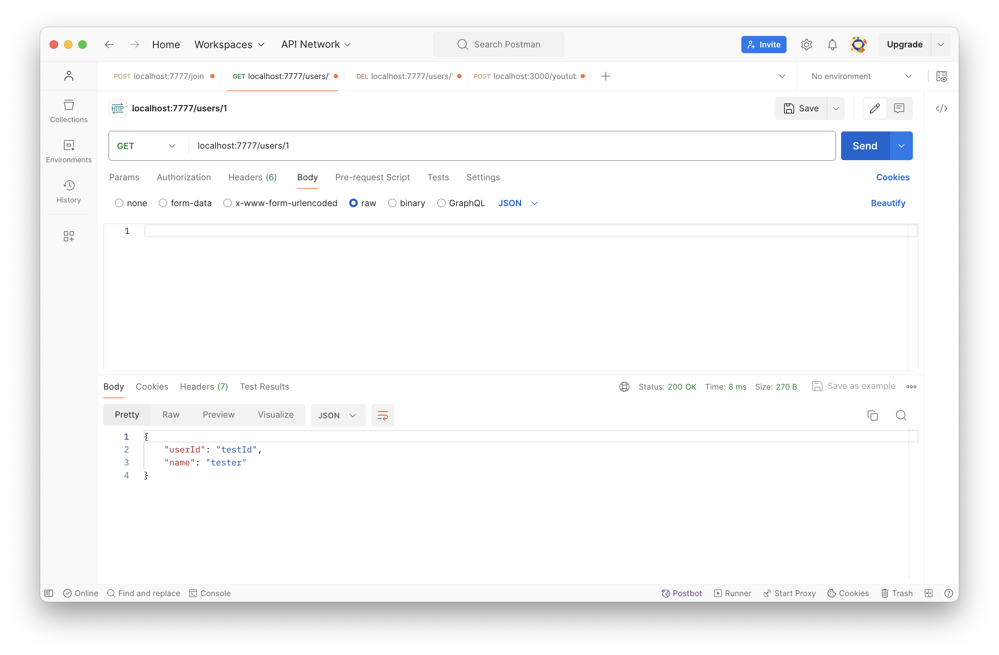
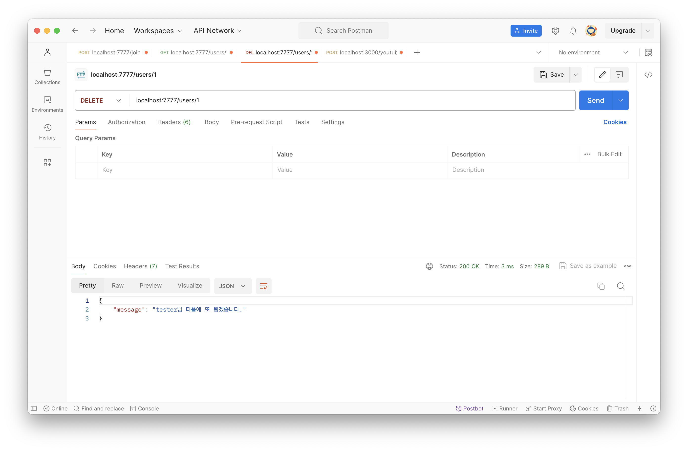

# [4주차 - Day5] 240322 정리

### 1️⃣ 핸들러 (handler)

HTTP 요청에 의해 자동으로 호출되는 메소드

- Node: 콜백함수로, app.http_method(path, 핸들러)
- Spring: 컨트롤러

### 2️⃣ 클린코드

if문은 부정문보다는 긍정문부터 쓰는 것이 원칙

```javascript
app.delete("/users/:id", function (req, res) {
  let id = req.params.id;
  id = parseInt(id);

  let user = db.get(id);

  if (user) {
    let channelTitle = youtuber.channelTitle;
    db.delete(id);

    res.json({
      message: `${channelTitle}님, 탈퇴가 완료되었습니다.`,
    });

    return;
  }

  res.json({
    message: `요청하신 ${id}번은 없는 유튜버입니다.”`,
  });
});
```

### 3️⃣ '==' vs '==='

- '==': 자료형 상관없이 값만 비교
- '===': 자료형, 값 모두 비교

### 4️⃣ HTTP 상태 코드

- 2XX: 성공
  - 200: 조회/수정/삭제 성공
  - 201: 등록 성공 (POST)
- 4XX : 클라이언트측 오류
  - 400: 요청한 연산(처리)을 할 때 필요한 데이터가 덜 왔을 때
  - 404: 찾는 페이지(리소스) 없음
- 5XX : 서버측 오류
  - 500: 서버가 죽었을 때

### 5️⃣ 상태코드를 추가한 POST 예외 처리

```javascript
app.use(express.json());
app.post("/users", (req, res) => {
  let channelName = req.body.channelName;

  if (channelName) {
    db.set(id++, req.body);

    res.status(201).json({
      message: `${db.get(id - 1).channelName}님, 환영합니다.`,
    });

    return;
  }

  res.status(400).json({
    message: "채널명을 입력해주세요.",
  });
});
```

(실행 결과)


### 6️⃣ 미니 프로젝트

1. 로그인 ➡️ **POST** /login
   - req: body(id, pwd)
   - res: `${name}님 환영합니다` ➡️ 메인페이지
2. 회원 가입 ➡️ **POST** /join
   - req: body (id, pwd, name)
   - res: `${name}님 환영합니다` ➡️ 로그인페이지
3. 회원 개별 정보 조회 ➡️ **GET** /users/:id
   - req: url (id)
   - res: id, name
4. 회원 개별 탈퇴 ➡️ **DELETE** /users/:id
   - req: url (id)
   - res: `${name}님 다음에 또 뵙겠습니다.` or 메인페이지

### 7️⃣ 회원 가입

```javascript
app.post("/join", (req, res) => {
  // body에 값이 없는 경우
  if (req.body == {}) {
    res.status(400).json({
      message: `입력값을 다시 확인해주세요.`,
    });

    return;
  }

  id += 1;
  db.set(id, req.body);

  new_id = db.get(id - 1);
  res.status(201).json({
    message: `${new_id.name}님 환영합니다.`,
  });
});
```

(실행 결과)


### 8️⃣ 회원 개별 조회

```javascript
app.get("/users/:id", function (req, res) {
  let { id } = req.params;
  id = parseInt(id); // id값을 숫자로 바꿔주기

  const user = db.get(id);
  if (user) {
    res.status(200).json({
      userId: user.userId,
      name: user.name,
    });

    return;
  }

  res.status(404).json({
    message: `회원 정보가 없습니다.`,
  });
});
```

(실행결과)
존재하는 회원(1)의 id입력


존재하지 않은 회원(2)의 id입력


### 9️⃣ 회원 개별 탈퇴

```javascript
app.delete("/users/:id", function (req, res) {
  let { id } = req.params;
  id = parseInt(id); // id값을 숫자로 바꿔주기

  const user = db.get(id);
  if (user == undefined) {
    res.status(404).json({
      message: `회원 정보가 없습니다.`,
    });

    return;
  }
  db.delete(id);

  res.status(200).json({
    message: `${user.name}님 다음에 또 뵙겠습니다.`,
  });
});
```

(실행결과)
존재하지 않은 회원(id)이 탈퇴했을 때


존재하는 회원(id)이 탈퇴했을 때


방금 탈퇴한 회원(id)을 가지고 다시 탈퇴했을 때

