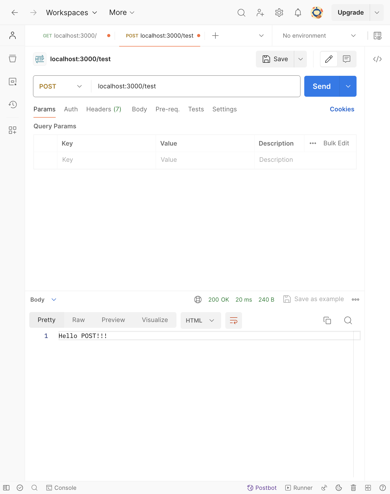
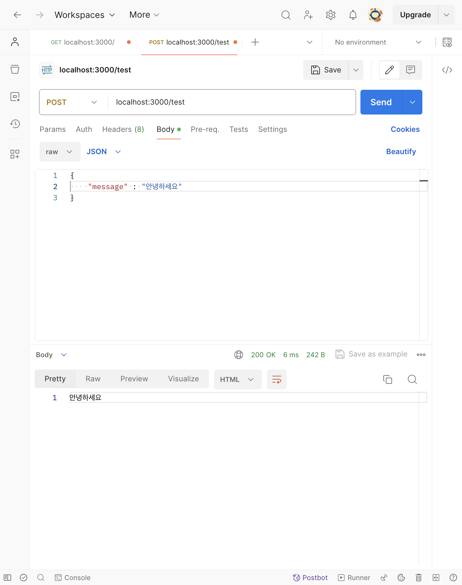

# [4주차] 정리
### 자바스크립트 네이밍 컨벤션
1. <span style="background-color:#FFFFF0">파일이름</span>은 소문자 kebab-case 또는 snake_case
2. <span style="background-color:#FFFFF0">패키지이름</span>은 lowerCamelCase로 표기
3. <span style="background-color:#FFFFF0">변수이름</span>은 lowerCamelCase로 표기, 알파벳으로 시작
4. <span style="background-color:#FFFFF0">함수이름</span>은 lowerCaseCamel로 표기, 동사구문
5. <span style="background-color:#FFFFF0">객체이름</span>은 lowerCaseCamel로 표기
6. <span style="background-color:#FFFFF0">클래스이름</span>은 PascalCase로 표기
7. <span style="background-color:#FFFFF0">폴더이름</span>은 공백에 '-' 사용하여 표기

### REST API 디자인 및 구현
### GET
* query 날려보기
    ```javascript
    app.get("/test", function (req, res) {
    const q = req.query;
    console.log(q);

    res.json({});
    });
    ```

### express 구조
[express 공식사이트](expressjs.com) <br>
* **웹 프레임워크**: 웹 애플리케이션 프레임워크(Web application framework)는 웹 서비스 개발을 위한 프레임워크

### POST
웹 서버가 요청 메시지의 본문에 감싸있는 데이터를 받아들일 것을 요청하고 이를 저장

* postman 사용해보기
  * GET
  
  * POST
  