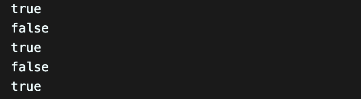
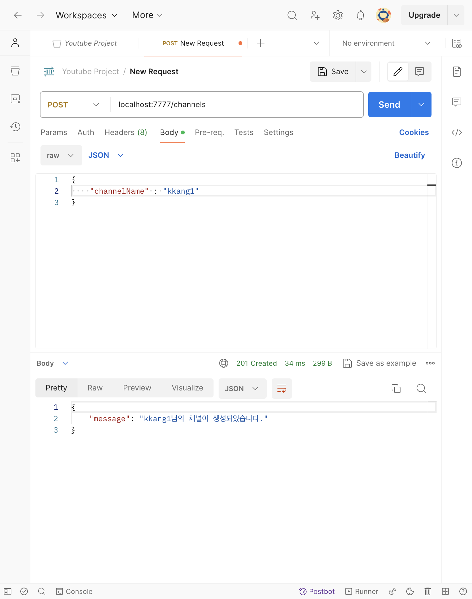
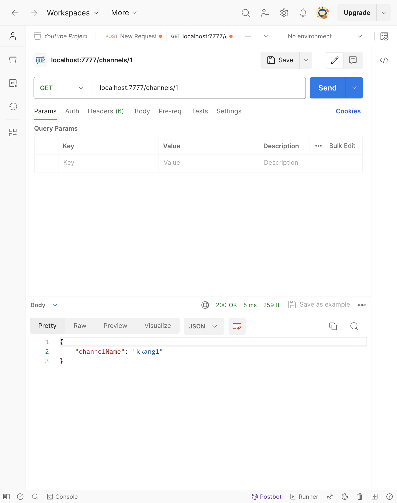
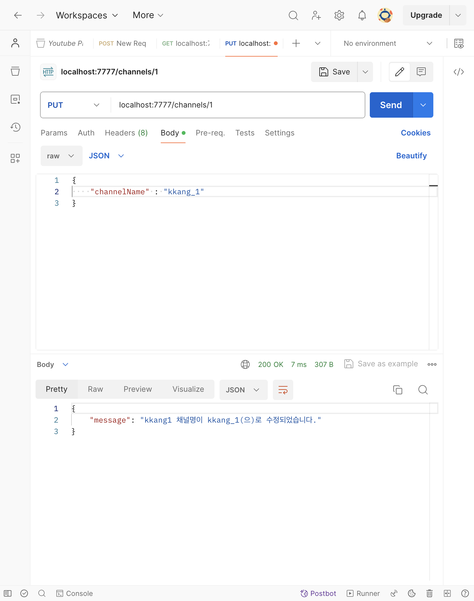
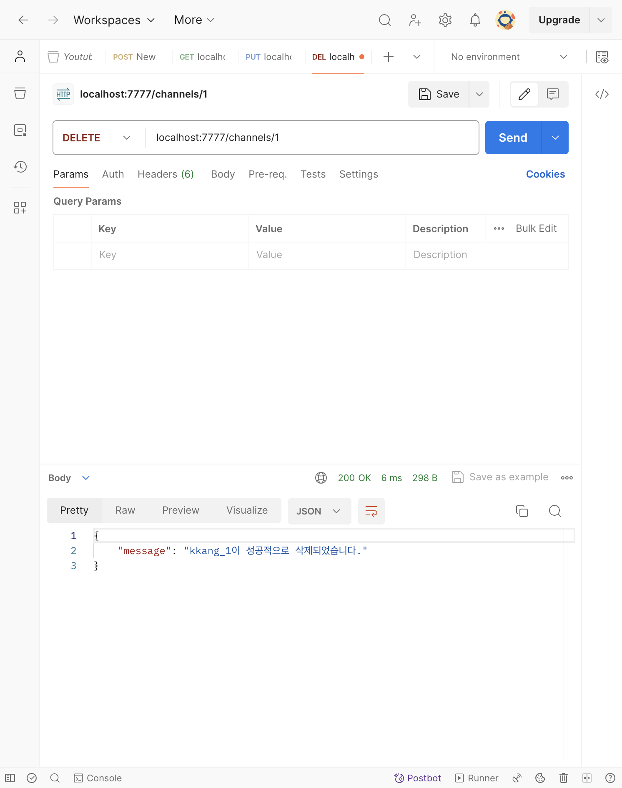
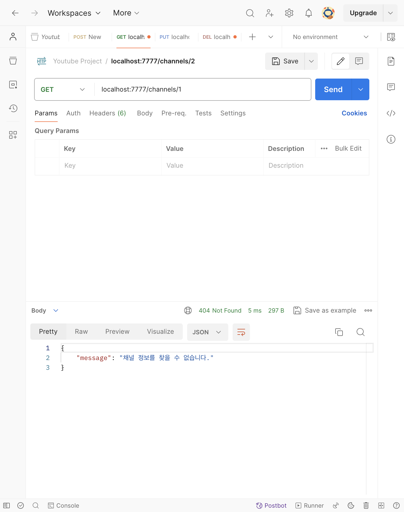
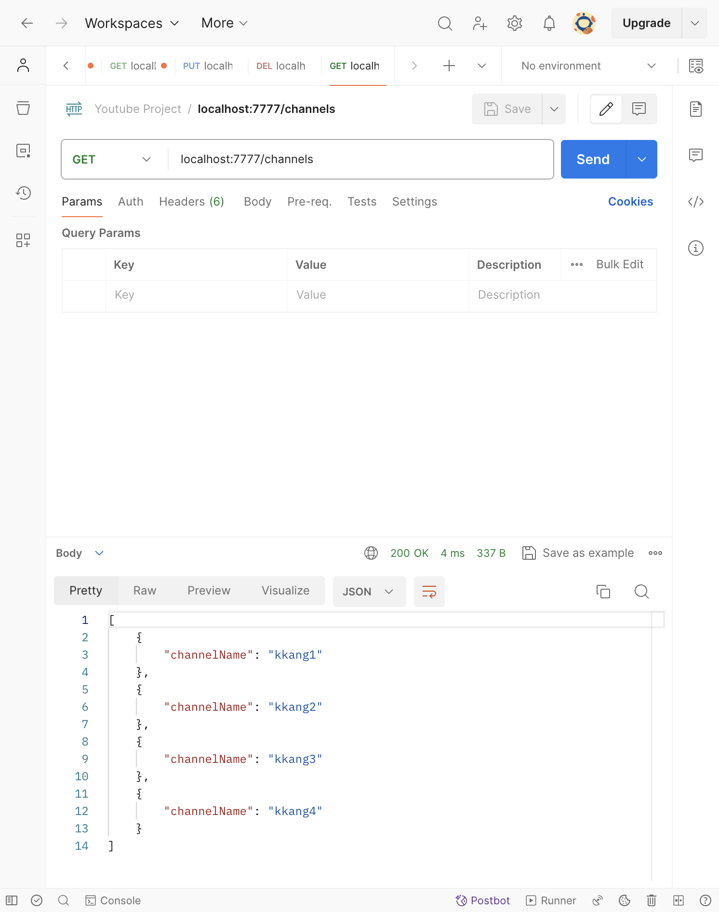

# [5주차 - Day1] 240325 정리

### 1️⃣ 빈 객체'{ }'를 확인하는 3가지 방법

- 객체.keys()
- for in (반복순회) ➡️ 추천 ❌
- lodash 라이브러리 사용 ➡️ isEmpty

### 2️⃣ 객체가 비어있는지 확인해보기

```javascript
let obj1 = {};
let obj2 = { message: "비어있지 않음" };
let num = 1;
let str1 = "one";
let str2 = ""; // 문자열도 객체

console.log(Object.keys(obj1).length === 0); // length === 0
console.log(Object.keys(obj2).length === 0); // length === 1

console.log(Object.keys(num).length === 0);
console.log(Object.keys(str1).length === 0);
console.log(Object.keys(str2).length === 0);
```

(실행결과)


❗️ 함수를 사용하는 방법도 있음

### 3️⃣ 로그인 고도화 실습

```javascript
// 객체 안이 존재하는지 확인하는 함수
function isExistedObj(obj) {
  if (Object.keys(obj).length) return true;

  return false;
}

// 로그인
app.post("/login", function (req, res) {
  // id가 db에 저장된 회원인지 확인하기
  const { userId, password } = req.body;
  let loginUser = {};

  db.forEach(function (user, id) {
    if (user.userId === userId) {
      loginUser = user; // loginUser 객체에 user 담기
    }
  });

  // userId값을 찾았으면 (loginUser 객체가 있으면)
  if (isExistedObj(loginUser)) {
    if (loginUser.password === password) {
      res.status(201).json({
        message: `환영합니다.`,
      });
    } else {
      res.status(400).json({
        message: "입력값을 다시 확인해주세요.",
      });
    }

    return;
  }

  res.json({
    message: "입력하신 id는 존재하지 않습니다.",
  });
});
```

### 4️⃣ 채널 API 설계

1. 채널 생성 ➡️ **POST** /channels
   - req: body에 채널명(channelName) 넣기
   - res: `${channelName}님의 채널이 생성되었습니다.`
2. 채널 전체 조회 ➡️ **GET** /channels
   - res: 채널 전체 리스트 보내주기
3. 채널 개별 수정 ➡️ **PUT** /channles/:id
   - req: params.id, body에 채널명 넣기
   - res: `채널명이 ${channelName}로 수정되었습니다.`
4. 채널 개별 삭제 ➡️ **DELETE** /channels/:id
   - req: params.id
   - res: `${채널명}이 성공적으로 삭제되었습니다.`
5. 채널 개별 조회 ➡️ **GET** /channels/:id
   - req: params.id
   - res: 채널 개별 데이터

### 5️⃣ 채널 생성

라우터를 사용하여 `app.route('/channels)`

```javascript
.post((req, res) => {
    // channelName이 body에 있으면
    if (req.body.channelName) {
      db.set(id++, req.body);

      res.status(201).json({
        message: `${db.get(id - 1).channelName}님의 채널이 생성되었습니다.`,
      });

      return;
    }

    // channelName이 없으면
    res.status(400).json({
      message: `입력값을 다시 확인해주세요.`,
    });
  });
```

(실행결과)


### 6️⃣ 채널 개별 조회

라우터를 사용하여 `app.route('/channels/:id)`

```javascript
.get((req, res) => {
    let { id } = req.params;
    id = parseInt(id);

    let channel = db.get(id);
    // 객체가 존재
    if (channel) {
      res.status(200).json(channel);
      return;
    }

    // 객체가 존재하지 않음
    res.status(404).json({
      message: "채널 정보를 찾을 수 없습니다.",
    });
  })
```

(실행결과)


### 7️⃣ 채널 개별 삭제/ 수정

라우터를 사용하여 `app.route('/channels/:id)`

**수정**

```javascript
.put((req, res) => {
    let { id } = req.params;
    id = parseInt(id);
    let channel = db.get(id);

    // 채널이 존재
    if (channel) {
      let newName = req.body.channelName; // 수정할 채널명 body에서 받아오기
      channel.channelName = newName; // 수정하기
      db.set(id, channel); // 바뀐 값 덮어쓰기
      res.json({
        message: `채널명이 ${newName}(으)로 수정되었습니다.`,
      });

      return;
    }

    // 채널이 존재하지 않음
    res.status(404).json({
      message: "채널 정보를 찾을 수 없습니다.",
    });
  })
```

(실행결과)


**삭제**

```javascript
.delete((req, res) => {
    let { id } = req.params;
    id = parseInt(id);

    let channel = db.get(id);

    // 객체가 존재
    if (channel) {
      db.delete(id);
      res.status(200).json({
        message: `${channel.channelName}이 성공적으로 삭제되었습니다.`,
      });

      return;
    }

    // 객체가 존재하지 않음
    res.status(404).json({
      message: "채널 정보를 찾을 수 없습니다.",
    });
  });
```

(실행결과)


**(삭제 후 개별 조회 시도)**


### 8️⃣ 채널 전체 조회

라우터를 사용하여 `app.route('/channels)`

```javascript
.get((req, res) => {
    // db에 값이 존재하면
    if (db.size) {
      let channels = []; // json 객체 생성

      db.forEach(function (value, key) {
        channels.push(value);
      });

      res.status(200).json(channels);

      return;
    }

    // db에 값이 한 개도 없다면
    res.json(404).json({
      message: "조회 가능한 채널이 없습니다.",
    });
  })
```

(실행결과)

