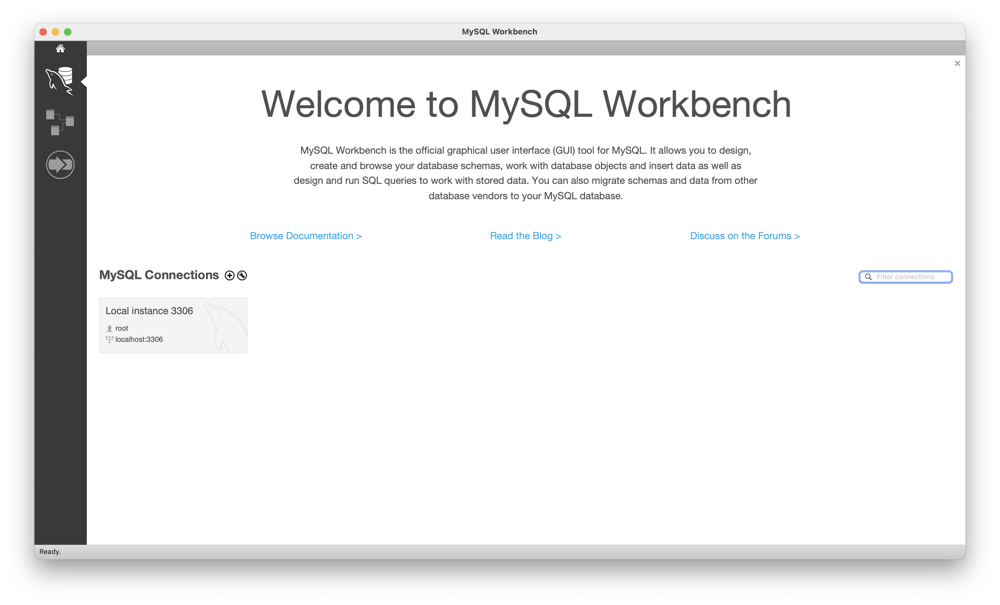

# [5주차 - Day3] 240327 정리

### 1️⃣ 데이터베이스(DataBase; DB)

여러 사람이 공유하여 사용할 목적으로 체계화해 통합, 관리하는 데이터의 집합
(장점) 데이터를 구조화하여 관리함으로써 데이터 중복을 막고, 효율적이고 빠른 데이터 연산을 가능하게 함

### 2️⃣ DBMS (DataBase Management System)

데이터베이스를 운영하고 관리하기 위해 사용하는 것
(종류) 오라클, MySQL, MariaDB ➡️ 주요 명령어(SQL)는 동일

### 3️⃣ RDBMS(Relational DataBase Management System)

관계형 데이터베이스를 만들고 업데이트하고 관리하는 데 사용하는 프로그램

### 4️⃣ 정규화

테이블을 쪼개는 것

**게시글**
| 게시글 번호 | 제목 | 내용 | 작성일자 | 수정일자 | 작성자 | 직업 | 생년월일 |
| --- | --- | --- | --- | --- | --- | --- | --- |
| 1 | 가나다 | abc | 2024-01-01 | 2024-01-16 | 김뫄뫄 | 회계사 | 800107 |
| 2 | 라마바 | def | 2024-01-15 | 2024-01-16 | 최뫄뫄 | 유튜버 | 820105 |
| 3 | 바사아 | ghi | 2023-12-25 | 2024-01-16 | 김뫄뫄 | 회계사 | 800107 |
| 4 | 자차카 | jkl | 2023-12-01 | 2024-01-16 | 김뫄뫄 | 회계사 | 830501 |
| 5 | 타파하 | mno | 2024-02-01 | 2024-01-16 | 정뫄뫄 | 간호사 | 850101 |
| 6 | 갸냐댜 | pqr | 2024-02-01 | 2024-01-16 | 정뫄뫄 | 간호사 | 850101 |

- Primary Key(Pk; 기본키) : 해당 테이블의 각 행을 유일(unique)하게 구별할 수 있도록 하는 키 값

### ✔️ 테이블 정규화해보기

**사용자**
| 사용자 번호 | 이름 | 직업 | 생년월일 |
| --- | --- | --- | --- |
| 1 | 김뫄뫄 | 회계사 | 800107 |
| 2 | 최뫄뫄 | 유튜버 | 820105 |
| 3 | 김뫄뫄 | 회계사 | 830501 |
| 4 | 정뫄뫄 | 간호사 | 850101 |

**게시글**
| 게시글 번호 | 제목 | 내용 | 작성일자 | 수정일자 | 사용자 번호 (FK) |
| --- | --- | --- | --- | --- | --- |
| 1 | 가나다 | abc | 2024-01-01 | 2024-01-16 | 1 |
| 2 | 라마바 | def | 2024-01-15 | 2024-01-16 | 2 |
| 3 | 바사아 | ghi | 2023-12-25 | 2024-01-16 | 1 |
| 4 | 자차카 | jkl | 2023-12-01 | 2024-01-16 | 3 |
| 5 | 타파하 | mno | 2024-02-01 | 2024-01-16 | 4 |
| 6 | 갸냐댜 | pqr | 2024-02-01 | 2024-01-16 | 4 |

- Foreign Key(FK; 외래키): A테이블에서 B테이블의 데이터를 찾아가고 싶을 때 사용하는 키 값
  - 최대한 B테이블의 PK값을 A테이블의 FK로 쓰는 것이 이상적!

### 5️⃣ 데이터베이스 테이블 간 연관관계

1:1, 1:N, N:M

- 게시글 vs 사용자

  1. 사용자 1명은 게시글 여러 개 작성 가능 ➡️ 1:N
  2. 게시글 1개 당 사용자는 1명 ➡️ 1:1

- 게시글-사용자 테이블 분리
  게시글 테이블을 보고 사용자 데이터를 확인

### 6️⃣ 유튜브 실습

**채널**
| 채널 번호 | 채널명 | 구독자 수 | 영상 수 | 채널 주인 | 회원 id | 비밀번호 | 연락처 |
| --- | --- | --- | --- | --- | --- | --- | --- |
| 1 | 짱구채널 | 1 | 5 | 짱구 | jjanggu | 1111 | 010-1234-5678 |
| 2 | 철수채널 | 20 | 50 | 철수 | chulsu | 2222 | 010-5678-1234 |
| 3 | 훈이채널 | 500 | 200 | 훈이 | hoone | 3333 | 010-9876-5432 |
| 4 | 철수의 하루 | 1000 | 600 | 철수 | chulsu | 2222 | 010-5678-1234 |
| 5 | 유리채널 | 1000000 | 900 | 유리 | yuri | 5555 | 010-5432-9876 |

- 회원 id는 중복 허용 ❌

### ✔️ 테이블 정규화해보기

**채널 (분리)**
| 채널 번호 | 채널명 | 구독자 수 | 영상 수 | 회원 id |
| --- | --- | --- | --- | --- |
| 1 | 짱구채널 | 1 | 5 | jjanggu |
| 2 | 철수채널 | 20 | 50 | chulsu |
| 3 | 훈이채널 | 500 | 200 | hoone |
| 4 | 철수의 하루 | 1000 | 600 | chulsu |
| 5 | 유리채널 | 1000000 | 900 | yuri |

**사용자 (분리)**
| 회원 id | 이름 | 비밀번호 | 연락처 |
| --- | --- | --- | --- |
| jjanggu | 짱구 | 1111 | 010-1234-5678 |
| chulsu | 철수 | 2222 | 010-5678-1234 |
| hoone | 훈이 | 3333 | 010-9876-5432 |
| yuri | 유리 | 5555 | 010-5432-9876 |

### ✔️ 연관관계

- 채널 vs 사용자

  1. 사용자 1명 당 채널 여러 개 가짐 ➡️ 1:N
  2. 채널 1개 당 사용자가 한 명 ➡️ 1:1

- 채널-사용자 테이블 분리
  채널 테이블에서는 사용자 데이터를 찾아갈 수 있음

### 7️⃣ MySQL Workbench 설치

