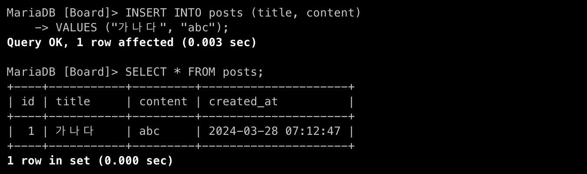

# [5주차 - Day4] 240328 정리

### 1️⃣ 게시판 데이터베이스 만들기

1.  **"board" 스키마 생성**

    ```SQL
    CREATE DATABASE Board;  // 스키마 생성
    USE Board;  // 방 들어가기
    ```

    

2.  **사용자 테이블 생성**

    ```SQL
    CREATE TABLE users(
    	id INT NOT NULL AUTO_INCREMENT,
    	name VARCHAR(30) NOT NULL,
    	job VARCHAR(100),
    	birth DATE,
    	PRIMARY KEY (id)
    );
    ```

    
    

3.  **사용자 데이터 삽입**

    ```SQL
    INSERT INTO users (name, job, birth)
    VALUES ("김뫄뫄",	"회계사",	"800107");
    ```

    

    ✔️ DATE 자료형 ➡️ ”YYYY-MM-DD” 형식으로 자동으로 삽입됨

    

    ✔️ NOT NULL인 컬럼에는 꼭 데이터를 넣어주어야 함
    ✔️ NOT NULL 컬럼안에 직접 null을 넣을 수 없음

4.  **게시글 테이블 생성**

    ```SQL
    CREATE TABLE posts(
    	id INT NOT NULL AUTO_INCREMENT,
    	title VARCHAR(100) NOT NULL,
    	content VARCHAR(2000),
    	created_at TIMESTAMP DEFAULT NOW(),
    	PRIMARY KEY (id)
    );
    ```

    

5.  **게시글 데이터 삽입**

    ```SQL
    INSERT INTO posts (title, content)
    VALUES ("가나다", "abc");
    ```

    

6.  **게시글 테이블 수정 (수정일자 추가)**

    ```SQL
    ALTER TABLE posts
    ADD COLUMN updated_at DATETIME
    DEFAULT NOW()
    ON UPDATE NOW();
    ```

    
    

    ✔️ 생성직후의 updated_at은 created_at과 동일한 시간으로 나타남

7.  **게시글 테이블 수정 (id=2인 row 수정)**

    ```SQL
    UPDATE posts
    SET content="updated"
    WHERE id=2;
    ```

    
    ✔️ id=2인 행을 업데이트했더니 updated_at컬럼이 수정된 일자로 변경됨

8.  **게시글 테이블 수정 (작성자 컬럼에 FK 추가하기)**
    ✔️ user_id 컬럼을 먼저 추가해야함

    ```SQL
    ALTER TABLE posts
    ADD COLUMN user_id INT;
    ```

    ```SQL
    ALTER TABLE posts
    ADD FOREIGN KEY (user_id)
    REFERENCES users (id);
    ```

    
    

    ✔️ user_id의 Key가 MUL로 표시 (여러행이 같은 값을 가질 수 있음 → 중복허용)
    
    ✔️ 존재하지 않는 users의 id를 입력하면 참조할 수 없다는 에러가 뜸
    
    ✔️ 참조할 수 있는 user_id=3을 삽입해주면 에러없이 잘 작동됨

    ✅ 에러가 나면서 실패가 되어도 id가 increase되었기 때문에 3→5가 됨

    ✅ auto_increment_lock_mode를 때문

    1. 0일 때 (traditional)

       모든 insert에 대해 auto_lock 사용. insert 결과를 예측하여 인덱스의 순서를 보장하기 위해 모든 구문마다 lock을 걸어 검사

    2. 1일 때 (consecutive) → default값

       프로세스 단위로 lock이 걸림

    3. 2일 때 (interleaved)

       lock사용하지 않음

9.  ⭐️**조인(JOIN)**

    ```SQL
    SELECT * FROM posts
    LEFT JOIN users
    ON posts.user_id = users.id;
    ```

    
    ✔️ 원하는 컬럼만 골라서 조인하기

    ```SQL
    SELECT posts.id, title, content, created_at, updated_at, name, job, birth
    FROM posts
    LEFT JOIN users
    ON posts.user_id = users.id;
    ```

    

### 2️⃣ MySQL 날짜/시간 타입

- **DATE** : 날짜만 포함 ➡️ ”YYYY-MM-DD” (1000-01-01~9999-12-31)
- **DATETIME** : 날짜 + 시간 ➡️ ”YYYY-MM-DD HH:MM:SS” (24시간)
- **TIME** : 시간 ➡️ ”HH:MM:SS”
- **TIMESTAMP** : 날짜 + 시간 (자동입력) ➡️ ”YYYY-MM-DD HH:MM:SS” (24시간)시스템 시간대 정보에 맞게 데이터 저장됨 (UTC로 변환)
  - default → current_timestamp()
  - UTC(국제표준시) : 한국시간 - 9

### 3️⃣ NOT NULL vs DEFAULT

- **NOT NULL** : 데이터를 무조건 넣어야함 (null이라는 데이터 제외)
- **DEFAULT** : 어떤 값을 입력하지 않을 때, 기본값으로 설정되는 것 (null을 입력하면 null로 세팅됨)
