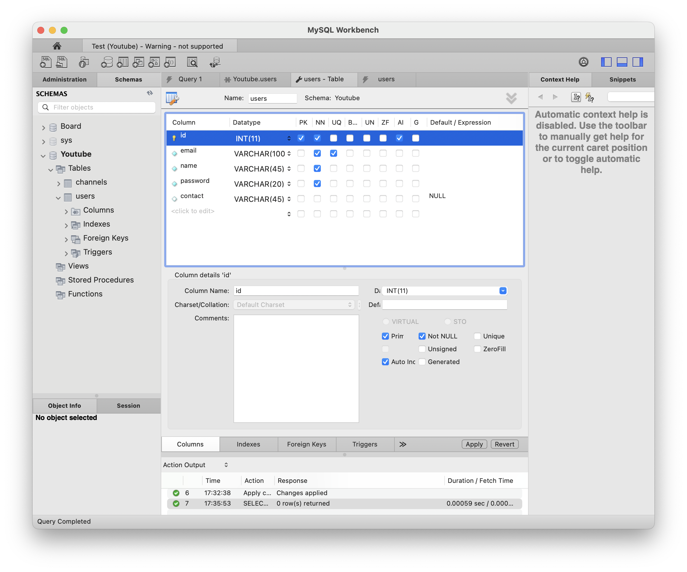
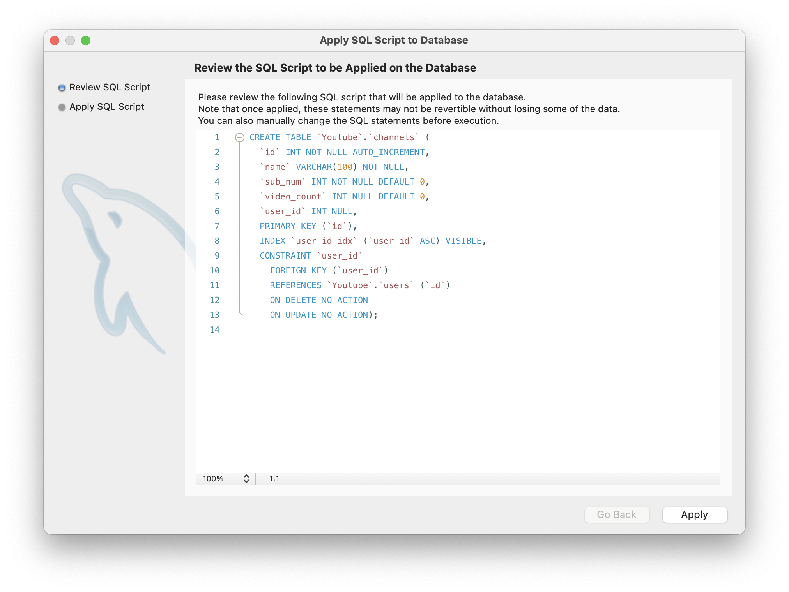

# [5주차 - Day5] 240329 정리

### 1️⃣ MySQL Workbench 접속

- **Hostname** : 데이터베이스가 설치되어 있는 컴퓨터
  
  GUI로 쉽게 결과를 수정할 수 있다.

### 2️⃣ Youtube 스키마 생성

**채널 (분리)**

| 채널 번호 | 채널명      | 구독자 수 | 영상 수 | 회원 id |
| --------- | ----------- | --------- | ------- | ------- |
| 1         | 짱구채널    | 1         | 5       | 1       |
| 2         | 철수채널    | 20        | 50      | 2       |
| 3         | 훈이채널    | 500       | 200     | 3       |
| 4         | 철수의 하루 | 1000      | 600     | 2       |
| 5         | 유리채널    | 1000000   | 900     | 4       |

**사용자 (분리)**

| 회원 id | 이메일         | 이름 | 비밀번호 | 연락처        |
| ------- | -------------- | ---- | -------- | ------------- |
| 1       | jjang@mail.com | 짱구 | 1111     | 010-1234-5678 |
| 2       | chul@mail.com  | 철수 | 2222     | 010-5678-1234 |
| 3       | hoon@mail.com  | 훈이 | 3333     | 010-9876-5432 |
| 4       | yuri@mail.com  | 유리 | 5555     | 010-5432-9876 |

### 3️⃣ users 테이블 생성



apply를 적용하면 알맞는 SQL문으로 보여줌


### 4️⃣ channels 테이블 생성




- CONSTRAINT: 제약조건 이름
- auto_increment는 DB에 맡기는 것이 좋음
  

- 구독자수, 영상개수는 디폴트 값으로 세팅됨
  

### 5️⃣ DB 연동하기

```javascript
// db-demo.js
// get the client
const mysql = require("mysql2");

// create the connection to database
const connection = mysql.createConnection({
  host: "127.0.0.1",
  port: "13306",
  user: "root",
  password: "root",
  database: "Youtube",
});

// simple query
connection.query("SELECT * FROM `users`", function (err, results, fields) {
  console.log(results);
  console.log(fields);
});
```

(실행결과)

```shell
// results
[
  {
    id: 1,
    email: 'jjang@mail.com',
    name: 'jjanggu',
    password: '1111',
    contact: '010-1234-5678'
  },
  {
    id: 2,
    email: 'chul@mail.com',
    name: 'chulsu',
    password: '2222',
    contact: '010-5678-1234'
  },
  {
    id: 3,
    email: 'hoon@mail.com',
    name: 'hoone',
    password: '3333',
    contact: '010-9876-5432'
  },
  {
    id: 4,
    email: 'yuri@mail.com',
    name: 'yuri',
    password: '4444',
    contact: '010-5432-9876'
  },
  {
    id: 6,
    email: 'test@mail.com',
    name: 'tester',
    password: '5555',
    contact: null
  }
]

// fields
[
  `id` INT NOT NULL PRIMARY KEY AUTO_INCREMENT,
  `email` VARCHAR(100) NOT NULL UNIQUE_KEY,
  `name` VARCHAR(45) NOT NULL,
  `password` VARCHAR(20) NOT NULL,
  `contact` VARCHAR(45)
]
```

- 비구조화해서 출력해보기

  ```javascript
  connection.query("SELECT * FROM `users`", function (err, results, fields) {
    let { id, email, name } = results[0];

    console.log(id);
    console.log(email);
    console.log(name);
  });
  ```

  

- users에 created_at 컬럼 추가
  
  

### 6️⃣ timezone 설정

```SQL
SET GLOBAL time_zone = 'Asia/Seoul';
SET time_zone=’Asia/Seoul’;
```

```javascript
const connection = mysql.createConnection({
  host: "127.0.0.1",
  port: "13306",
  user: "root",
  password: "root",
  timezone: "Asia/Seoul",
  database: "Youtube",
});
```


### 7️⃣ datastring 사용

```javascript
const connection = mysql.createConnection({
  host: "127.0.0.1",
  port: "13306",
  user: "root",
  password: "root",
  //   timezone: "Asia/Seoul",
  database: "Youtube",
  dateStrings: true,
});
```

(출력결과)

