# [6주차 - Day1] 240401 정리

### 1️⃣ DB 모듈화

```javascript
module.exports = connection;
```

```javascript
const conn = require("../mariadb");
```

connection을 모듈화한 다음, 외부 파일에서 가져와 사용하고 app.js를 작동하면 콘솔창에 다음과 같은 출력이 찍히는 것을 볼 수 있다.
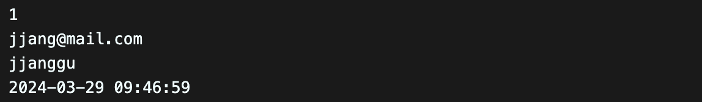

### 2️⃣ 회원 개별 조회 DB 연동

`?`로 쿼리를 날려주고 다음 파라미터에 email 변수를 values값으로 넣어줌

```javascript
let { email } = req.body;

conn.query(
  `SELECT * FROM users WHERE email = ?`,
  email,
  function (err, results, fields) {
    if (results.length) {
      res.status(200).json(results);
      return;
    }
    // 값이 없으면
    res.status(404).json({
      message: `회원 정보가 없습니다.`,
    });
  }
);
```

json array 형태로 반환이 된다.
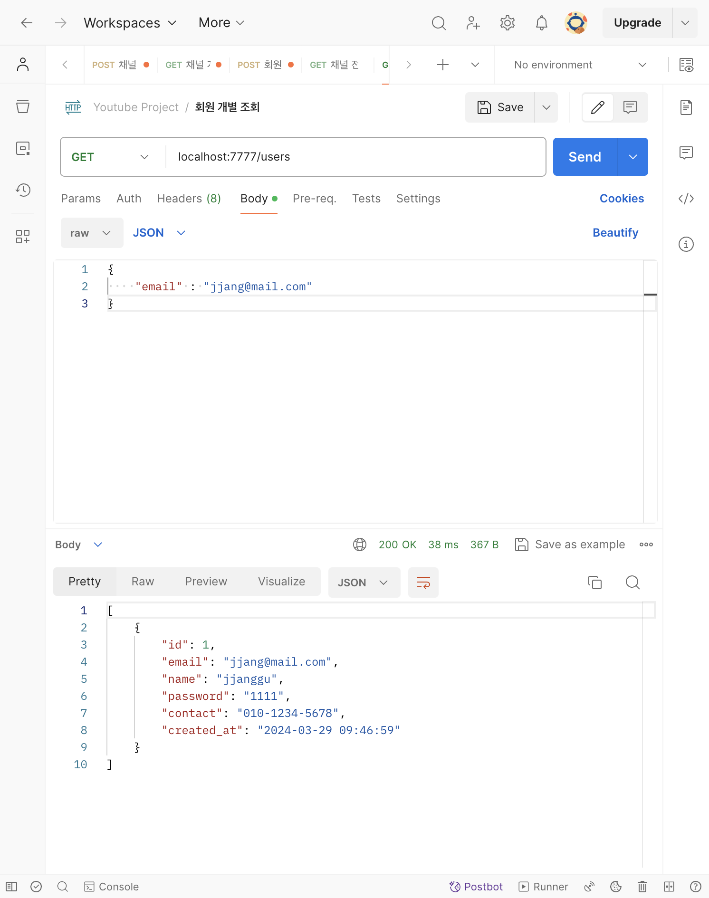

### 3️⃣ 회원 가입 DB 연동

```javascript
if (req.body == {}) {
  res.status(400).json({
    message: `입력값을 다시 확인해주세요.`,
  });

  return;
}

const { email, name, password, contact } = req.body;

conn.query(
  "INSERT INTO users (email, name, password, contact) VALUES (?, ?, ?, ?)",
  [email, name, password, contact],
  function (err, results, fields) {
    res.status(201).json(results);
  }
);
```

`meanggu`라는 user를 DB 안에 성공적으로 INSERT했다.
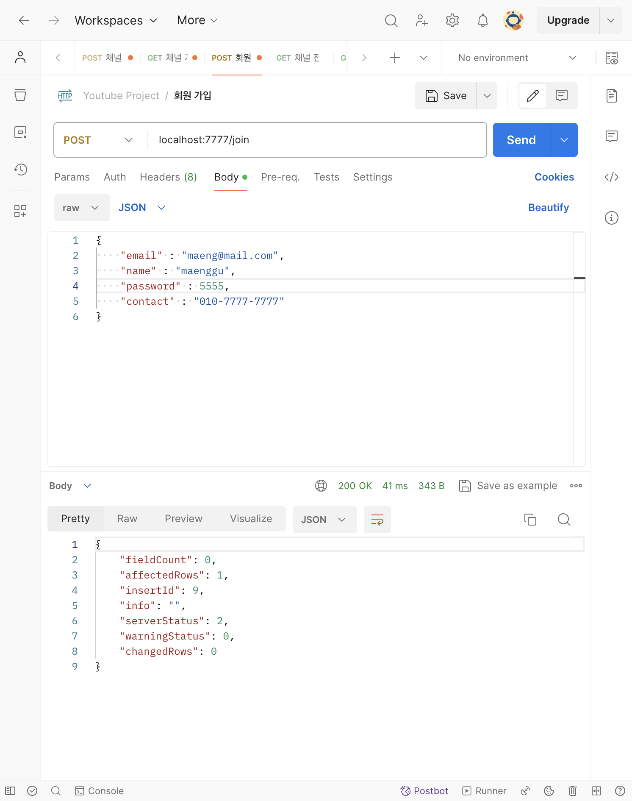

workbench에도 성공적으로 INSERT되었음을 알 수 있다.
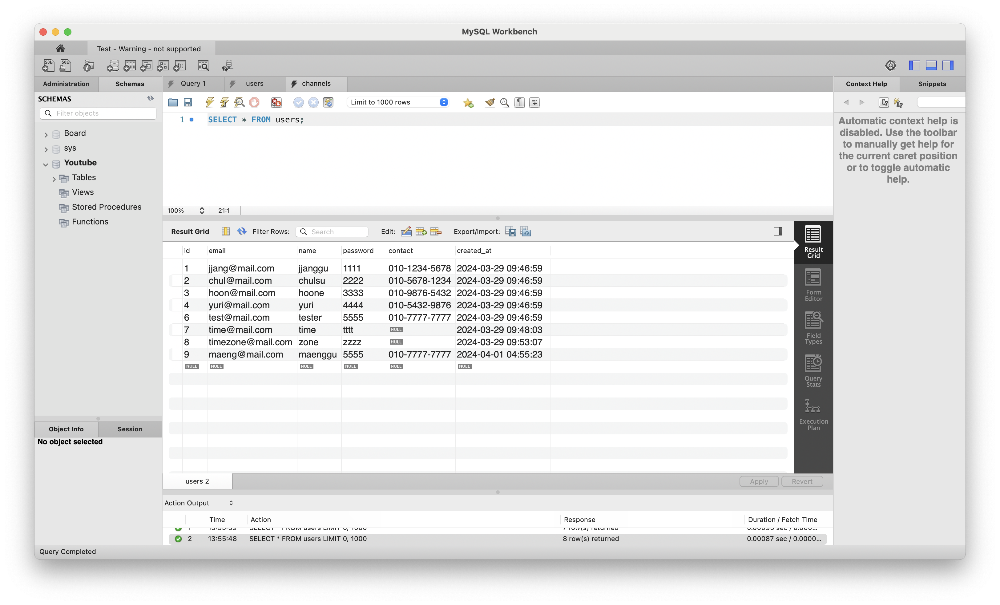

### 4️⃣ 회원 탈퇴 DB 연동

```javascript
const { email } = req.body;

conn.query(
  `DELETE FROM users WHERE email = ?`,
  email,
  function (err, results, fields) {
    res.status(200).json(results);
  }
);
```

`maeng@mail.com`을 가진 user가 성공적으로 삭제되었다.
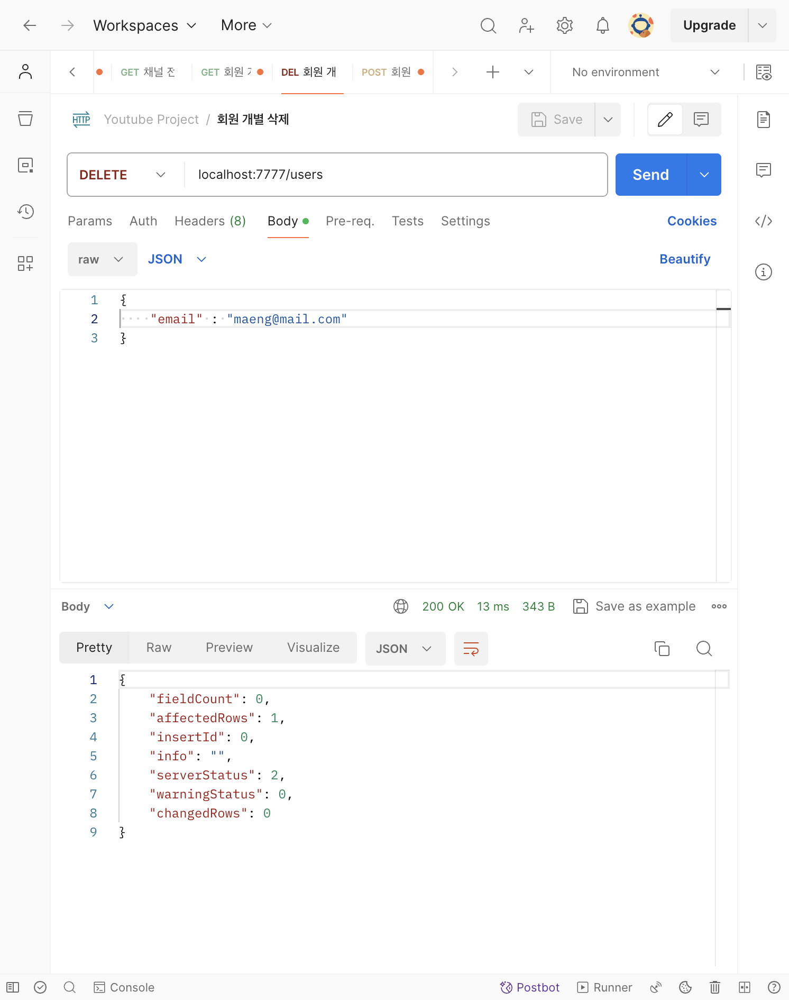

workbench에도 성공적으로 DELETE되었음을 알 수 있다.
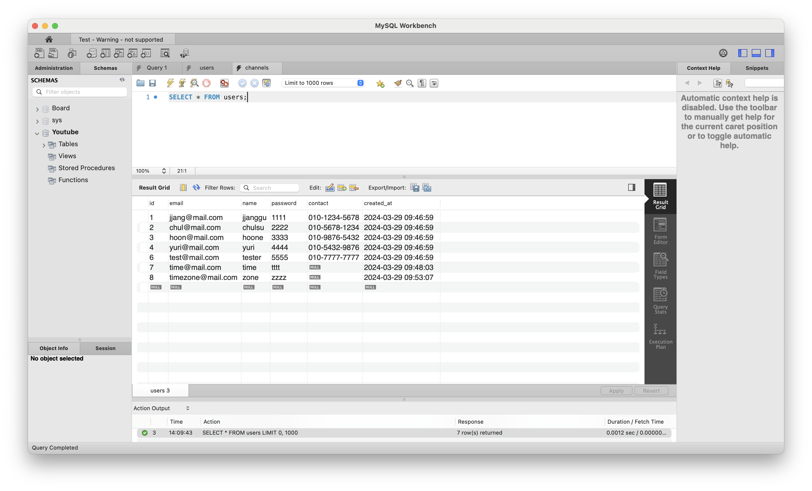

### 5️⃣ 회원 로그인 DB 연동

```javascript
const { email, password } = req.body;

conn.query(
  `SELECT * FROM users WHERE email = ?`,
  email,
  function (err, results, fields) {
    let loginUser = results[0];

    if (loginUser && loginUser.password == password) {
      res.status(200).json({
        message: `${loginUser.name}님 로그인 되었습니다.`,
      });

      return;
    }

    // loginUser가 존재하지 않는다면
    res.status(404).json({
      message: `이메일 또는 비밀번호가 틀렸습니다.`,
    });
  }
);
```

알맞은 이메일과 비밀번호를 입력하면 로그인 성공이 된다.
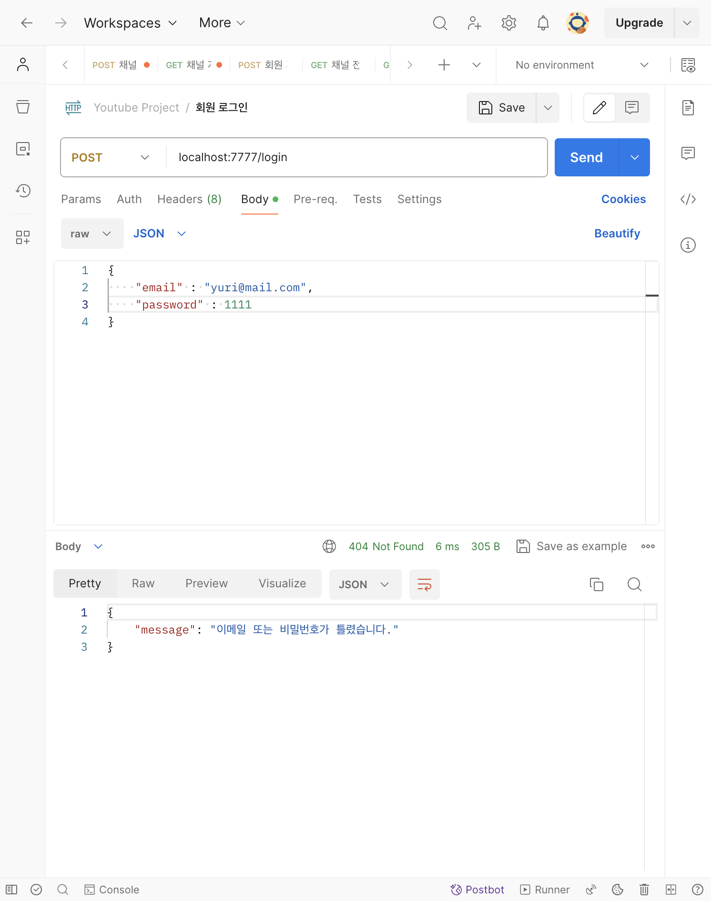

### 6️⃣ 채널 개별 조회 DB 연동

```javascript
let { id } = req.params;
id = parseInt(id);

let sql = `SELECT * FROM channels WHERE id = ?`;

conn.query(sql, id, function (err, results) {
  if (results.length) {
    res.status(200).json(results);

    return;
  }

  // 채널을 찾을 수 없음
  notFoundChannel(res);
});
```

존재하는 채널 id를 입력하면 채널 조회 성공
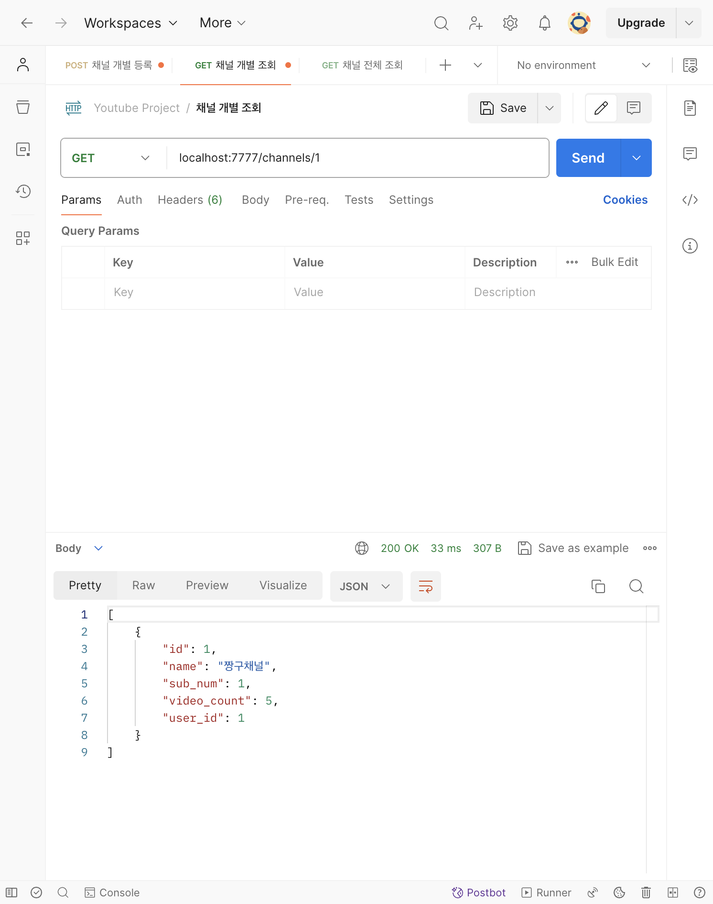

존재하지 않은 채널 id를 입력하면 채널 조회 실패
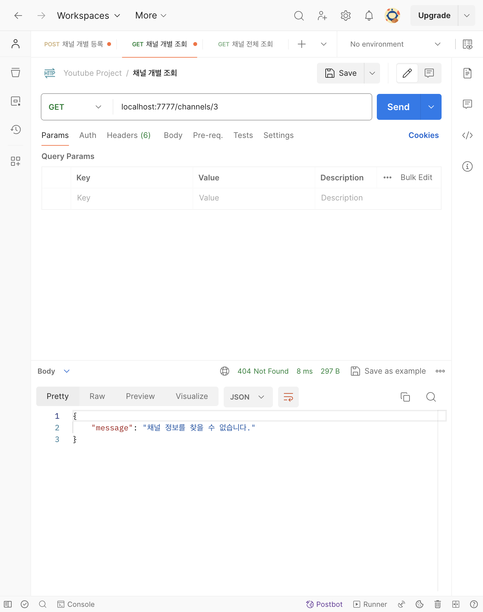

### 7️⃣ 채널 전체 조회 DB 연동

```javascript
let { userId } = req.body;

let sql = `SELECT * FROM channels WHERE user_id = ?`;

if (userId) {
  conn.query(sql, userId, function (err, results) {
    if (results.length) {
      res.status(200).json(results);

      return;
    }

    notFoundChannel(res); // 채널을 찾을 수 없음
  });

  return;
}

// body에 userId가 존재하지 않으면
res.status(400).end();
```

userId가 1인 회원의 채널을 모두 조회할 수 있다.
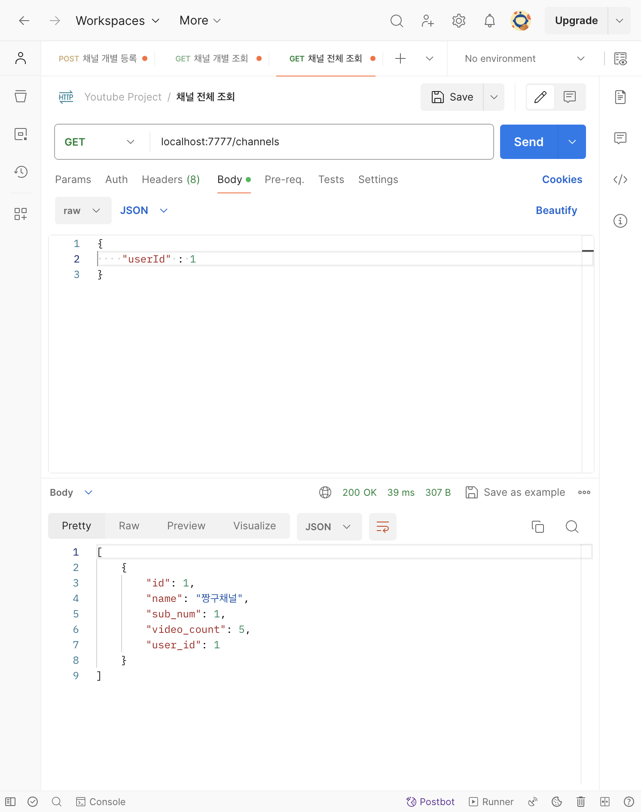

존재하지 않은 userId의 채널은 조회할 수 없다.
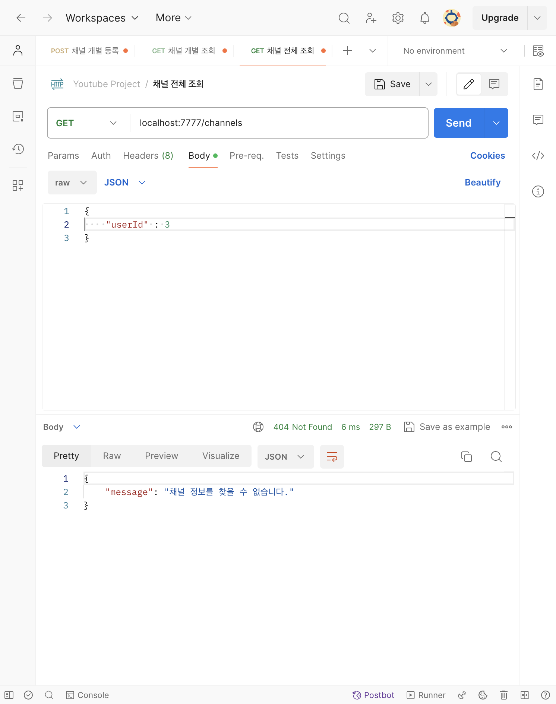

### 8️⃣ 채널 개별 등록 DB 연동

```javascript
const { name, userId } = req.body;

// name과 userId의 유효성 검사를 해주어야 함 !!

if (name && userId) {
  let sql = `INSERT INTO channels (name, user_id) VALUES (?, ?)`;
  let values = [name, userId];

  conn.query(sql, values, function (err, results) {
    res.status(201).json(results);
  });

  return;
}

// channel name이 없으면
res.status(400).json({
  message: `입력값을 다시 확인해주세요.`,
});
```

`훈이채널`이 새로 DB에 등록되었다.
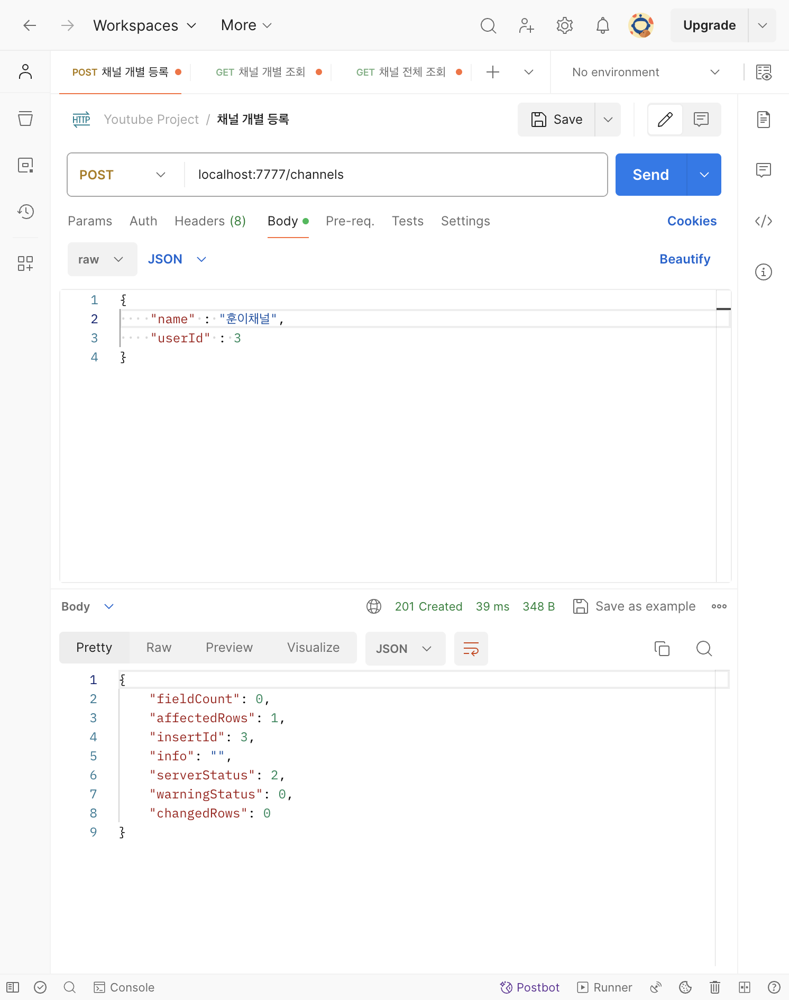

workbench에도 성공적으로 INSERT되었음을 알 수 있다.
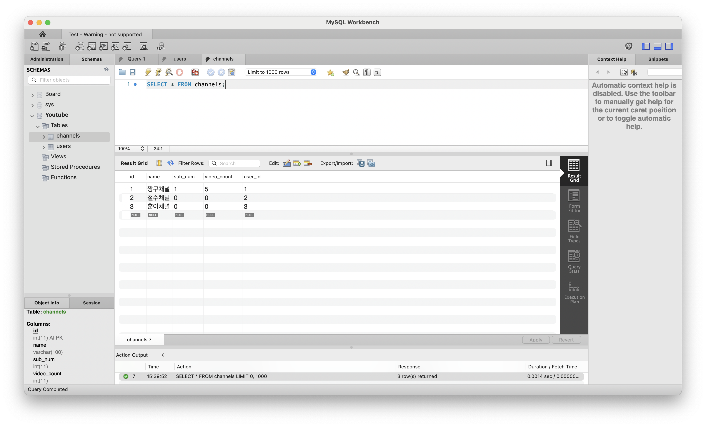
