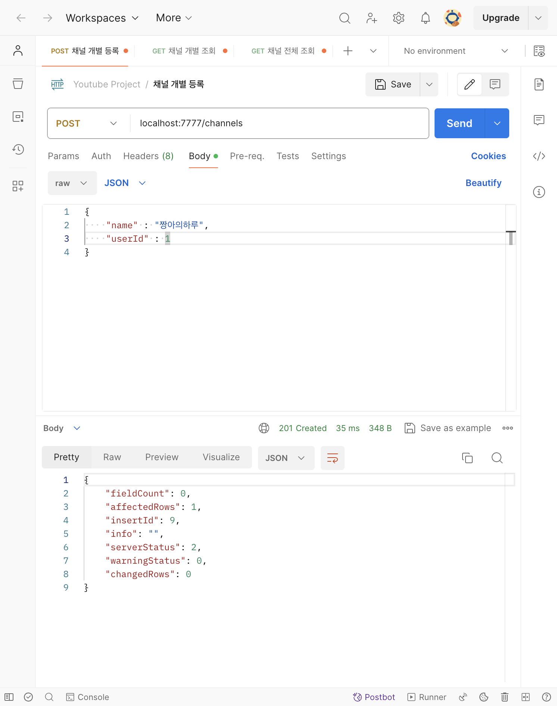
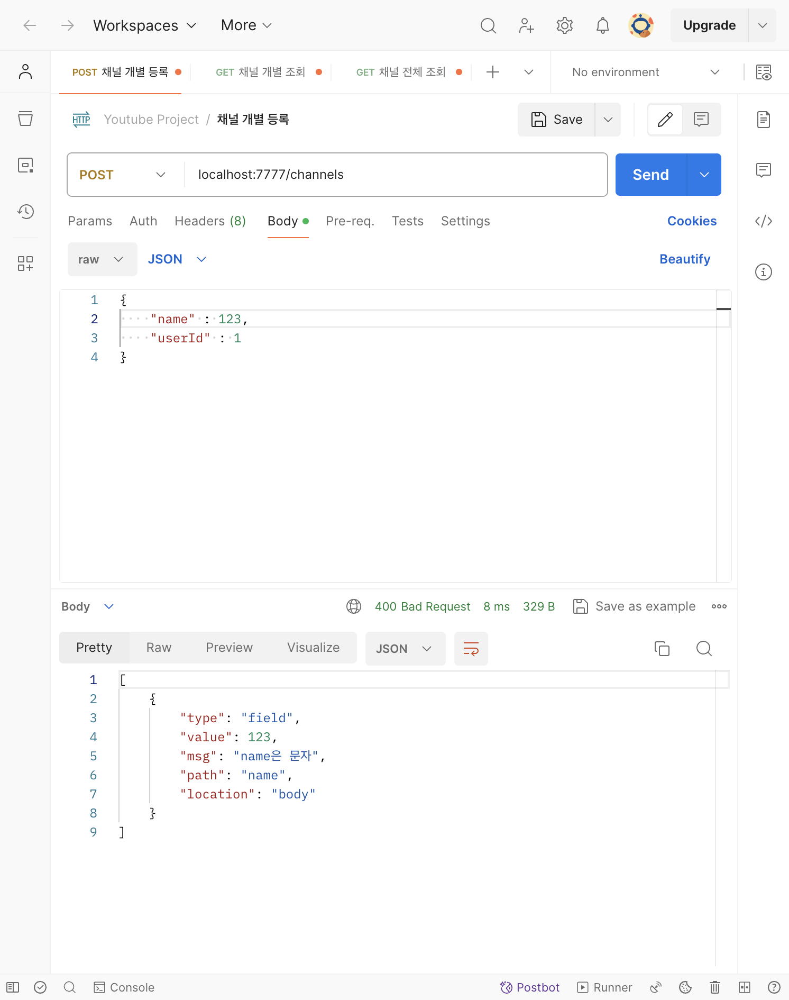
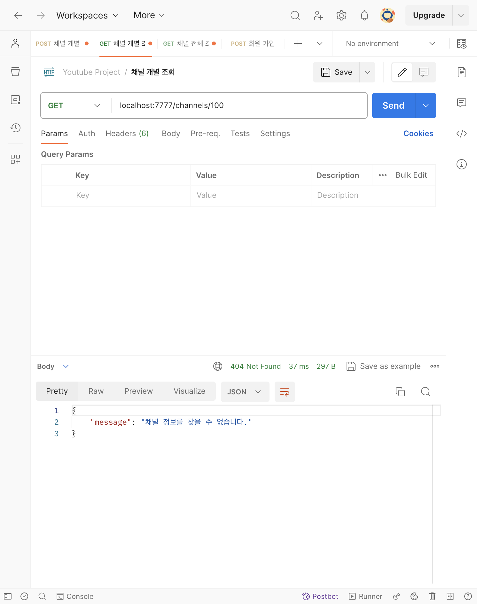
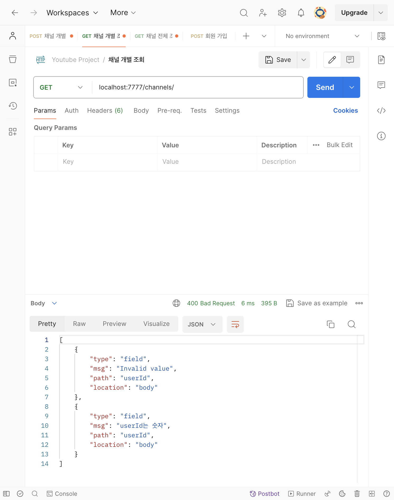
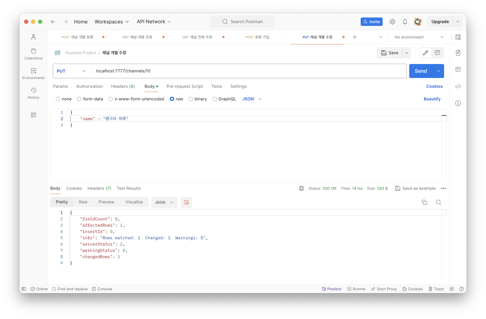
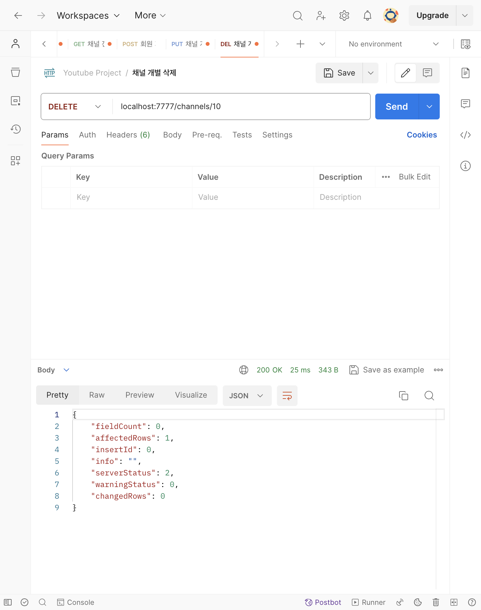
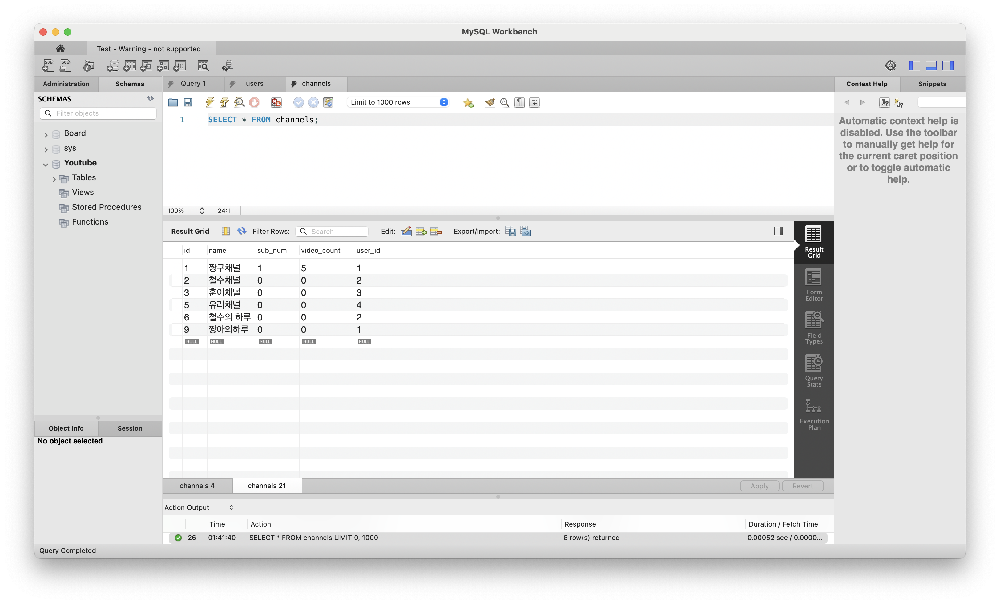

# [6주차 - Day2] 240402 정리

### 1️⃣ 유효성 검사

사용자가 입력한 값이 유효한지 검사하는 것
(예)

- **userId** : 값이 존재, 숫자로 구성
- **channel name** : 값이 존재, 문자열
- **user name** : 문자열, 2자 이상

### 2️⃣ express-validator

모듈 설치

```shell
npm install express-validator
```

설치 후에 모듈 적용하기

```javascript
const { body, validationResult } = require("express-validator");
```

### 3️⃣ 채널 개별 등록 유효성 검사

```javascript
.post(
    [
      body("userId").notEmpty().isInt().withMessage("userId는 숫자"),
      body("name").isEmpty().isString().withMessage("name은 문자"),
    ],
    (req, res) => {
      // name과 userId의 유효성 검사를 해주어야 함
      const err = validationResult(req);

      if (!err.isEmpty()) {
        console.log(err.array());
      }

      ...
 });
```

(실행결과) 정상적으로 입력했을 때


(실행결과) 잘못된 값을 입력했을 때 name은 문자열을 사용하라는 err배열이 출력된다.


### 4️⃣ 채널 전체 조회 유효성 검사

```javascript
.get(
    body("userId").notEmpty().isInt().withMessage("userId는 숫자"),
    (req, res) => {
      const err = validationResult(req);

      if (!err.isEmpty()) {
        return res.status(400).json(err.array());
      }

        // 유효성 검사 통과 후 코드 ....
  })
```

### 5️⃣ 채널 개별 조회 유효성 검사

```javascript
.get(param("id").notEmpty().withMessage("채널 id"), (req, res) => {
});
```

(실행결과) 존재하지 않는 id를 url에 입력했을 때


(실행결과) id를 url에 넣지 않았을 때


### 6️⃣ 채널 개별 수정 유효성 검사

```javascript
[
  param("id").notEmpty().withMessage("채널 id"),
  body("name").notEmpty().isString().withMessage("채널이름 에러"),
];
```

(실행결과) `맹구채널`을 `맹구의 하루`로 성공적으로 변경되었고, workbench에도 반영되었다.



### 7️⃣ 채널 개별 삭제 유효성 검사

```javascript
.delete(param("id").notEmpty().withMessage("채널 id"), (req, res) => {
    const err = validationResult(req);
    // id 유효성 검사
    if (!err.isEmpty()) {
      return res.status(400).json(err.array());
    }

    let { id } = req.params;
    id = parseInt(id);

    let sql = `DELETE FROM channels WHERE id = ?`;

    // ...
});
```

(실행결과) id=10인 `맹구의 하루` 채널을 성공적으로 삭제했고 workbench에도 반영되었다.



### 8️⃣ 유효성 검사 미들웨어 분리

```javascript
const checkValid = (req, res) => {
  const err = validationResult(req);

  if (!err.isEmpty()) {
    return res.status(400).json(err.array());
  }
};
```

콜백함수를 부르기 전에 유효성 검사를 먼저 하도록 같이 담아준다.

```javascript
[
  body("userId").notEmpty().isInt().withMessage("userId는 숫자"),
  checkValid,
],
```

❗️이렇게 하면 다음 response가 오지 않는 문제 발생 ➡️ 내일 해결해보자.
