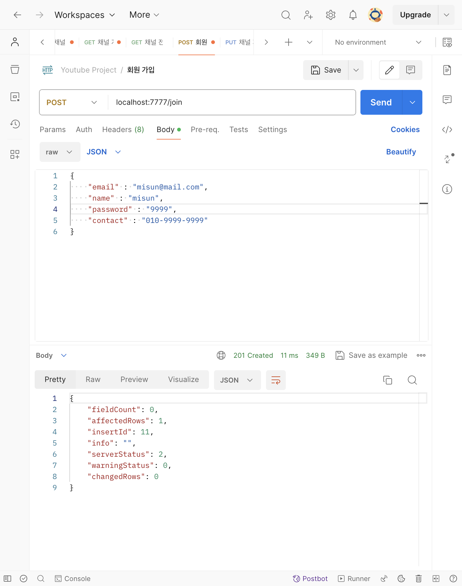
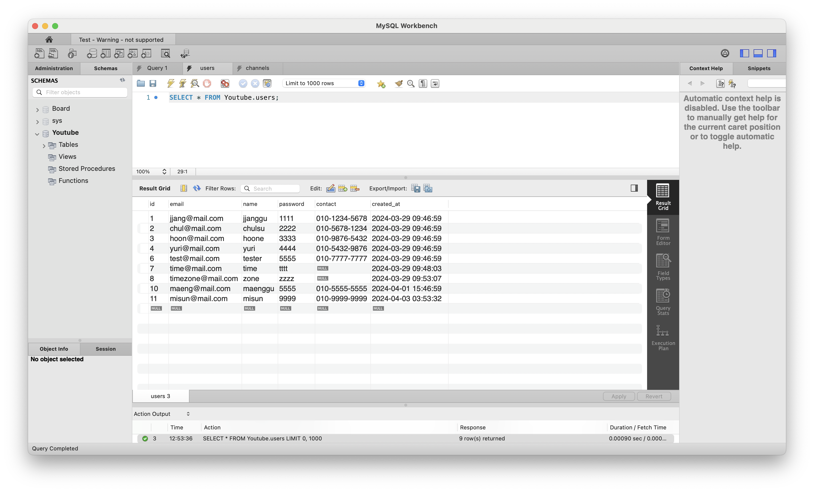
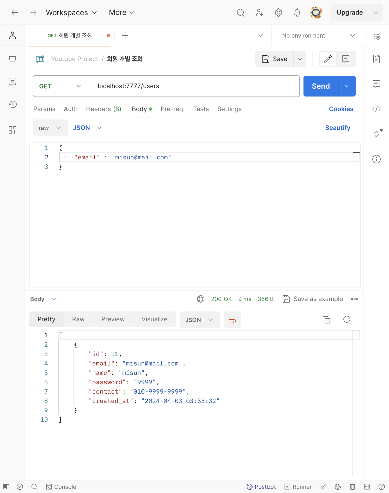
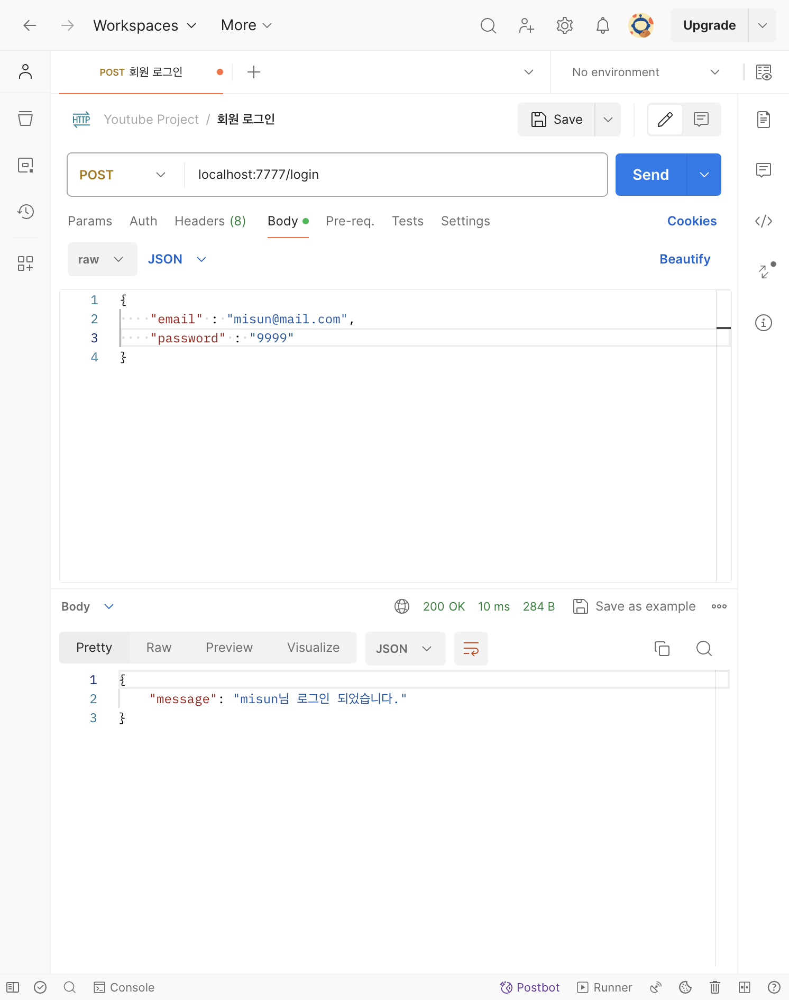
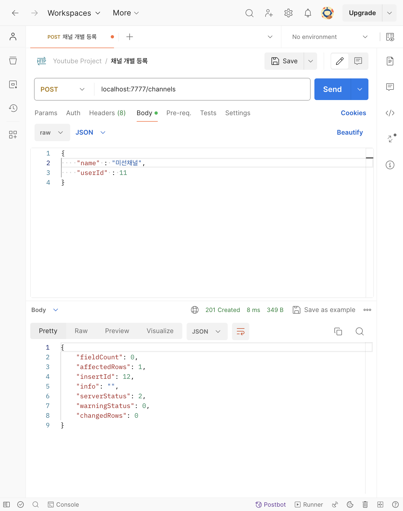
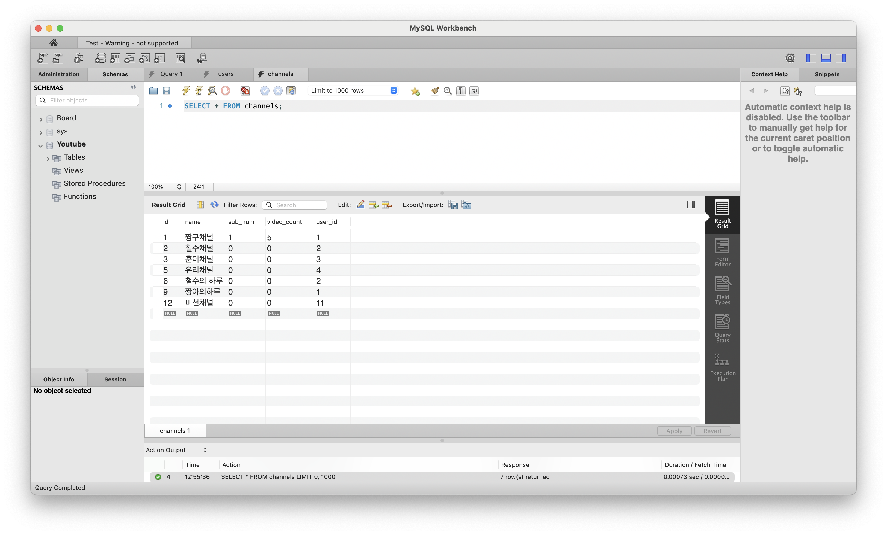
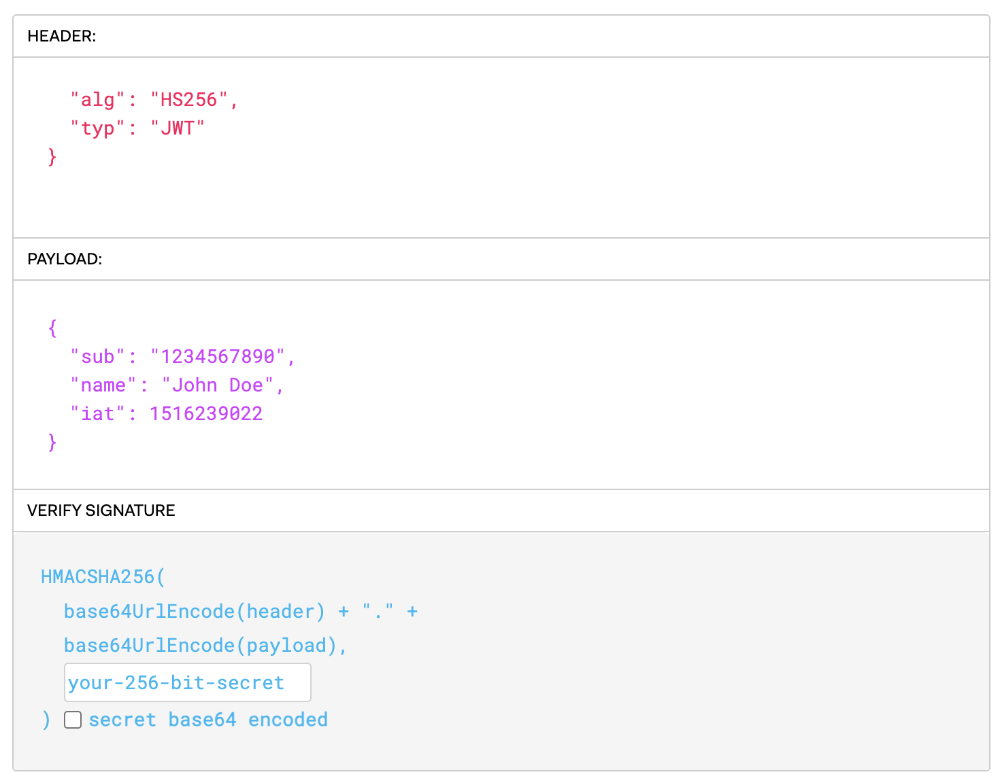
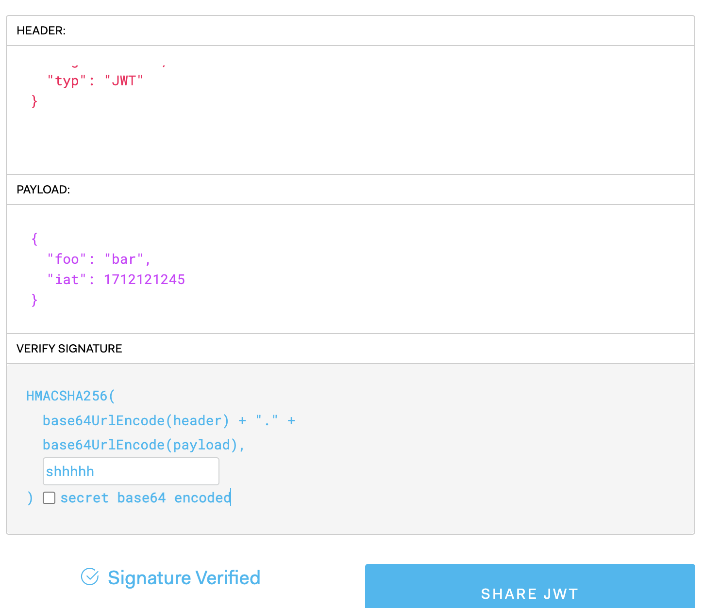
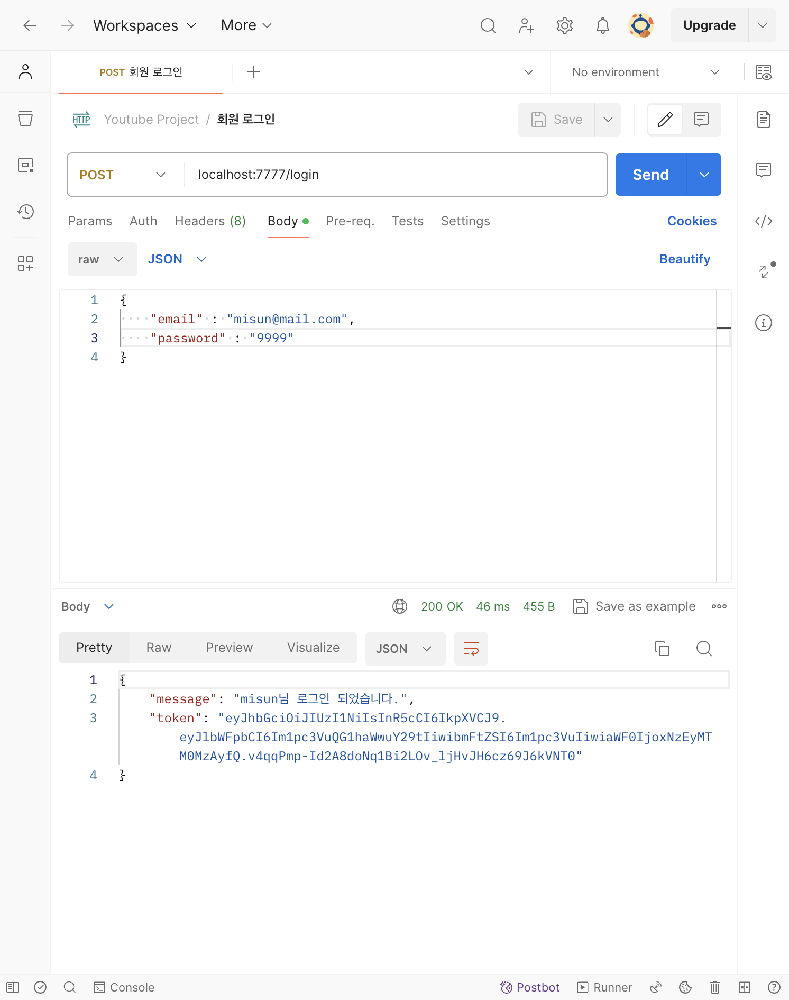

# [6주차 - Day3] 240403 정리

### 1️⃣ next()

함수를 모듈화하기

```javascript
const checkValid = (req, res, next) => {
  const err = validationResult(req);

  if (!err.isEmpty()) {
    return res.status(400).json(err.array());
  }

  // 에러가 발생하지 않으면 다음 콜백함수로 가라
  return next();
};
```

라우터에 적용하기

```javascript
[
  body("userId").notEmpty().isInt().withMessage("userId는 숫자"),
  checkValid,
],
(req, res, next) =>
```

- 6-2 강의에서 response가 오지 않는 오류를 고칠 수 있음

### 2️⃣ 유효성 검사를 적용한 최종 결과

`misun`으로 회원가입


워크벤치에 `misun`이 뜸


`misun` 개별 조회


`misun` 회원 로그인


`misun` 채널 개별 등록


워크벤치에 등록된 채널 뜸


### 3️⃣ 인증과 인가

- 인증 (Authentication, 로그인)
  관리자든 고객이든 인증을 통해 사이트에 가입된 사용자라는 것을 증명

- 인가 (Authorization, 로그인 후 접근 권한)
  인증 후에 특정 페이지 접근 권한이 있는지 확인

### 4️⃣ 쿠키, 세션, JWT

**쿠키**: 서버와 클라이언트가 주고받는 파일

- 장점: 서버 저장공간 절약, Stateless = RESTful
- 단점: _보안 취약_ 😞

**세션**: 쿠키에 넣을 중요한 내용을 저장하고 세션 ID만 쿠키에 넣어 통신

- 장점: 보안 비교적 좋음
- 단점: 서버가 저장 → 서버의 저장 공간을 사용, Stateless❌ (상태 저장)

**JWT (JSON Web Token)**: JSON형태의 데이터를 웹에서 안전하게 전송하기 위한 토큰

⭐️ 토큰: 접근 인증용, 권한

- 장점: 보안에 강함(암호화되어 있음), HTTP특징 잘 따름 → Stateless (상태 저장❌), 서버 부담 감소 ➡️ 토큰을 발행하는 서버를 따로 만들기도 가능
- 구조: HEADER, PAYLOAD, SIGNATURE
  
  - **헤더**: 토큰(JWT)을 암호화하는 데 사용한 알고리즘
  - **페이로드**: 사용자 정보 (이름, 주소 등)
  - **서명**: 페이로드값이 바뀌면 서명값도 모두 바뀜

### 5️⃣ JWT로 인증/인가하는 절차 (예시)

1. 클라이언트가 로그인 요청 (POST /login)
   - body(username, password)에 담아 보냄
2. 서버가 존재하는 회원인지 확인 후 로그인 성공, JWT(토큰 시점) 발행
3. 이제 서버가 JWT 서명값을 확인하고 로그인 유지 ➡️ 서버가 JWT를 클라이언트로 줌
4. 클라이언트가 다른 요청을 함
   - header(+ JWT) : 인증된 사용자임을 확인하도록 함
5. 서버가 요청을 보고 자신이 해준 서명인지 확인

### 6️⃣ JWT 적용해보기

jsonwebtoken 외부 모듈 설치

```shell
npm install jsonwebtoken
```

```javascript
let jwt = require("jsonwebtoken");
let token = jwt.sign({ foo: "bar" }, "shhhhh");

console.log(token);
```



검증 (검증 성공: 페이로드 값 확인)

```javascript
let decoded = jwt.verify(token, "shhhhh");
console.log(decoded);
```

### 7️⃣ .env (environment, 환경변수 설정값)

외부에 유출되면 안되는 중요한 환경변수 값을 따로 관리하기 위한 파일

```shell
npm install dotenv
```

.env 파일은 환경변수 파일 ➡️ 프로젝트 최상위 패키지에 위치

```javascript
let dotenv = require("dotenv").config();
// 서명 = 토큰 발행
let token = jwt.sign({ foo: "bar" }, process.env.PRIVATE_KEY);
// 검증 (검증 성공: 페이로드 값 확인)
let decoded = jwt.verify(token, process.env.PRIVATE_KEY);
```

### 8️⃣ JWT - 유튜브 적용

일단은 회원 로그인할 때 정보를 token값을 body로 보내도록 함


- token이 잘 출력된 것을 볼 수 있다.
