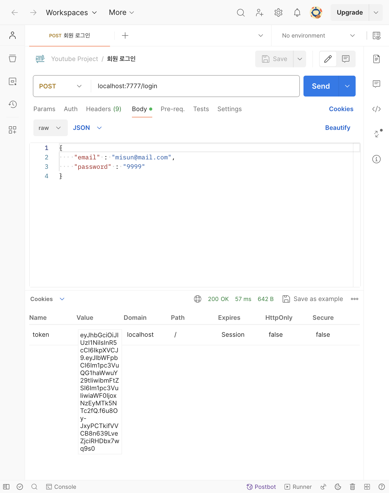
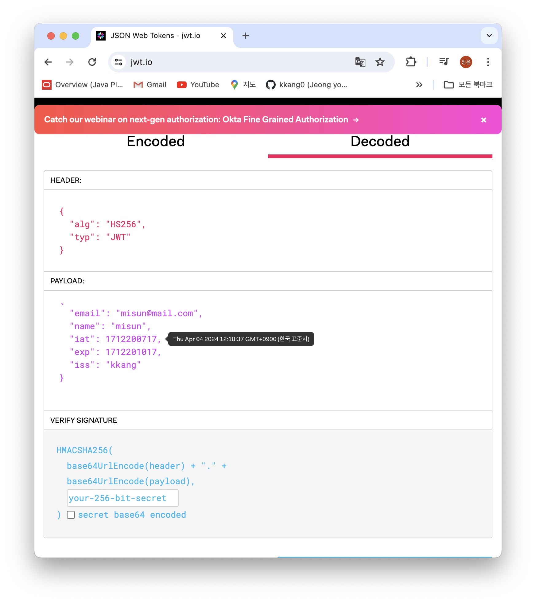

# [6주차 - Day4] 240404 정리

### 1️⃣ cookie 사용하기

```javascript
res.cookie("token", token);
```

Cookies에 토큰값이 뜨는 것을 볼 수 있다.


### 2️⃣ Status Code 403

**웹 페이지를 볼 수 있는 권한이 없습니다**

서버에서 설정해 둔 권한과 맞지 않는 접속 요청이 들어오면 접근을 거부하고 접근거부 코드를 반환

### 3️⃣ Cookies 살펴보기

- **Secure**: HTTP/ HTTPS (암호화 여부)
  - HTTP: 일반 텍스트로, 권한이 없는 당사자가 인터넷을 통해 쉽게 액세스하고 읽을 수 있다.
  - HTTPS: 모든 데이터를 암호화된 형태로 전송
- **HTTPOnly**: 클라이언트 측에서 HTTP 통신외에는 Cookie에 접근이 불가능하게 하는 것
  - 💡 XSS(Cross Site Scripting) 공격: 서버 측에서 제공되는 스크립트가 아닌 권한이 없는 사용자가 웹사이트에 스크립트를 삽입하여 의도치 않은 동작을 일으키는 공격
  - XSS공격에 대응하기 위한 방안
  ```javascript
  // 쿠키에 토큰 담아서 보내기
  res.cookie("token", token, {
    httpOnly: true,
  });
  ```
  이렇게 하면 HttpOnly: true 로 설정된다.

### 4️⃣ JWT 유효기간 설정하기

```javascript
const token = jwt.sign(
  { email: loginUser.email, name: loginUser.name },
  process.env.PRIVATE_KEY,
  {
    expiresIn: "5m", // 유효기간: 5분으로 설정
    issuer: "kkang", // 토큰 발행인 설정
  }
);
```

토큰값을 입력하면 유효기간과 발행인이 포함되어 뜬다.


✔️ 여기까지가 백엔드 심화과정!
