# [6주차 - Day5] 240405 정리

# 도서 주문 API 설계

## ✔️ 회원 API

### 1️⃣ **회원 가입**

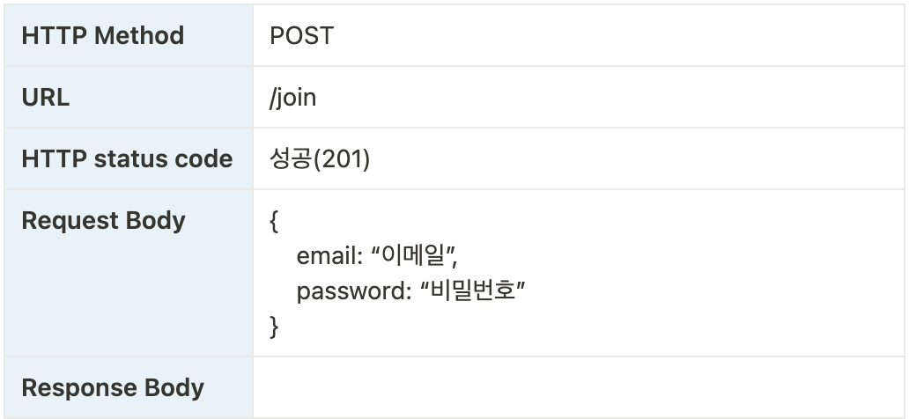

### 2️⃣ **로그인**

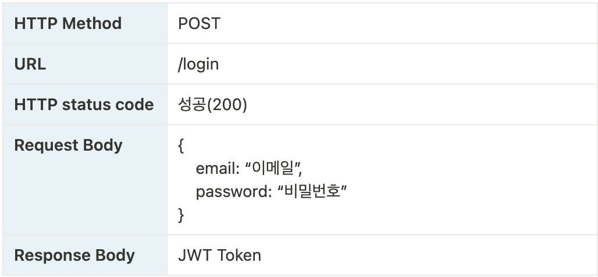

### 3️⃣ **비밀번호 초기화 요청**

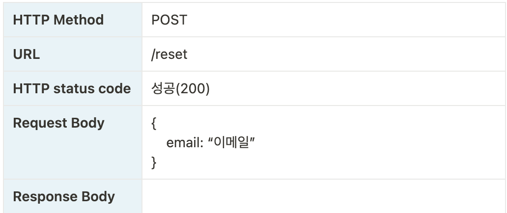

### 4️⃣ **비밀번호 초기화(수정)**

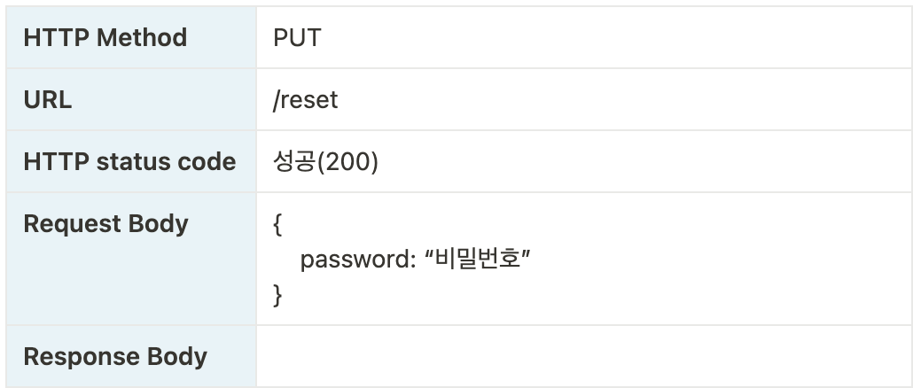

## ✔️ 도서 API

### 1️⃣ 전체 도서 조회

✅ img 경로, 페이지네이션
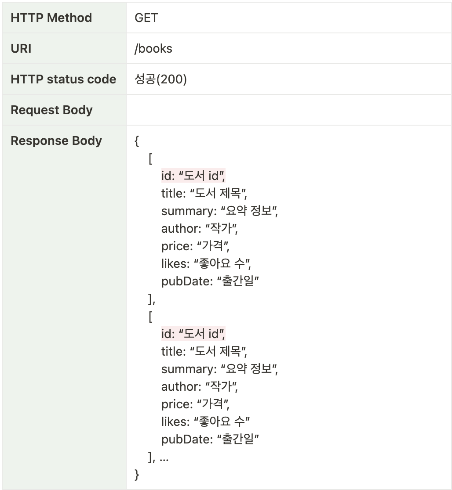

### 2️⃣ **개별 도서 조회**

✅ img 경로
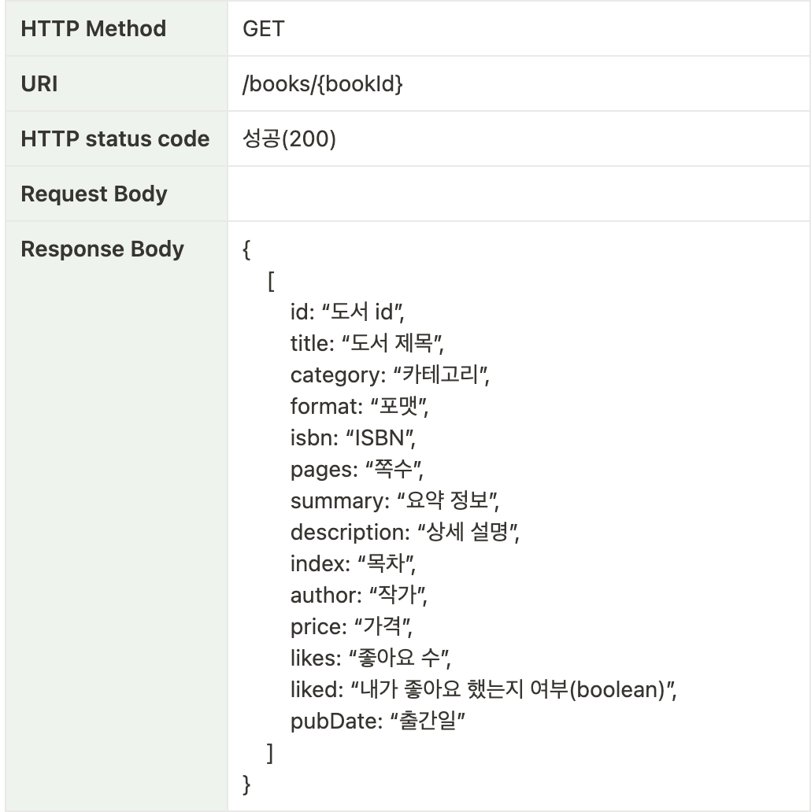

### 3️⃣ **카테고리 별 도서 조회**

✅ 도서 id
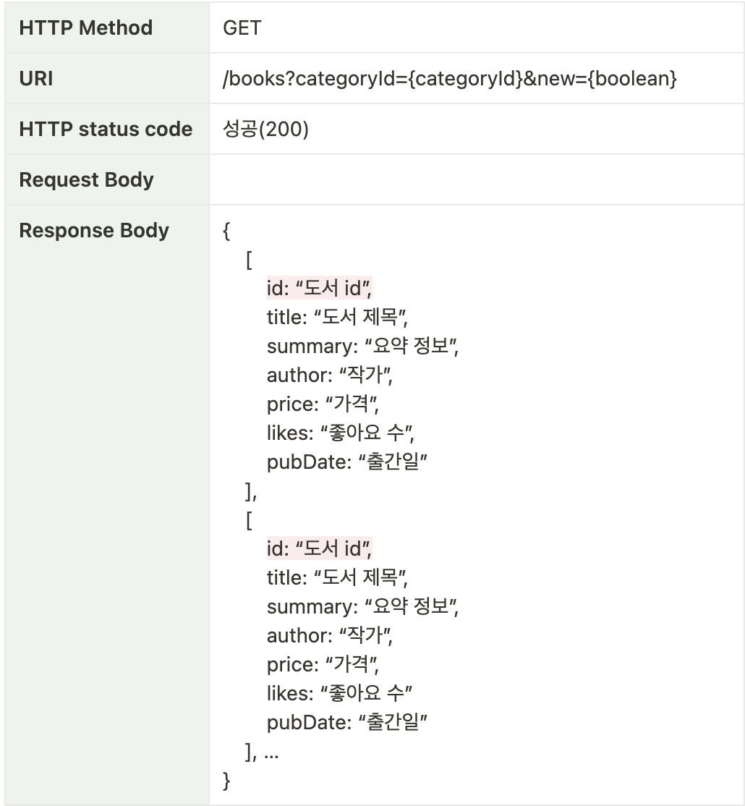

- querystring: 여러가지 값을 요청할 때 (? 사용)
- new=true면 신간 (기준: 출간일 30일 이내)

## ✔️ 장바구니 API

### 1️⃣ **장바구니 담기**

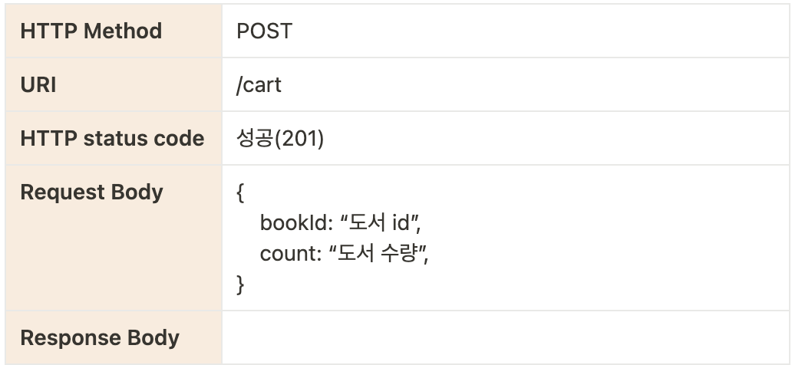

### 2️⃣ **장바구니 조회**

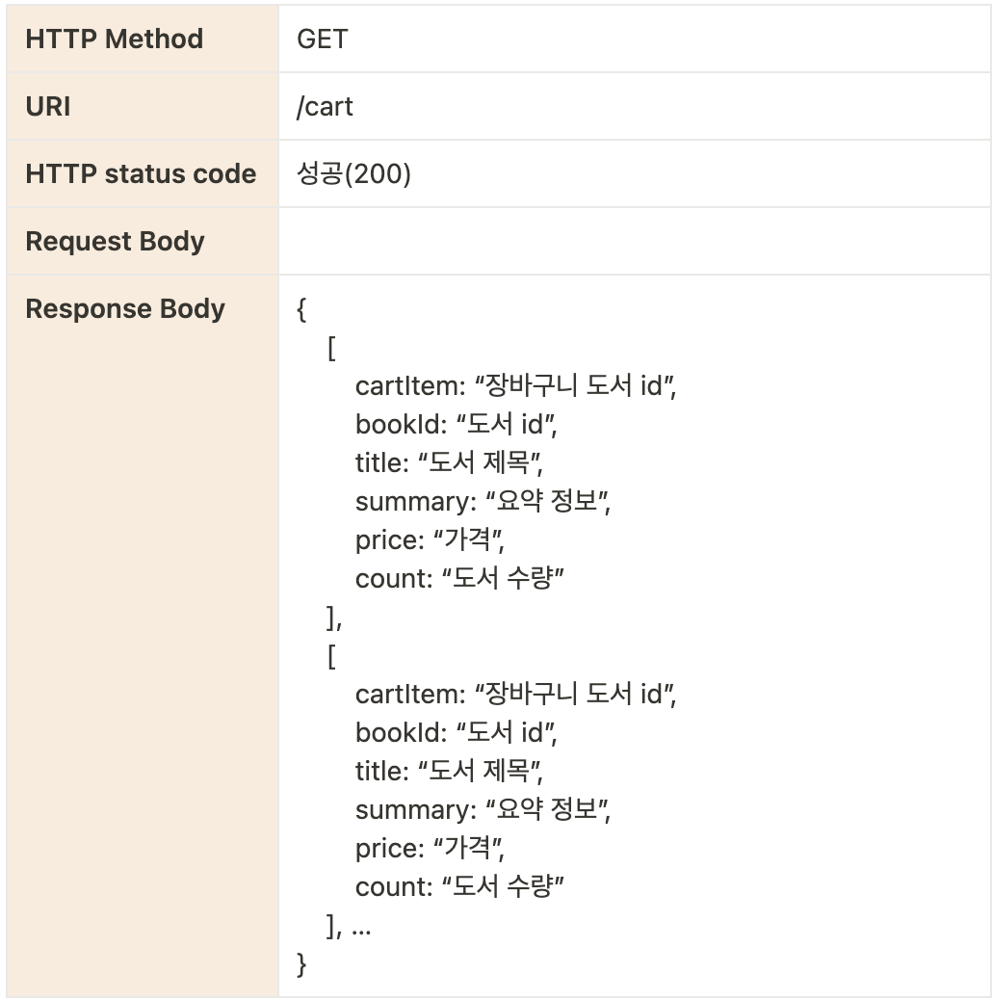

### 3️⃣ **장바구니 삭제**

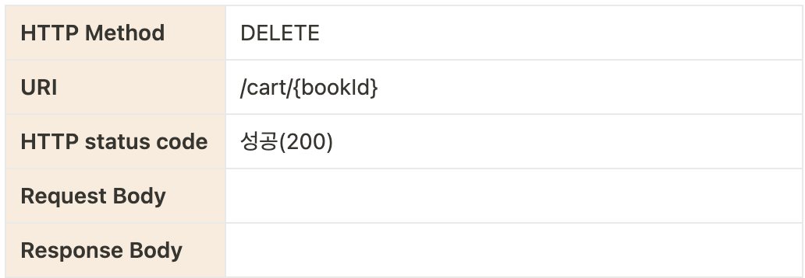

## ✔️ 주문 API

### 1️⃣ **장바구니에서 선택한 주문 상품 목록 조회**

✅ 주문 상품
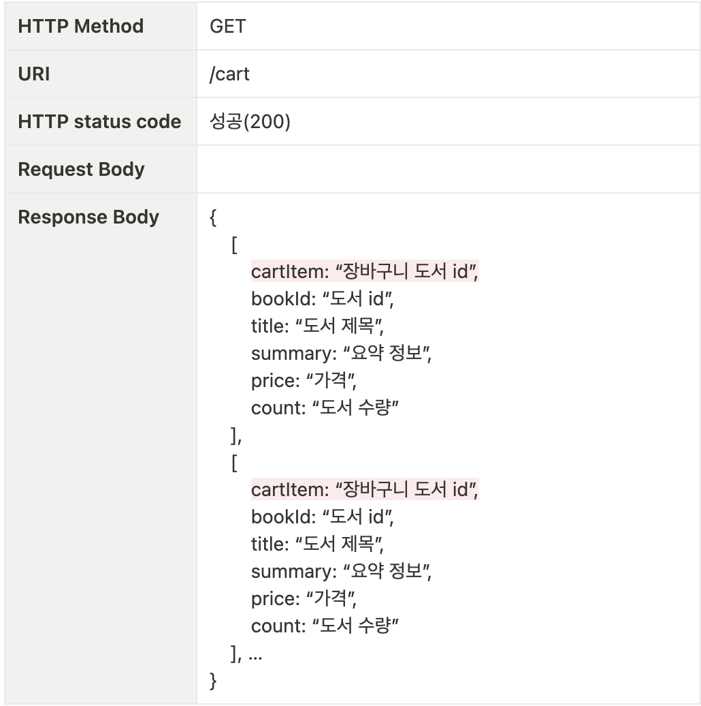
