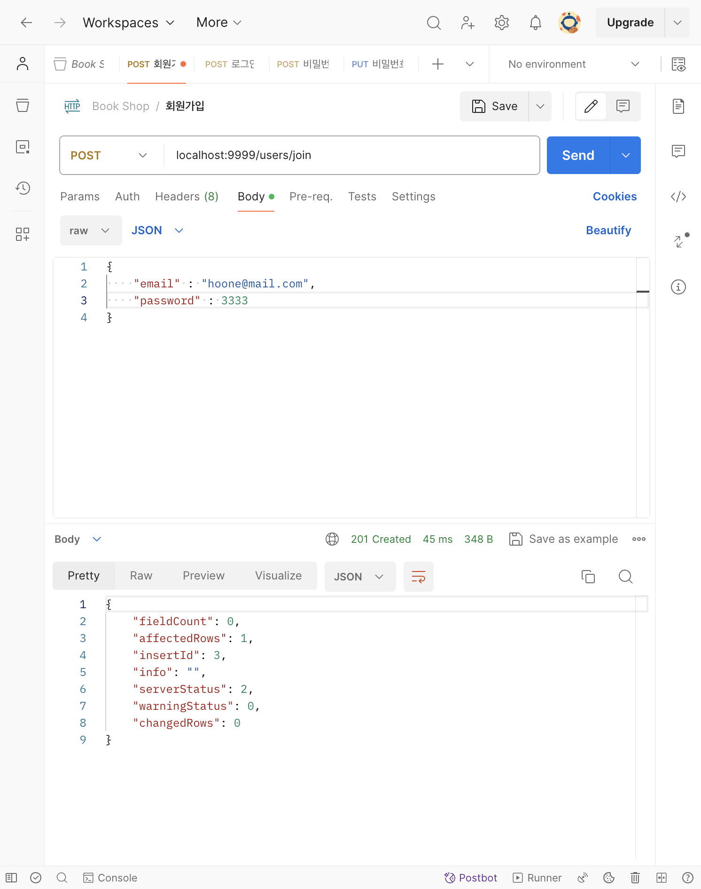
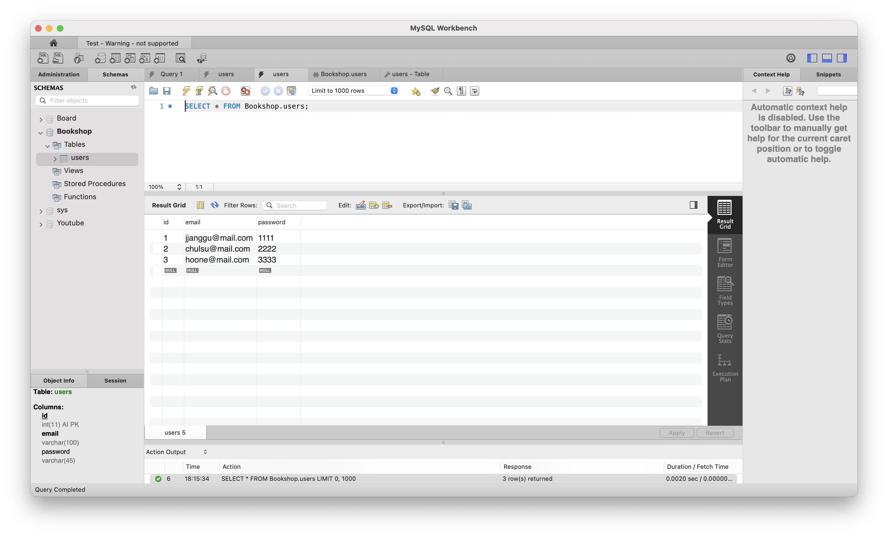
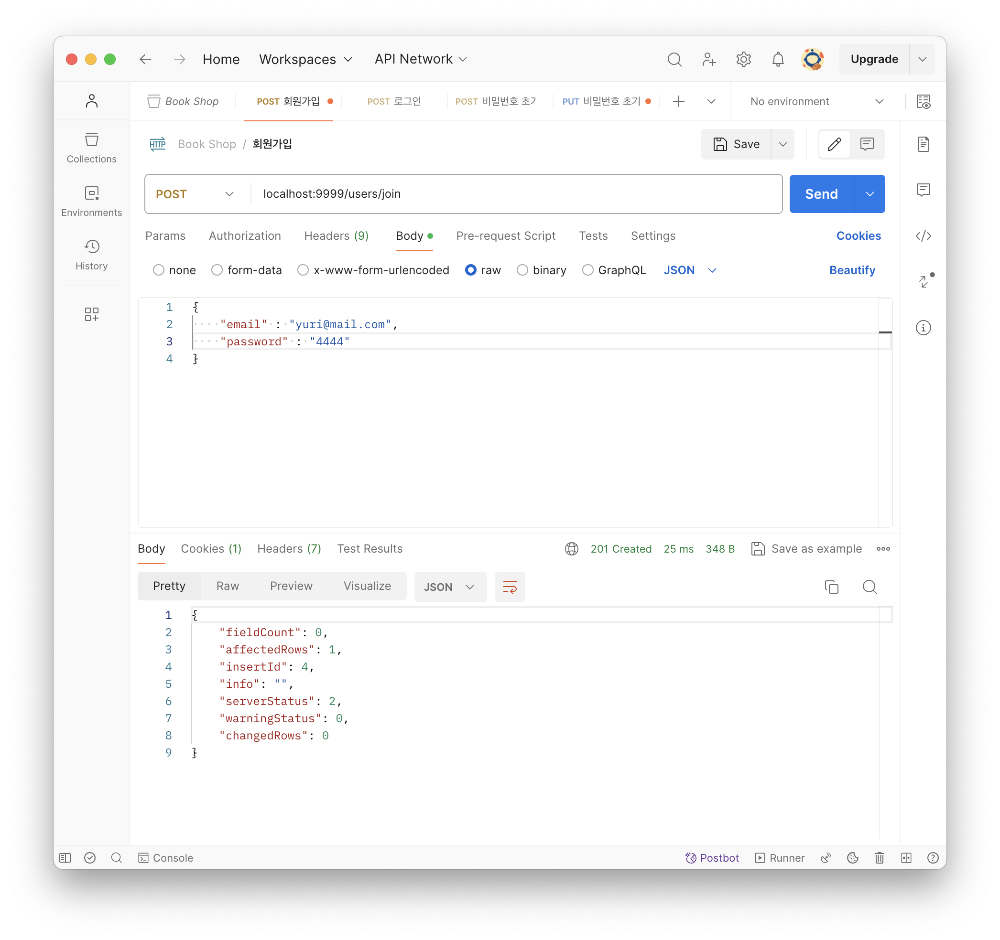
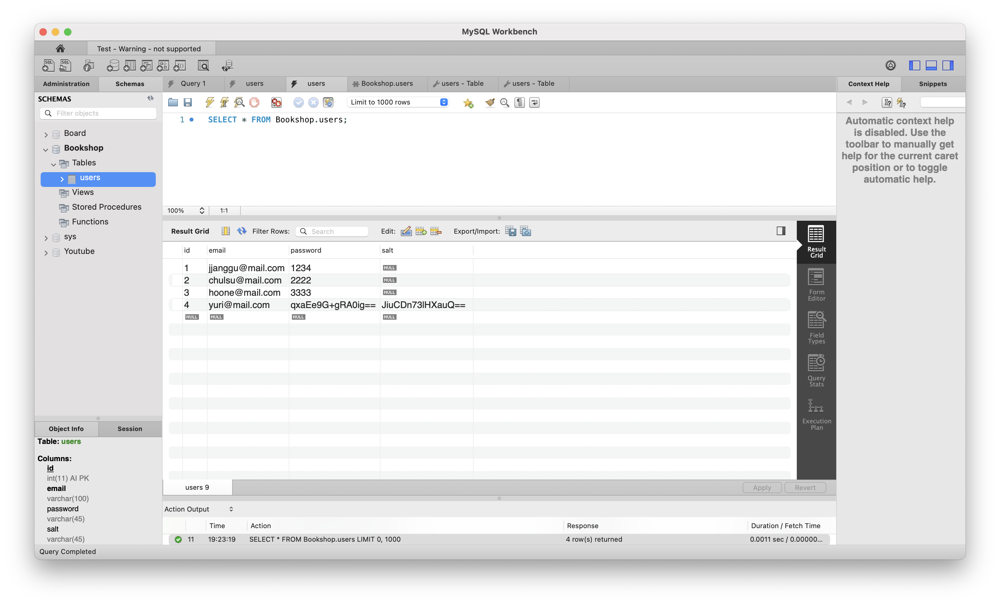
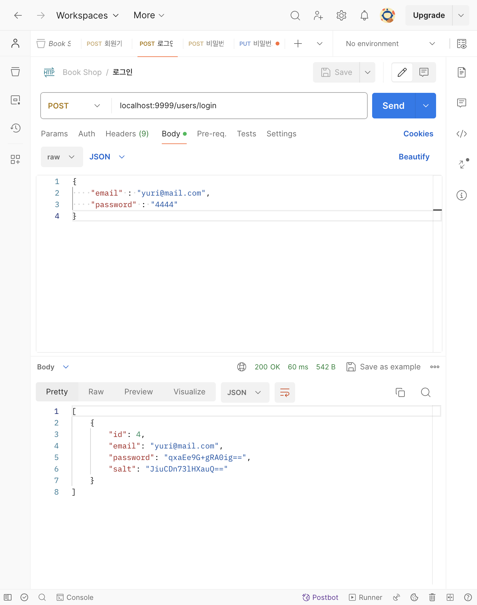
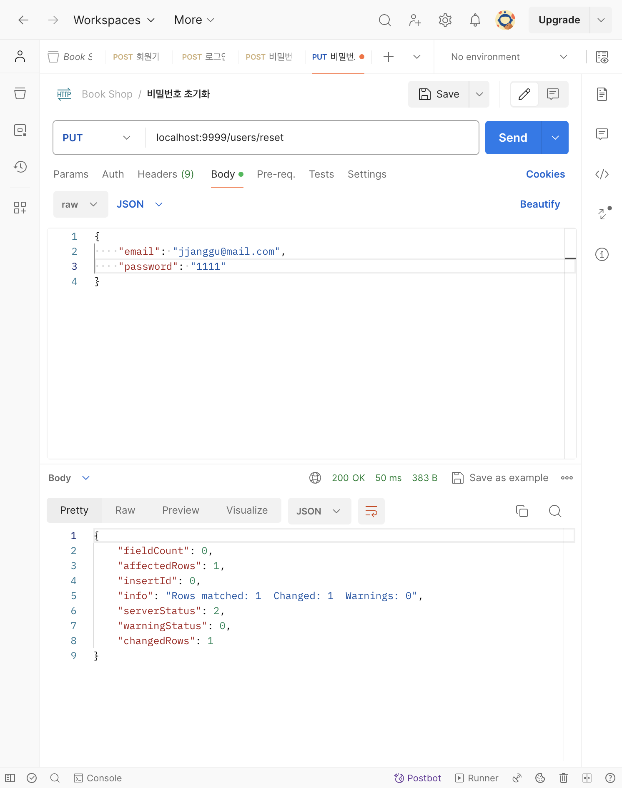
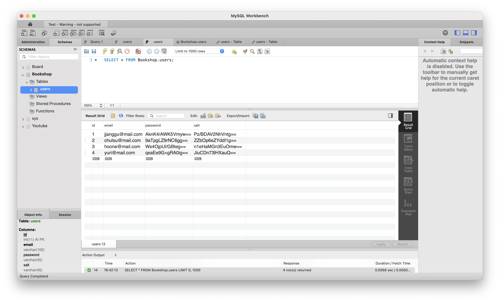

# [7주차 - Day3] 240410 정리

### 1️⃣ mariadb 연동하기

```javascript
const mariadb = require("mysql2");

const conn = mariadb.createConnection({
  host: "",
  port: "",
  user: "",
  password: "",
  database: "",
  dateStrings: true,
});

module.exports = conn;
```

### 2️⃣ http-status-codes 모듈 사용하기

status code를 작성해주는 모듈

```shell
npm i http-status-codes
```

### 3️⃣ Router와 Controller 분리하기

- routes/users.js

  ```javascript
  const join = require("../controller/UserController");

  router.post("/login", join);
  ```

- controller/UsersController.js

  ```javascript
  const conn = require("../mariadb");
  const { StatusCodes } = require("http-status-codes");

  const join = (req, res) => {
    ... // 회원가입 컨트롤러
  }

  module.exports = join;
  ```

  
  

### 4️⃣ 비밀번호 암호화 하기

```javascript
const crypto = require("crypto");

const salt = crypto.randombytes(64).toString("base64");
const hashedPW = crypto
  .pbkdf2Sync(password, salt, 10000, 64, "sha512")
  .toString("base64");
```

- 회원가입 시 암호화 테스트
  
  

- 로그인 시 암호화 테스트
  **로그인 성공**
  

- 비밀번호 초기화 테스트
  
  
