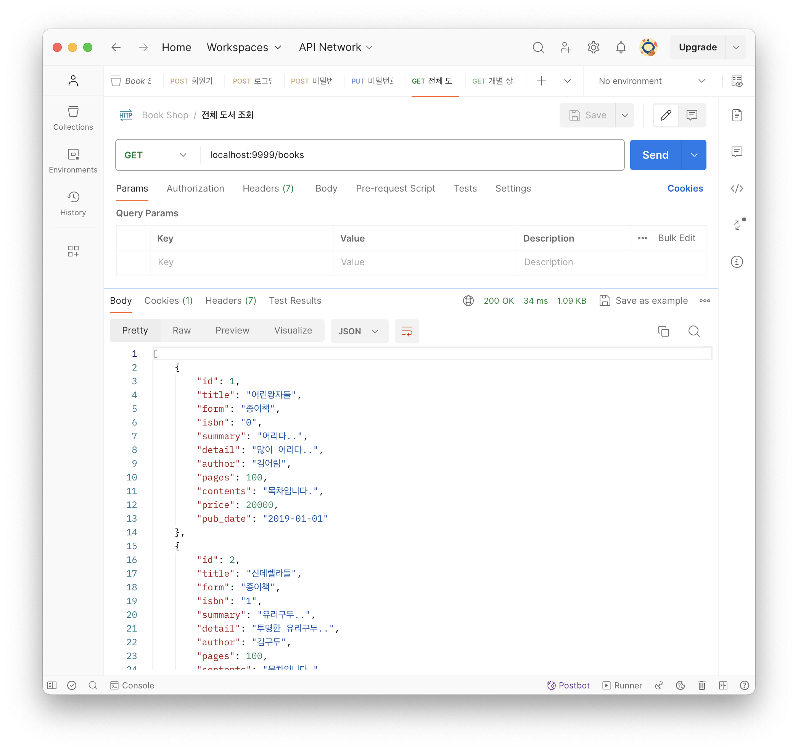
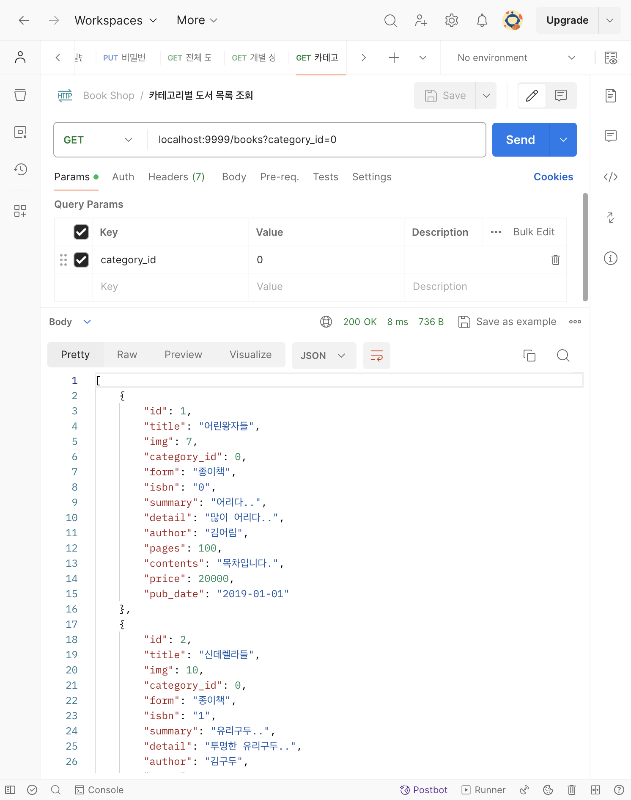

# [7주차 - Day4] 240411 정리

### 1️⃣ book router와 book controller 분리

- routes/books.js

  ```javascript
  // ...

  router.use(express.json());
  router.get("/", allBooks); // 전체 도서 조회
  router.get("/:id", individualBook); // 개별 도서 조회
  router.get("/", booksByCategory); // 카테고리별 도서 목록 조회

  module.exports = router;
  ```

- controller/BookController.js

  ```javascript
  const conn = require("../mariadb"); // db module
  const { StatusCodes } = require("http-status-codes"); // status code module
  // 전체 도서 조회 컨트롤러
  const allBooks = (req, res) => {
    res.json("전체 도서 조회");
  };

  // 개별 도서 조회 컨틀롤러
  const individualBook = (req, res) => {
    res.json("개별 도서 조회");
  };

  // 카테고리별 도서 조회 컨트롤러
  const booksByCategory = (req, res) => {
    res.json("카테고리별 도서 목록 조회");
  };

  module.exports = {
    allBooks,
    individualBook,
    booksByCategory,
  };
  ```

### 2️⃣ 전체 도서 조회



### 3️⃣ 카테고리별 도서 조회

우선순위 이슈로 get 메서드가 공통되는 곳에서 querystring의 존재여부에 따라 분기

```javascript
const allBooks = (req, res) => {
  let { category_id } = req.query;

  // 카테고리 id가 있을 때
  if (category_id) {
    let sql = "SELECT * FROM books WHERE category_id = ?";
    conn.query(sql, category_id, (err, results) => {
      if (err) return;
    });

    return;
    // 결과가 반영이 안됐을 때
    if (results.length) return;

    return;
  }

  // 카테고리 id가 없을 때는 전체 목록 조회
  let sql = "SELECT * FROM books";

  conn.query(sql, (err, results) => {
    if (err) return;
  });

  return;
};
```


