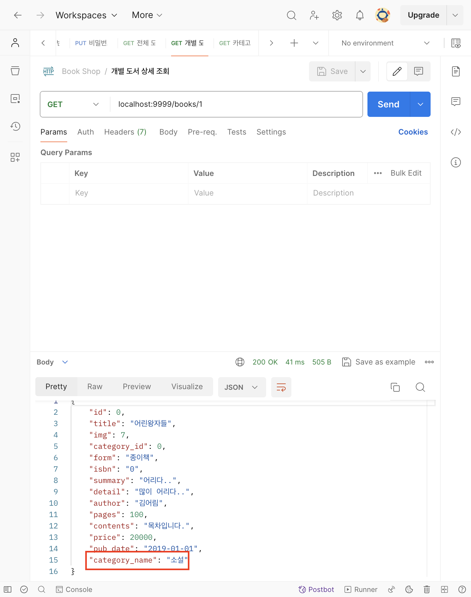
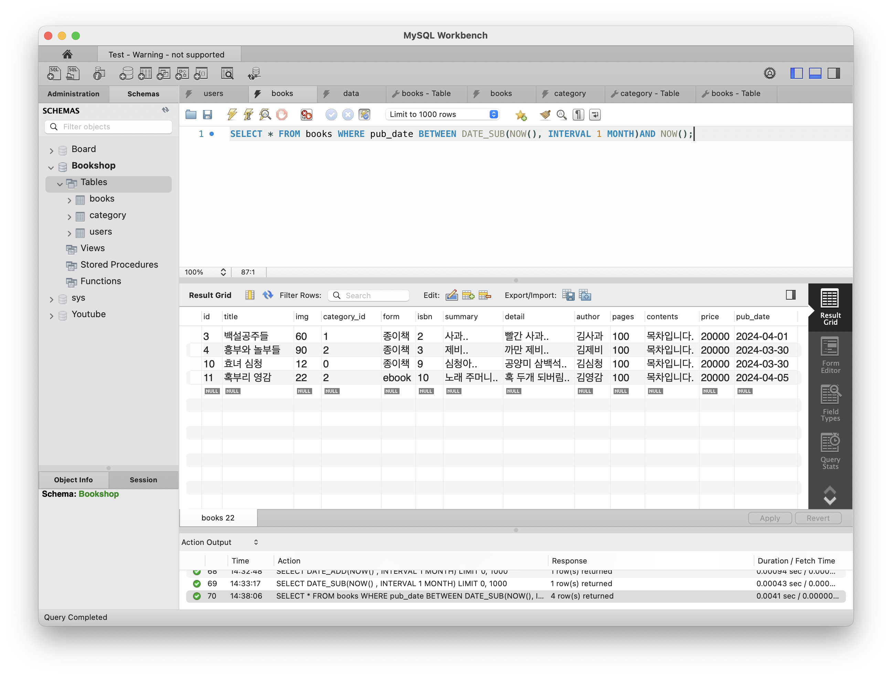
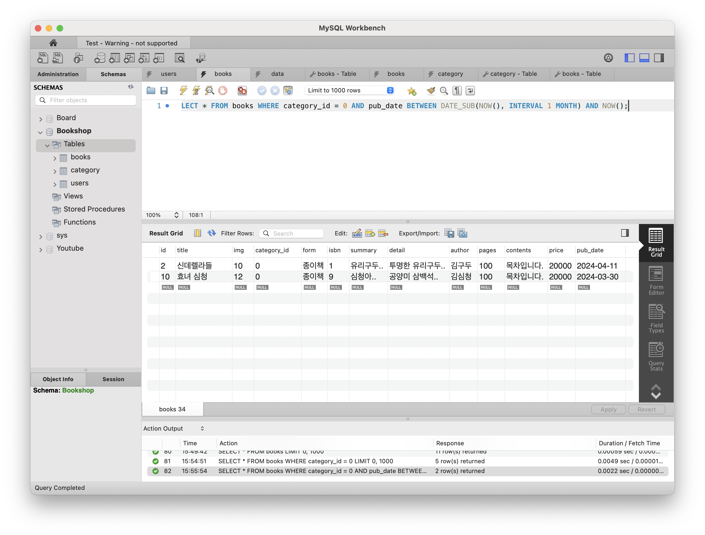
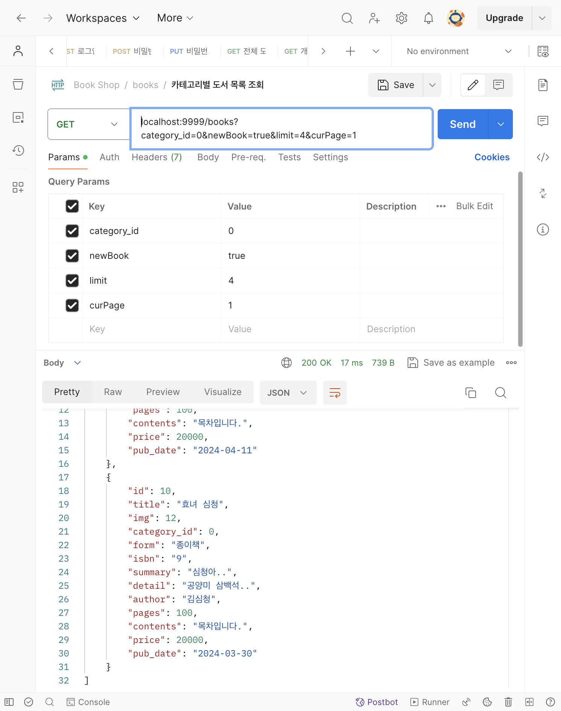

# [7주차 - Day5] 240412 정리

### 1️⃣ LEFT JOIN으로 category_name 추가하기

- BookController.js

  ```javascript
  const individualBook = (req, res) => {
    let { id } = req.params;
    let sql = `SELECT * FROM books LEFT JOIN category ON books.category_id = category.id WHERE books.id = ?`;

    conn.query(sql, id, (err, results) => {
      if (err) return;

      // 결과가 존재할 때
      if (results[0]) return "성공응답";

      // 존재하지 않을 때
      return "에러";
    });
  };
  ```

  

### 2️⃣ 도서 조회 (신간 조회, 카테고리별 조회, 페이징 기법)

- 시간 더하기 ➡️ DATE_ADD(기준날짜, INTERVAL)
- 시간 빼기 ➡️ DATE_SUB(기준날짜, INTERVAL)
- 시간 범위 설정 ➡️ 오늘 날짜 기준(2024-04-12)으로 한 달 이내 출판된 신간 조회
  
- 페이징(Paging): 한 페이지에 몇 개의 데이터를 보여줄 것인지 결정

  ```sql
  SELECT * FROM books LIMIT 4 OFFSET 8;
  ```

  - LIMIT: 출력할 행의 수
  - OFFSET: 시작 지점 (행은 0번부터)

  ```sql
  SELECT * FROM books LIMIT 8, 4; // 이렇게 쓰기도 가능
  ```

  - offset = limit X (curPage - 1)

### 3️⃣ category_id, newBook, limit, offset을 querystring에 담아 보내기

- category_id=0이고 신간인 책 조회
  
  

  querystring에 다음과 같은 값을 넣어 총 두 개의 응답이 JSON형식으로 전달된 것을 확인할 수 있다.
