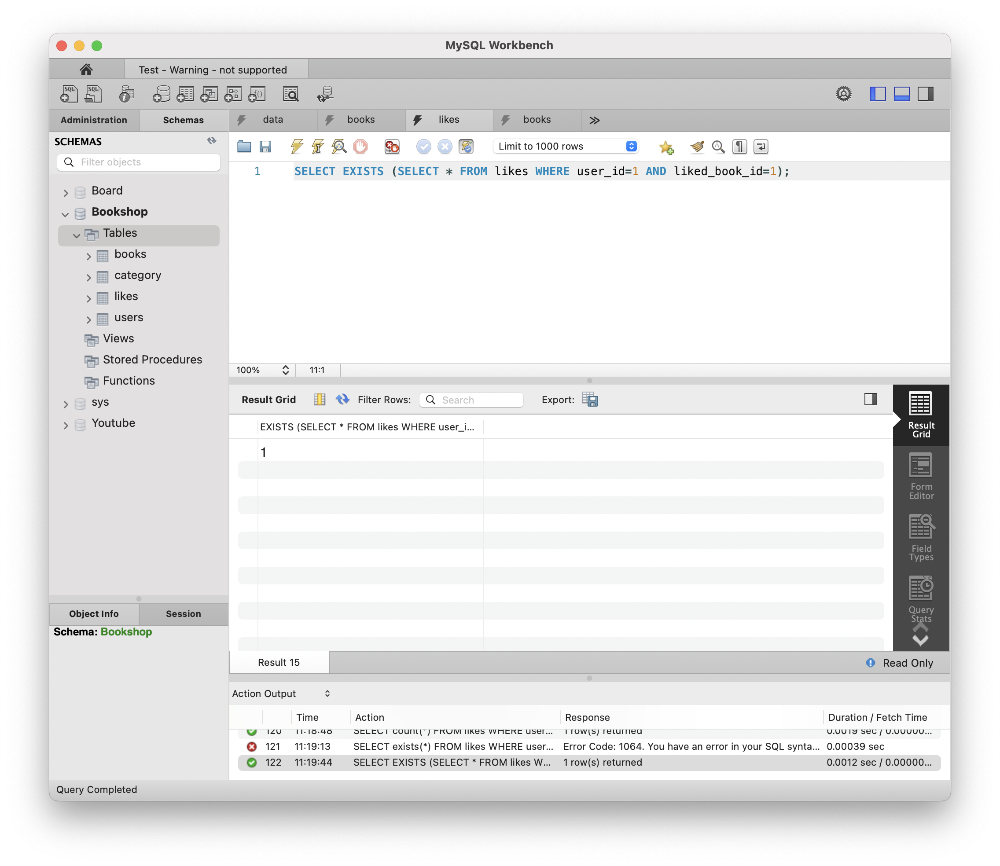

# [8주차 - Day1] 240415 정리

## 1️⃣ COUNT() 함수

조건을 만족하는 행의 개수

```SQL
SELECT count(*) FROM likes WHERE liked_book_id=4;
```

- likes(좋아요 수)가 추가됨
  

## 2️⃣ EXISTS() 함수

조건을 만족하는 행이 존재하는지 확인

```SQL
SELECT EXISTS (SELECT * FROM likes WHERE user_id=1 AND liked_book_id=1);
```

- exists 결과과 출력됨
  

## 3️⃣ 좋아요 개수(likes)와 좋아요 여부(liked)를 추가하기

```SQL
SELECT *,
	(SELECT count(*) FROM likes WHERE liked_book_id = books.id) AS likes,
	(SELECT EXISTS (SELECT * FROM likes WHERE user_id=1 AND liked_book_id=1)) AS liked
	FROM books WHERE books.id=1;
```

- 결과
  

## 4️⃣ 카테고리 이름 LEFT JOIN하여 나타내기

```SQL
SELECT *,
	(SELECT count(*) FROM likes WHERE liked_book_id = books.id) AS likes,
	(SELECT EXISTS (SELECT * FROM likes WHERE user_id=1 AND liked_book_id=1)) AS liked
	FROM books
    LEFT JOIN category
    ON books.category_id = category.id
    WHERE books.id=1;
```

- 결과
  
  
