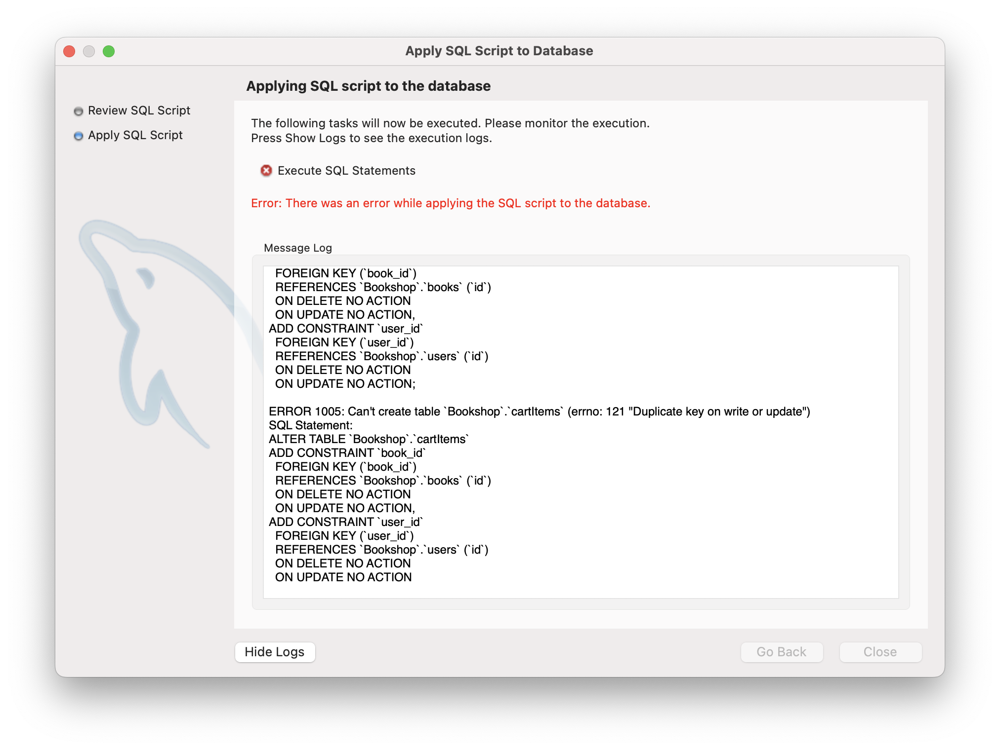
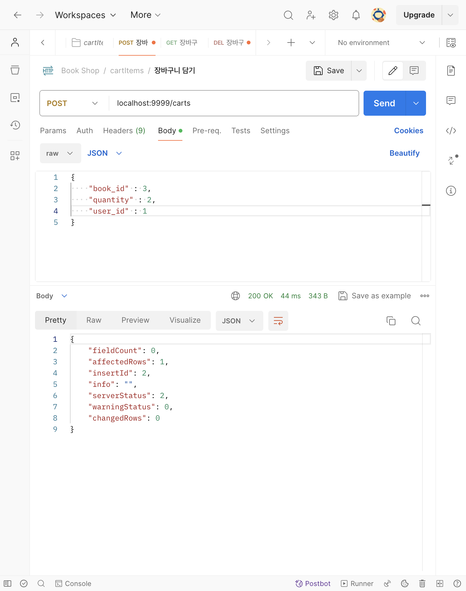
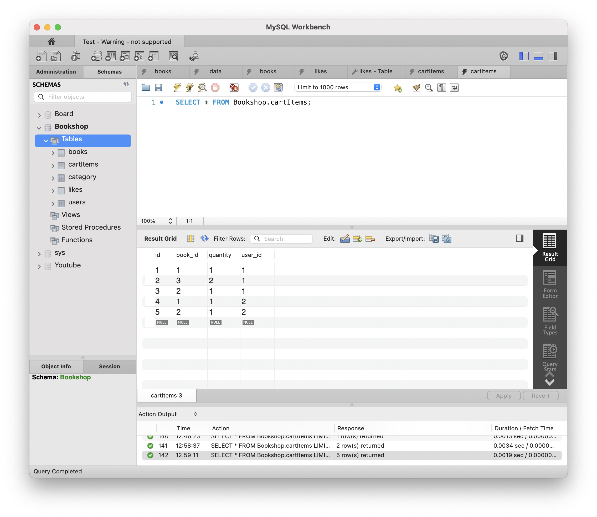
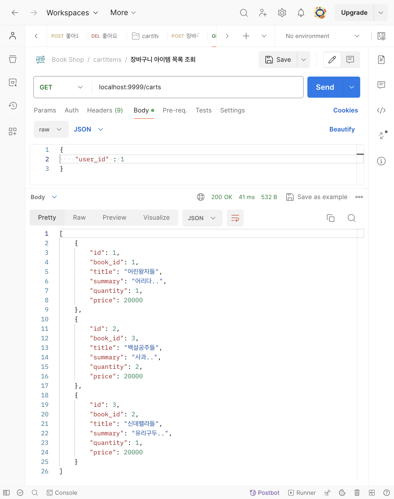
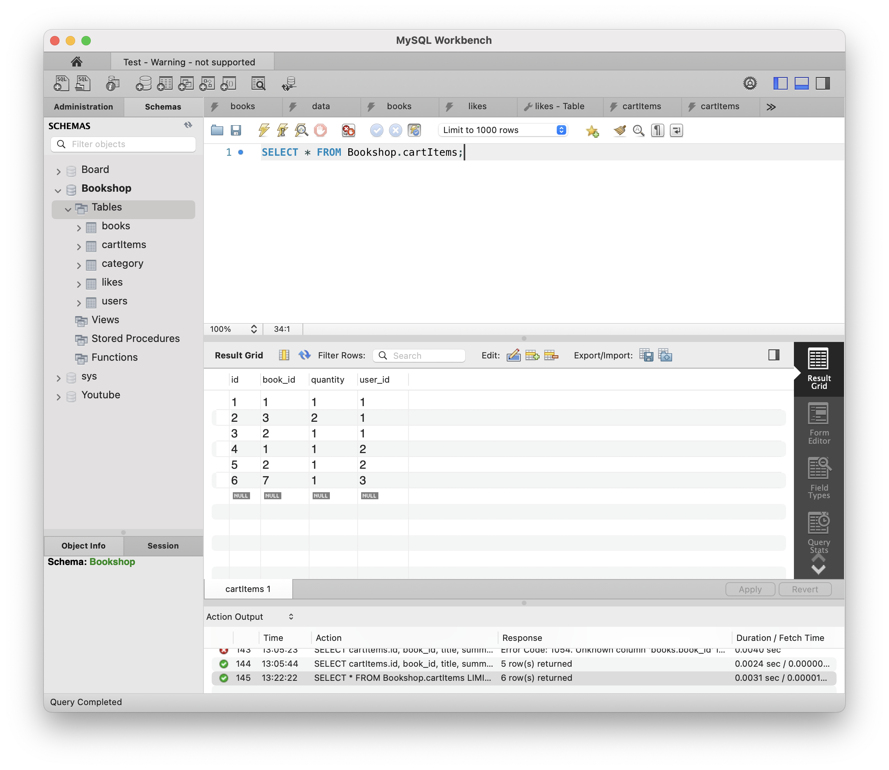
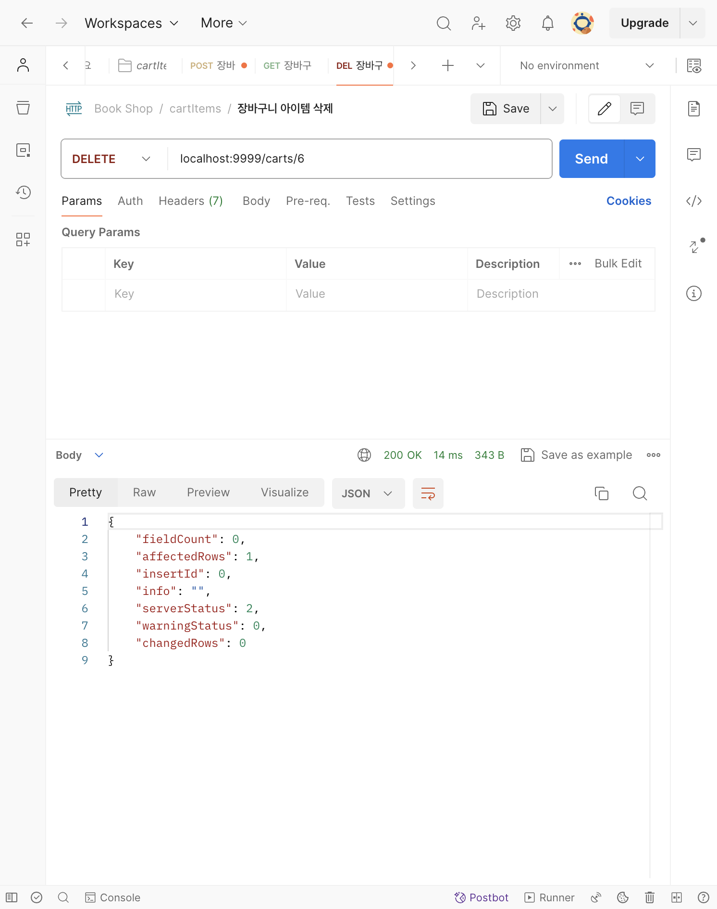
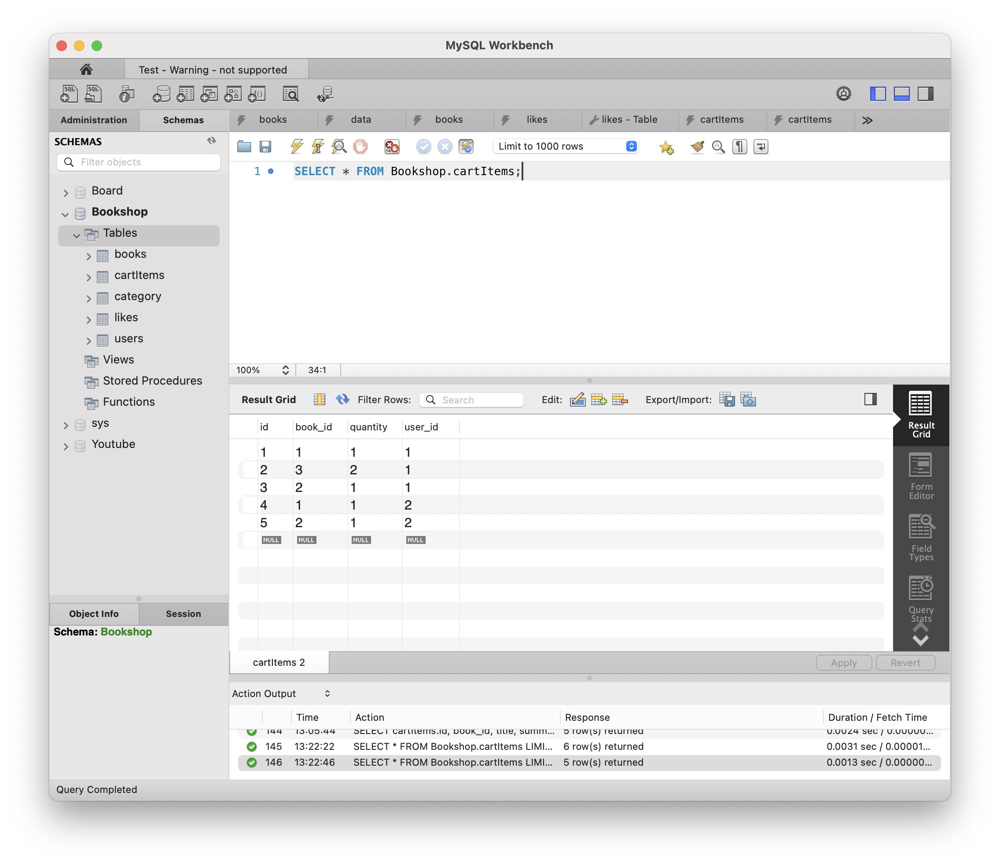
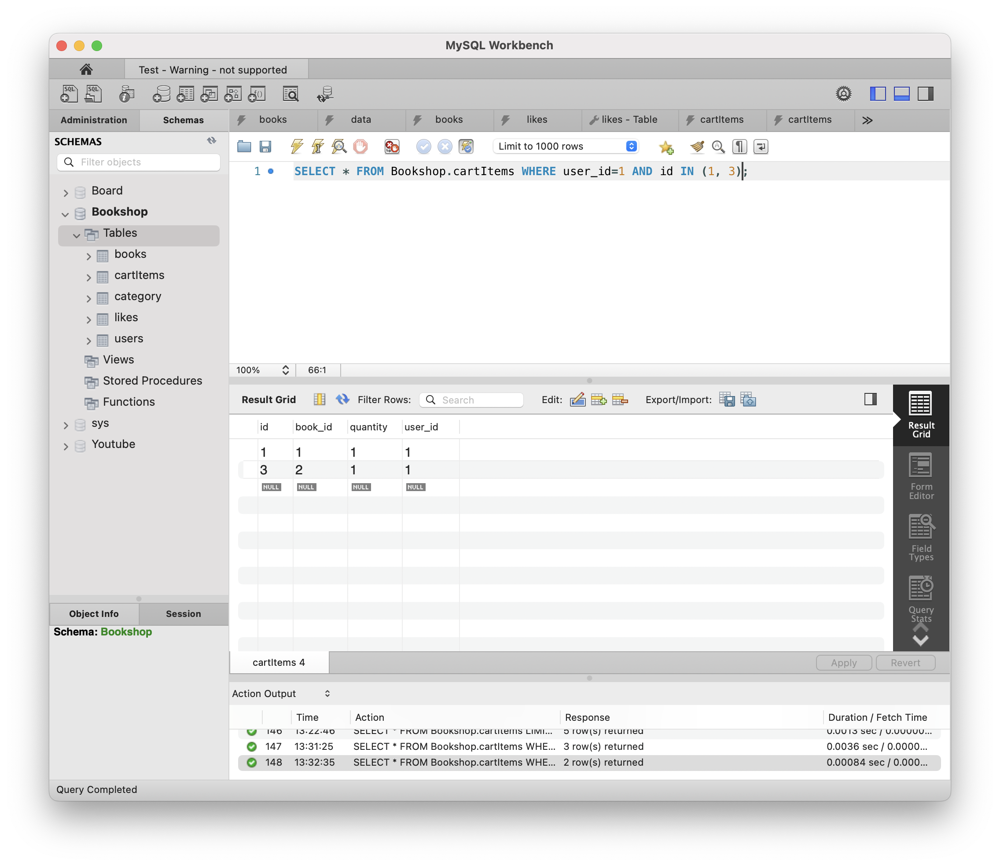
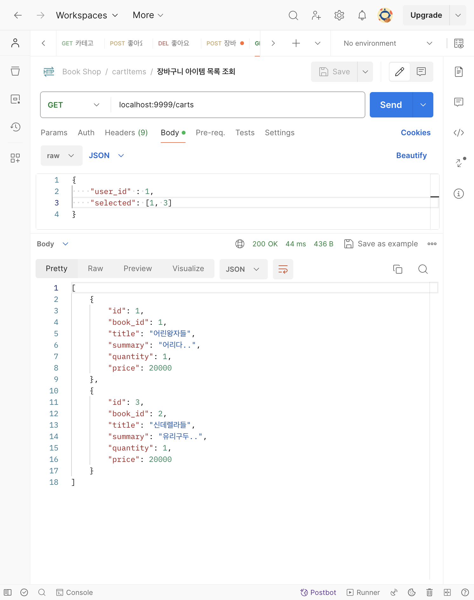

# [8주차 - Day2] 240416 정리

## 1️⃣ 장바구니 (cartItems)

- cartItems인 이유 : 장바구니에 담겨 있는 아이템에 대한 API이기 때문!
- foreign key 제약조건 이름을 다르게 지어주어야 함
  

## 2️⃣ FK 제약 조건 이름 짓기

- fk*기준테이블명*참조테이블명\_참조키
- cartItems.user_id > users.id : fk_cartItems_users_id
- likes.user_id > users.id : fk_likes_users_id

## 3️⃣ 장바구니 담기




## 4️⃣ 장바구니 아이템 목록 조회



## 5️⃣ 장바구니 아이템 삭제





## 6️⃣ 여러 개를 만족하는 데이터 뽑아내기

```SQL
SELECT * FROM cartItems WHERE user_id=1 AND id IN (1, 3);
```



## 7️⃣ 선택한 장바구니 상품 목록만 조회


