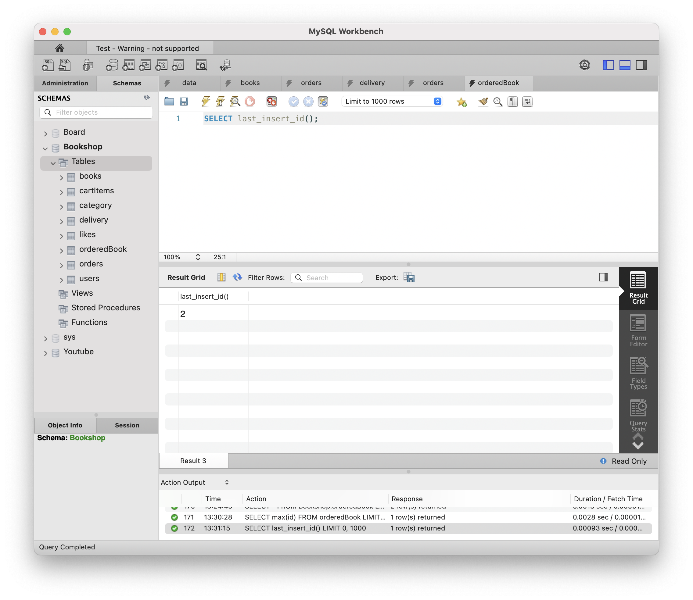
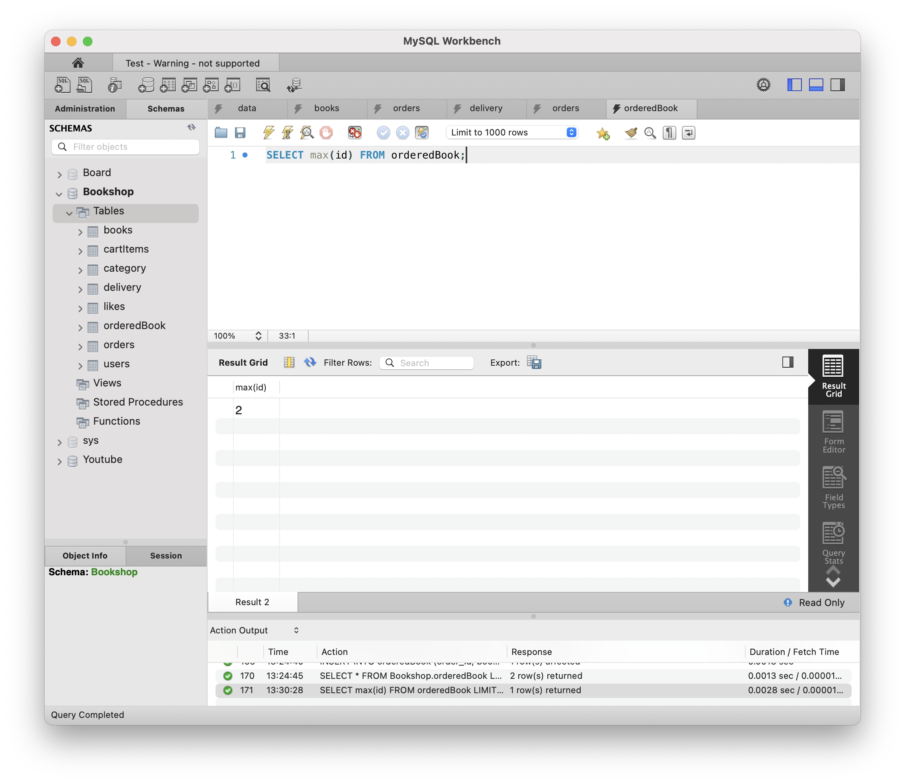
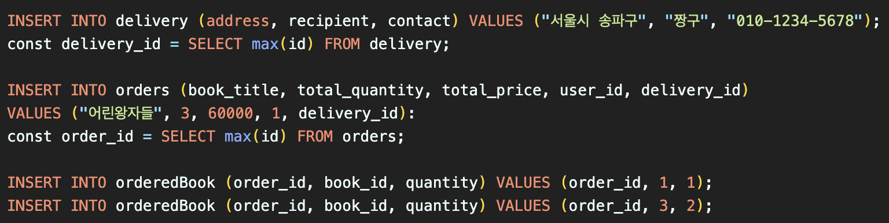
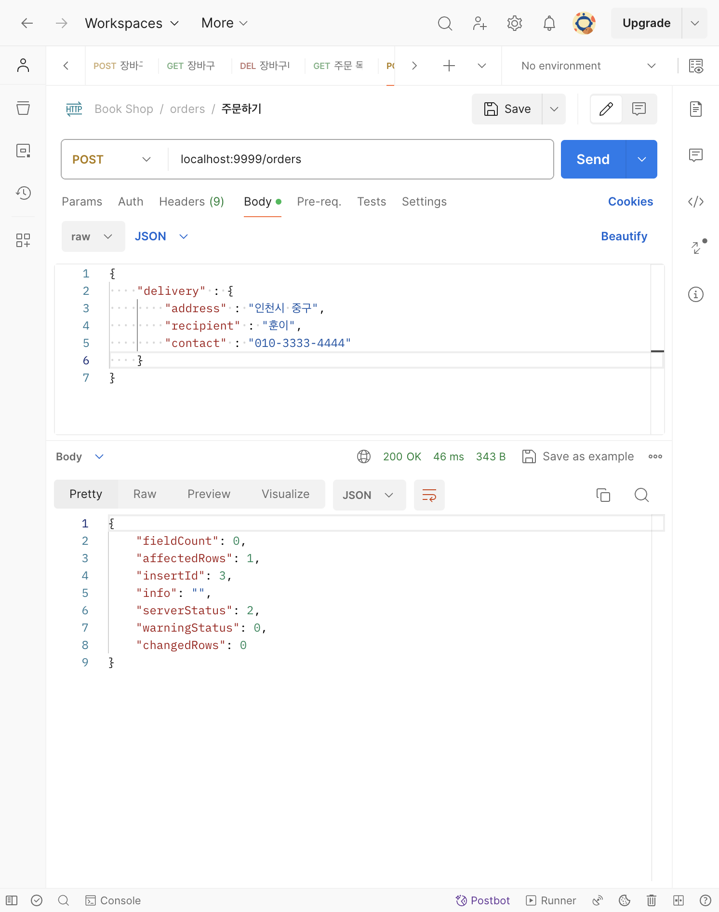
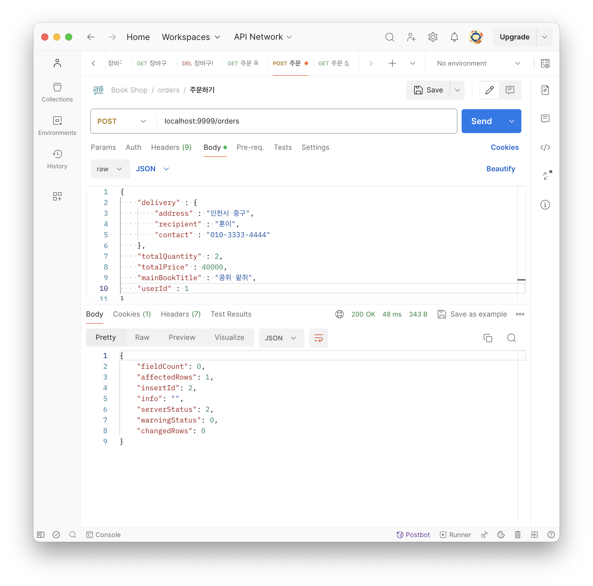
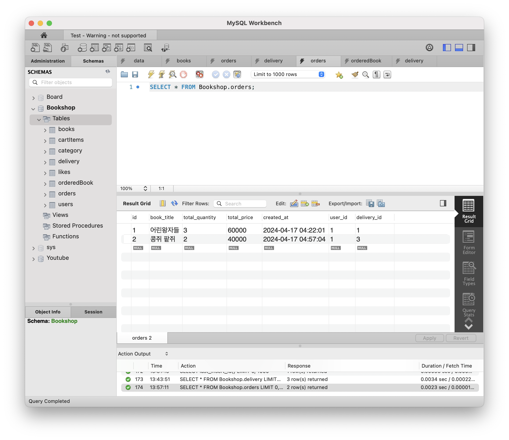
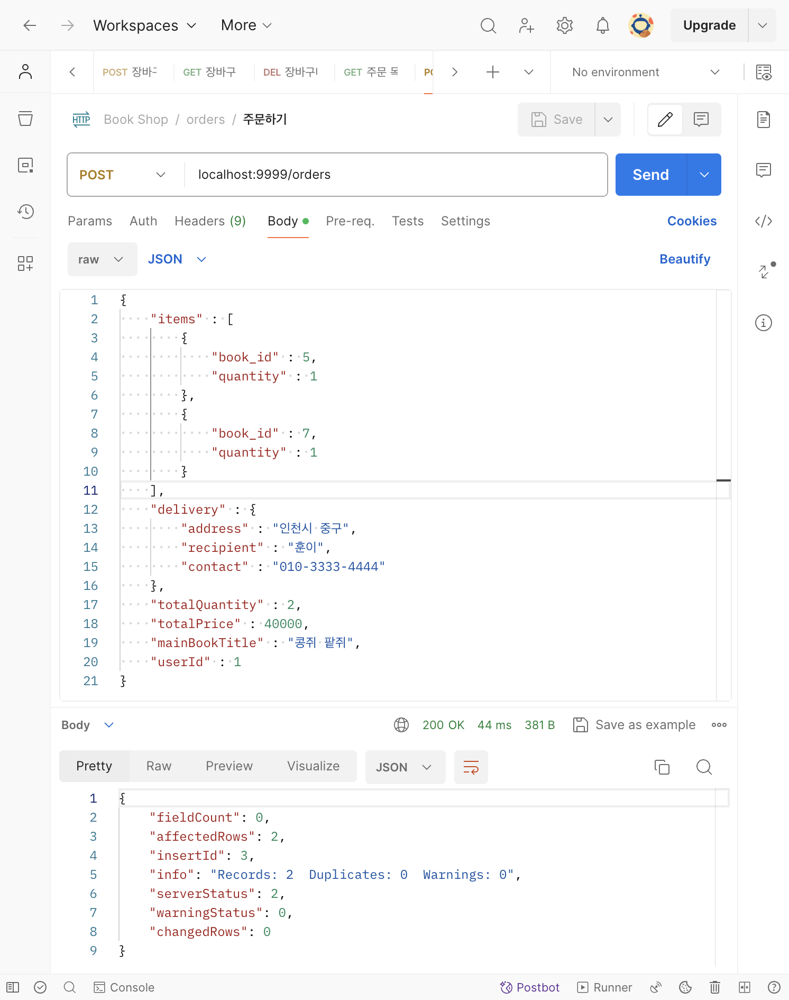

# [8주차 - Day3] 240417 정리

## 1️⃣ 방금 INSERT했던 데이터의 PK 가져오기

- LAST_INSERT_ID(): 시간차 공격 ➡️ 이전 값을 들고오는 오류가 간간히 발생 (비슷한 시간대에 INSERT된 id를 들고오는 문제 발생 가능성)
  
- MAX(): 가장 최근에 INSERT된 PK는 무조건 가장 큰 값일 것
  

- SQL 정리해보기
  

## 2️⃣ 주문하기 컨트롤러 벌크로 INSERT한 결과

