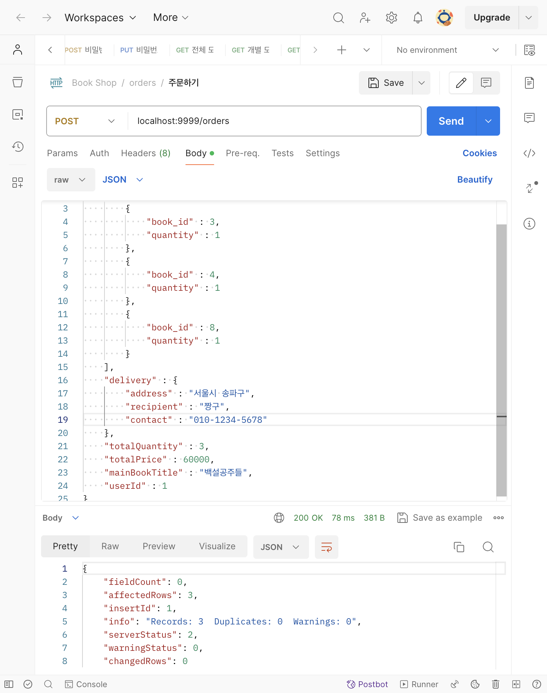
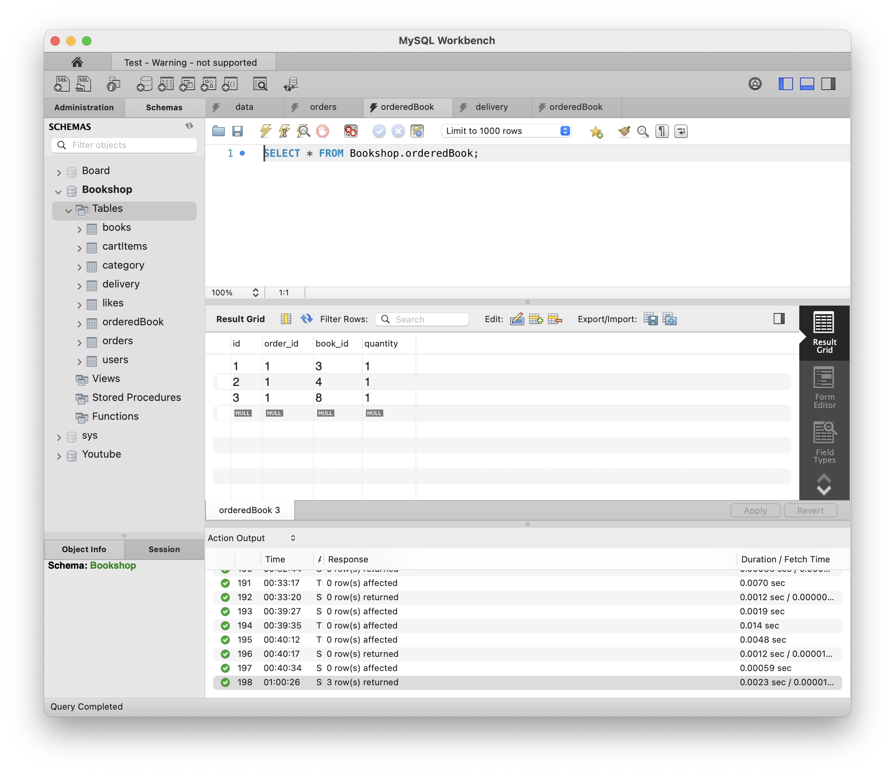
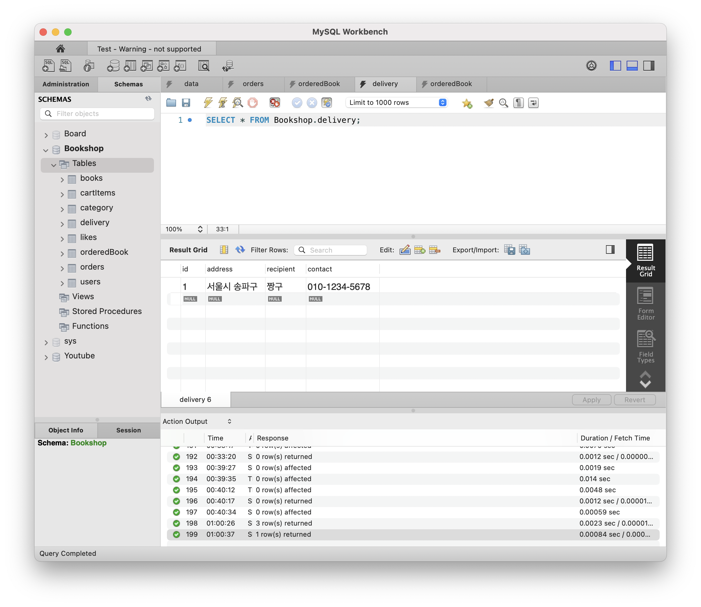
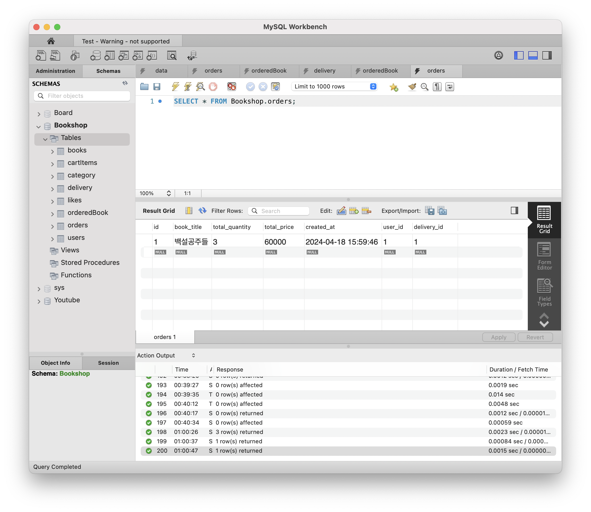
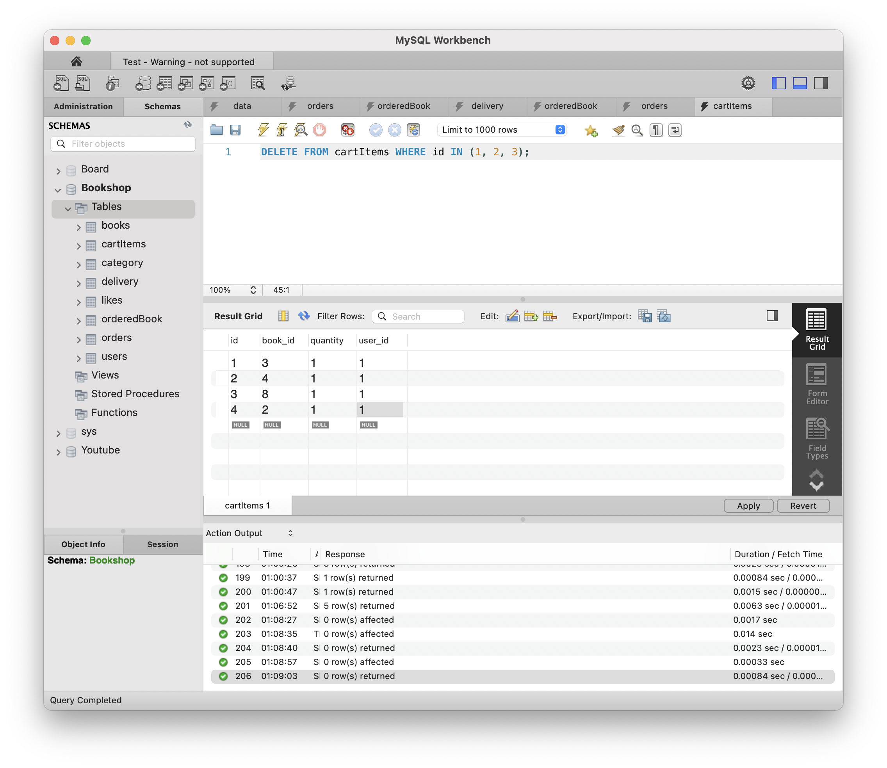
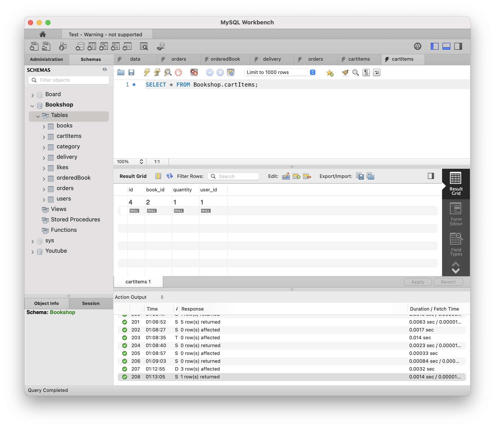
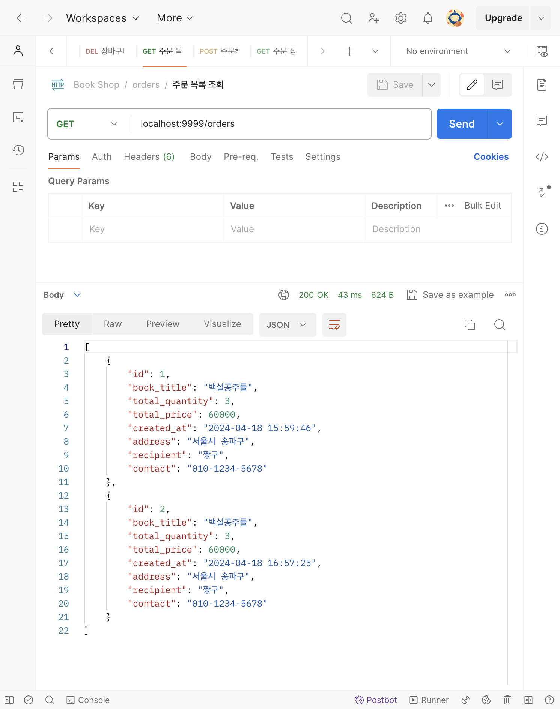
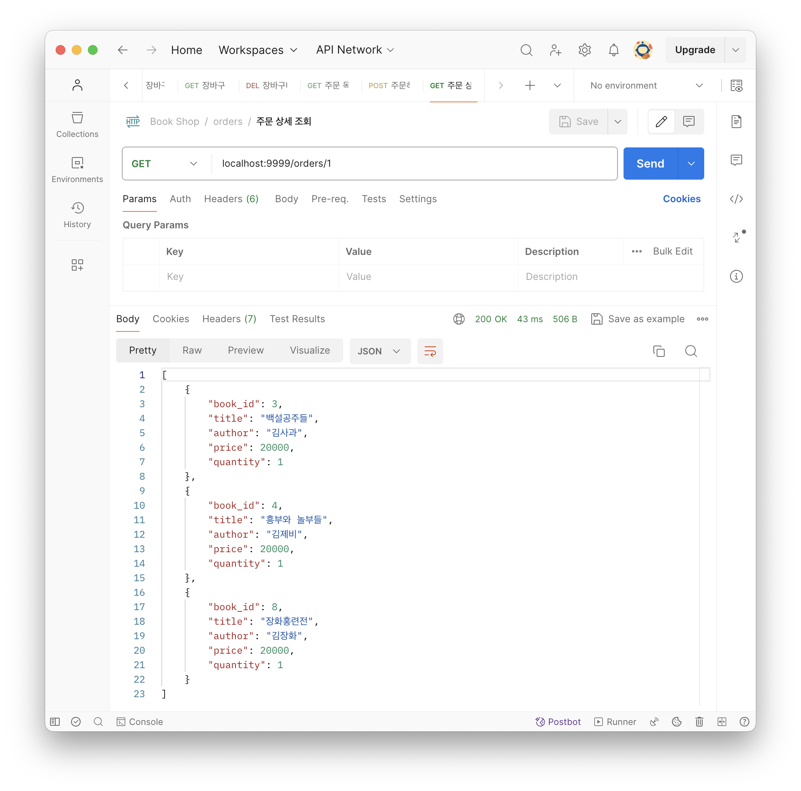

# [8주차 - Day5] 240419 정리

## 1️⃣ MySQL 데이터 삭제하기

- **DELETE:** `DELETE FROM [table] (WHERE 조건);` ➡️ WHERE절 없으면 모든 행이 삭제, 테이블은 존재
- **DROP:** `DROP TABLE [table];` ➡️ 테이블 자체를 삭제
- **TRUNCATE:** `TRUNCATE [table];` ➡️ 모든 행이 삭제, 테이블은 존재 (AI값도 다시 1부터 초기화해줌)

## 2️⃣ FK 제약조건 제한 해제하기

```sql
SET FOREIGN_KEY_CHECKS = 0;
```

## 3️⃣ 주문하기 컨트롤러로 순차적으로 INSERT하기



- orderedBook 테이블
  
- delivery 테이블
  
- orders 테이블
  

## 4️⃣ 주문이 완료되어 장바구니에 해당 주문건 DELETE하기

- 원래 장바구니 DB
  
- 삭제된 장바구니 DB
  

## 5️⃣ 주문 내역 조회



## 6️⃣ 주문 상세 조회
orderedBook에서 SELECT문을 이용하여 JOIN해서 나타내기


