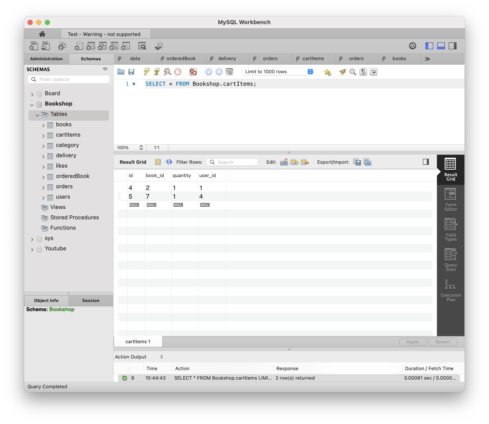

# [9주차 - Day1] 240422 정리

## 1️⃣ JWT

- 회원정보를 req.header cookie에 저장하여 로그인 정보 받기
- 이전 req의 cookie를 받아 다음 req 때 기억했다가 던지기
  
- 로그인된 회원의 jwt를 받아서 좋아요 추가
  
  
- 로그인된 회원의 jwt를 받아서 좋아요 삭제
  
  
- 로그인된 회원의 jwt를 받아서 장바구니 담기 (장바구니 조회)
  
  

## 2️⃣ jwt 예외 처리

1. **TokenExpiredError :** 유효기간이 지난(만료된) 토큰
2. **JsonWebTokenError :** 문제가 있는 토큰
   ➡️ try/catch 구문 사용하여 예외 처리

## 3️⃣ try/catch

개발자가 예상하지 못한 에러(실수, 사용자 입력 잘못, 데이터베이스 응답 오류 등)를 처리하는 문법

```jsx
try {
  // A 코드 실행;
} catch (err) {
  // 에러 처리
}
```

- try 구문의 코드를 실행하다가 에러가 발생하면 try 코드를 중지하고 error와 함께 catch 문으로 빠져나감

## 4️⃣ 에러 객체

자바스크립트가 내장된 에러 객체를 만들어 둔 것

## 5️⃣ throw 연산자

- throw 에러 객체 ➡️ ex. throw new SyntaxError()

## 6️⃣ try/catch를 적용한 로그인 세션 만료 에러 처리


