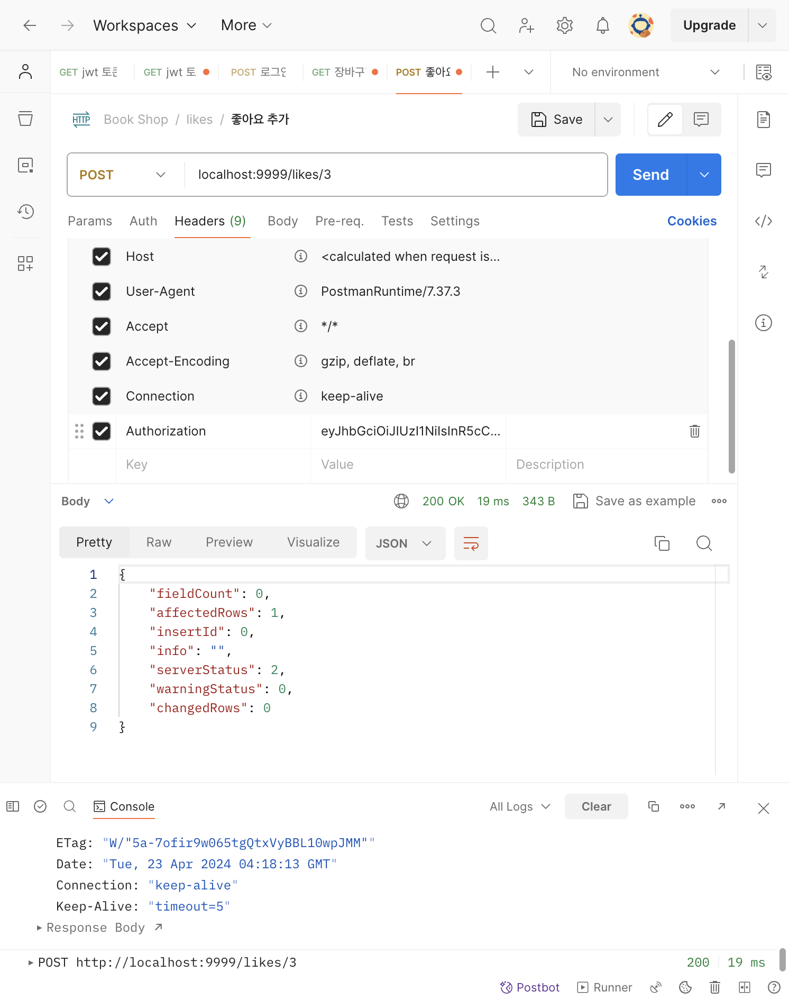
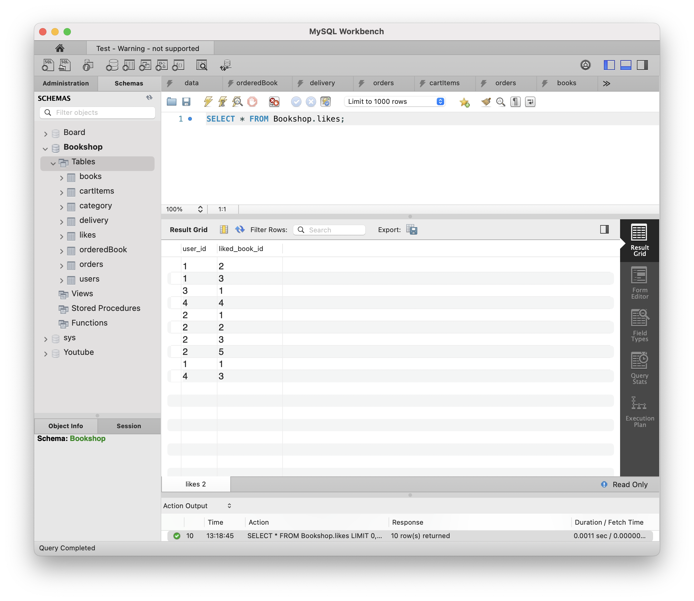
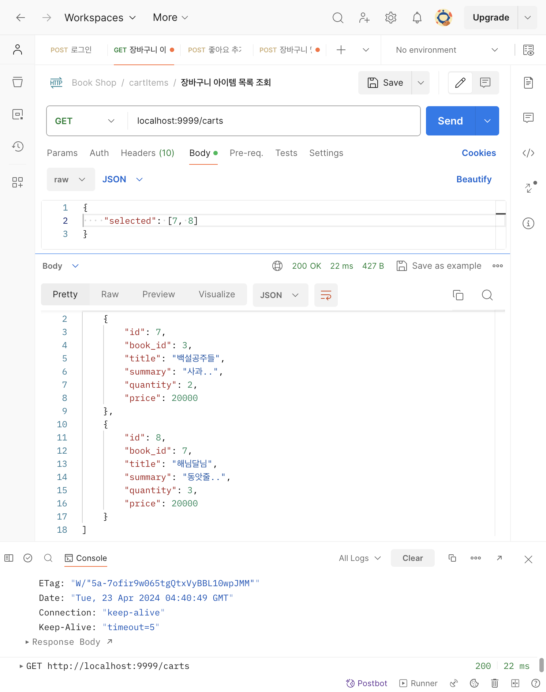
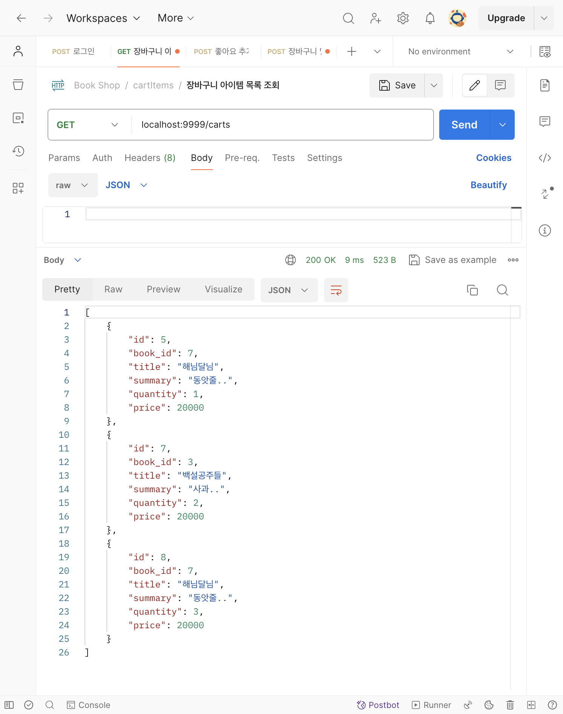

# [9주차 - Day2] 240423 정리

## 1️⃣ 토큰 인증 함수 모듈화

```jsx
// auth.js
const jwt = require("jsonwebtoken");
const dotenv = require("dotenv");
dotenv.config();

const ensureAuthorization = (req, res) => {
  try {
    let receivedJwt = req.headers["authorization"];

    let decodedJwt = jwt.verify(receivedJwt, process.env.PRIVATE_KEY);

    return decodedJwt;
  } catch (err) {
    console.log(err.name);
    console.log(err.message);

    return err;
  }
};

module.exports = ensureAuthorization;
```

- 결과
  
  

## 2️⃣ 내 장바구니 조회해보기

- selected를 req.body에 담아준 경우
  
- selected가 없는 경우
  
